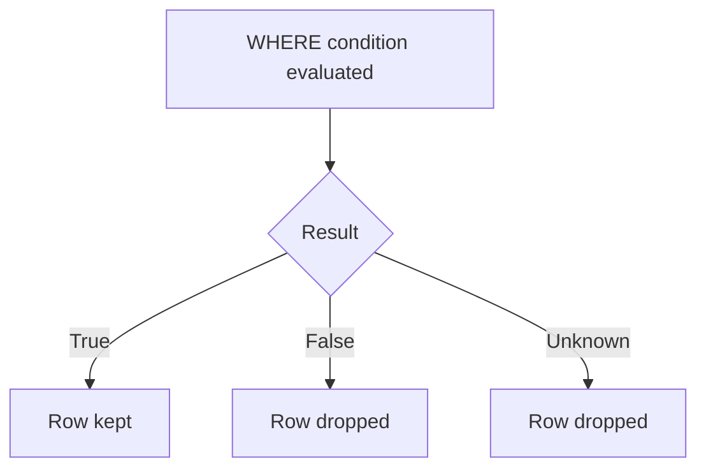
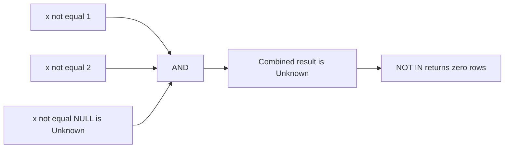

# Lecture 3 — Data Types, `NULL`, and Built-in Functions

> **Duration:** ~2 hours. **Outcome:** You know the data types you meet in week one, you understand `NULL` and SQL's three-valued logic well enough to *predict* the bugs it causes, and you can reach for the common string, number, and date functions to transform values inside a query.

Lecture 2 gave you the clauses. This lecture is about the *values* those clauses operate on — their types, the special non-value `NULL`, and the functions that reshape them. This is the lecture that separates "my query runs" from "my query is correct."

## 1. Data types — the domains of a column

Every column has a **type** (the relational model's *domain*): the set of legal values. Types are why `salary > 100000` compares numerically while `last_name > 'M'` compares alphabetically — the type tells the engine how to interpret and compare the bytes. The types you meet this week:

| Family | PostgreSQL types | SQLite affinity | In `employees` |
|--------|------------------|-----------------|----------------|
| Integer | `INTEGER`, `BIGINT`, `SMALLINT` | `INTEGER` | `emp_id`, `manager_id` |
| Exact decimal | `NUMERIC(p,s)` / `DECIMAL` | `NUMERIC` | `salary`, `commission_pct` |
| Floating point | `REAL`, `DOUBLE PRECISION` | `REAL` | — |
| Text | `TEXT`, `VARCHAR(n)`, `CHAR(n)` | `TEXT` | `first_name`, `email`, `city`, … |
| Boolean | `BOOLEAN` | (stored as `0`/`1`) | `is_remote` |
| Date/time | `DATE`, `TIMESTAMP`, `TIMESTAMPTZ` | `TEXT`/`NUMERIC` | `hire_date`, `birth_date` |

Key ideas for week one:

- **`NUMERIC` vs floating point.** `NUMERIC` (a.k.a. `DECIMAL`) is *exact* — use it for money, always. `REAL`/`DOUBLE` are binary floating point and can't represent `0.1` exactly, so `0.1 + 0.2 <> 0.3` in floating point. Salaries and commissions use `NUMERIC` for that reason.
- **`VARCHAR(n)` vs `TEXT`.** `VARCHAR(n)` caps length at `n`; `TEXT` is unbounded. In PostgreSQL there's no performance difference — use `TEXT` unless a length limit is a real business rule.
- **Postgres is strict; SQLite is lenient.** Postgres rejects `'hello'` in a `NUMERIC` column outright. SQLite uses **type affinity** — it *prefers* a type but will store almost anything, so a typo can slip in silently. That leniency is convenient and dangerous; know which engine you're on.
- **Casting** converts a value from one type to another. Standard SQL: `CAST(salary AS TEXT)`. Postgres shorthand: `salary::TEXT`. You'll need casts when, say, concatenating a number into a string.

```sql
SELECT emp_id,
       CAST(salary AS TEXT) AS salary_text,   -- standard, works on both engines
       salary::NUMERIC(10,2)                  -- Postgres shorthand cast
FROM employees;
```

## 2. `NULL` — the absence of a value

`NULL` is not zero. It is not an empty string. It is **"unknown / not applicable / no value here."** In `employees`, two people have a `NULL` email (we don't know it), and every non-Sales employee has a `NULL` `commission_pct` (it doesn't apply — they earn no commission). Both are legitimate uses.

Because `NULL` means "unknown," any arithmetic or comparison *involving* it yields `NULL`, not a normal answer:

```sql
SELECT 100 + NULL;        -- NULL  (unknown plus anything is unknown)
SELECT salary * commission_pct FROM employees;  -- NULL for everyone with NULL commission
SELECT NULL = NULL;       -- NULL, NOT true! (two unknowns — can't say they're equal)
```

That last one is the crux of everything: **you cannot compare to `NULL` with `=`.** `x = NULL` and `x <> NULL` are both `NULL`, never true. That's why Lecture 2 insisted on `IS NULL` / `IS NOT NULL` — they are the *only* operators that test for it.

## 3. Three-valued logic — the part that breaks queries

Ordinary boolean logic has two values: **true** and **false**. SQL has **three**: **true**, **false**, and **unknown** (which is what a `NULL` comparison produces). `WHERE` keeps a row only when its condition is **true** — rows where the condition is **false** *or* **unknown** are dropped. That single rule causes most "why did my rows disappear?" bugs.


*Only true keeps a row — false and unknown both drop it, which is why NULL comparisons quietly vanish rows.*

Truth tables (`U` = unknown):

**AND** — false wins:

| AND | T | F | U |
|-----|---|---|---|
| **T** | T | F | U |
| **F** | F | F | F |
| **U** | U | F | U |

**OR** — true wins:

| OR | T | F | U |
|----|---|---|---|
| **T** | T | T | T |
| **F** | T | F | U |
| **U** | T | U | U |

**NOT:** `NOT T = F`, `NOT F = T`, **`NOT U = U`** (the surprising one — negating "unknown" is still "unknown").

### The gotchas these tables predict

**Gotcha 1 — a filter silently skips `NULL` rows.** "Everyone not in Sales":

```sql
SELECT * FROM employees WHERE department <> 'Sales';
```

If `department` were nullable and some rows were `NULL`, those rows would be **excluded** — `NULL <> 'Sales'` is `unknown`, not true. (Our `department` is `NOT NULL`, so it's safe here — but the moment a column is nullable, this bites.) To include them: `WHERE department <> 'Sales' OR department IS NULL`.

**Gotcha 2 — `NOT IN` with a `NULL` in the list returns nothing.**

```sql
SELECT * FROM employees WHERE emp_id NOT IN (1, 2, NULL);   -- returns ZERO rows!
```

`x NOT IN (1,2,NULL)` expands to `x<>1 AND x<>2 AND x<>NULL`. That last term is `unknown`, and `something AND unknown` can never be `true` — so no row qualifies. Fix: strip `NULL`s from the list, or use `NOT EXISTS` (Week 3). This is one of the most infamous SQL traps in existence.


*One Unknown term in the AND chain poisons the whole condition, so every row gets dropped.*

**Gotcha 3 — aggregates ignore `NULL`.** `AVG(commission_pct)` averages only the non-NULL commissions (the Sales people), *not* over all 30 employees. `COUNT(commission_pct)` counts non-NULL values; `COUNT(*)` counts rows. Different answers, same-looking query. (Full treatment in Week 3 — flagged now so it doesn't surprise you.)

### Handling `NULL`: `COALESCE`, `NULLIF`, `IS DISTINCT FROM`

```sql
-- COALESCE: return the first non-NULL argument — great for defaults
SELECT first_name,
       COALESCE(email, 'no-email-on-file') AS email
FROM employees;

-- COALESCE a NULL commission to 0 so the math works
SELECT first_name, salary * COALESCE(commission_pct, 0) AS commission
FROM employees;

-- NULLIF(a, b): returns NULL when a = b (useful to dodge divide-by-zero)
SELECT NULLIF(commission_pct, 0);

-- IS [NOT] DISTINCT FROM: a NULL-safe equality (treats two NULLs as equal)
SELECT * FROM employees WHERE email IS DISTINCT FROM 'grace.hopper@crunch.io';
```

`COALESCE` is the workhorse — you'll use it constantly to substitute a sensible default for a `NULL`.

## 4. String functions

Text-shaping functions. All of these work on both engines unless noted.

| Function | Does | Example → result |
|----------|------|------------------|
| `LOWER(s)` / `UPPER(s)` | change case | `LOWER('Ada')` → `ada` |
| `LENGTH(s)` | character count | `LENGTH('Ada')` → `3` |
| `TRIM(s)` | strip leading/trailing spaces | `TRIM('  hi ')` → `hi` |
| `s1 \|\| s2` | concatenate | `'a' \|\| 'b'` → `ab` |
| `SUBSTRING(s FROM p FOR n)` | slice | `SUBSTRING('crunch' FROM 1 FOR 3)` → `cru` |
| `POSITION(sub IN s)` | index of substring (1-based, 0 if absent) | `POSITION('@' IN email)` |
| `REPLACE(s, from, to)` | swap substrings | `REPLACE('a.io','.io','.com')` |

```sql
-- Normalize names and build a display string
SELECT UPPER(last_name) || ', ' || first_name AS sortable_name,
       LENGTH(first_name)                       AS name_len,
       LOWER(email)                             AS email_norm
FROM employees
ORDER BY sortable_name;
```

**Engine note:** SQLite spells substring `SUBSTR(s, p, n)` and lacks `POSITION`/`INITCAP`. Postgres also has `INITCAP` (title-case), `LEFT`/`RIGHT`, and `SPLIT_PART`. Stick to `LOWER`/`UPPER`/`LENGTH`/`TRIM`/`||`/`REPLACE` when you want code that runs on both.

## 5. Numeric functions

| Function | Does | Example → result |
|----------|------|------------------|
| `ROUND(x, d)` | round to `d` decimals | `ROUND(88000.0/12, 2)` → `7333.33` |
| `CEIL(x)` / `FLOOR(x)` | round up / down | `CEIL(7.1)` → `8` |
| `ABS(x)` | absolute value | `ABS(-5)` → `5` |
| `MOD(a, b)` or `a % b` | remainder | `MOD(10,3)` → `1` |
| `POWER(a, b)` | exponent | `POWER(2,10)` → `1024` |

```sql
SELECT first_name,
       ROUND(salary / 12.0, 2) AS monthly_pay,   -- note /12.0 to force decimal division
       ROUND(salary * COALESCE(commission_pct, 0), 2) AS commission
FROM employees
ORDER BY monthly_pay DESC;
```

⚠️ **Integer division truncates.** In Postgres, `5 / 2` is `2`, not `2.5`, because both operands are integers. Write `5 / 2.0` (or cast) to get `2.5`. This silently wrong result — always an integer when you expected a fraction — is a very common bug.

## 6. Date and time functions

Dates are their own type with their own arithmetic. The essentials:

| Function / operator | Does | Notes |
|---------------------|------|-------|
| `CURRENT_DATE` | today's date | both engines |
| `CURRENT_TIMESTAMP` / `NOW()` | current date+time | `NOW()` is Postgres |
| `EXTRACT(YEAR FROM d)` | pull a field out of a date | Postgres; also `MONTH`, `DAY`, `DOW` |
| `AGE(d)` | interval from `d` to now | Postgres only |
| `date + INTEGER` | add days | Postgres: `hire_date + 30` |
| `strftime('%Y', d)` | format a date | **SQLite** equivalent of `EXTRACT` |

```sql
-- Postgres: who was hired in 2021, and how long ago?
SELECT first_name,
       hire_date,
       EXTRACT(YEAR FROM hire_date) AS hire_year,
       AGE(hire_date)               AS tenure
FROM employees
WHERE EXTRACT(YEAR FROM hire_date) = 2021
ORDER BY hire_date;
```

```sql
-- SQLite: the same "hired in 2021" idea, using strftime
SELECT first_name, hire_date
FROM employees
WHERE strftime('%Y', hire_date) = '2021'
ORDER BY hire_date;
```

**Engine difference, spelled out:** date field extraction is where Postgres and SQLite diverge most. Postgres uses `EXTRACT(... FROM ...)` and real `DATE`/`INTERVAL` arithmetic; SQLite stores dates as text and uses `strftime()` / `date()` / `julianday()`. The *concept* (get the year, add days, compute an interval) is identical — only the spelling changes. Comparisons like `hire_date >= '2021-01-01'` work identically on both because `'YYYY-MM-DD'` text sorts chronologically.

## 7. Functions inside `WHERE` and `ORDER BY`

Functions aren't limited to the `SELECT` list — they work anywhere an expression is allowed:

```sql
-- case-insensitive match without ILIKE, works on both engines
SELECT * FROM employees WHERE LOWER(last_name) = 'turing';

-- everyone whose name is short
SELECT first_name FROM employees WHERE LENGTH(first_name) <= 4;

-- sort by domain of the email, ignoring the local part
SELECT email FROM employees WHERE email IS NOT NULL ORDER BY SUBSTRING(email FROM POSITION('@' IN email));
```

One caution for later: wrapping an *indexed* column in a function (`WHERE LOWER(last_name) = ...`) can stop the database from using an index on that column, making the query slow on big tables. That's a Week 6/7 concern — note it, don't worry about it yet.

## 8. Check yourself

- Why store money in `NUMERIC` and never `REAL`?
- What does `NULL` mean, and why is `salary = NULL` never true?
- In three-valued logic, `WHERE` keeps a row only when the condition is ______ (not ______ and not ______).
- Why does `WHERE emp_id NOT IN (1, 2, NULL)` return zero rows?
- What does `COALESCE(commission_pct, 0)` do, and why would you use it in a multiplication?
- In Postgres, what is `5 / 2`? How do you get `2.5`?
- Give the Postgres and the SQLite way to filter "hired in 2021."
- Which function returns the first non-`NULL` of its arguments?

If those land, you're ready for the exercises — start with [Exercise 1](../exercises/exercise-01-first-queries.md).

## Further reading

- **PostgreSQL — Data Types:** <https://www.postgresql.org/docs/current/datatype.html>
- **PostgreSQL — String / Math / Date-time functions:** <https://www.postgresql.org/docs/current/functions.html>
- **SQLite — Datatypes and type affinity:** <https://www.sqlite.org/datatype3.html>
- **SQLite — Date and time functions:** <https://www.sqlite.org/lang_datefunc.html>
- **"SQL NULL handling" (Modern SQL):** <https://modern-sql.com/concept/null>
