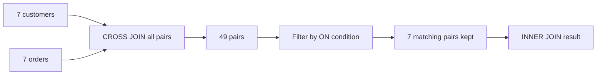
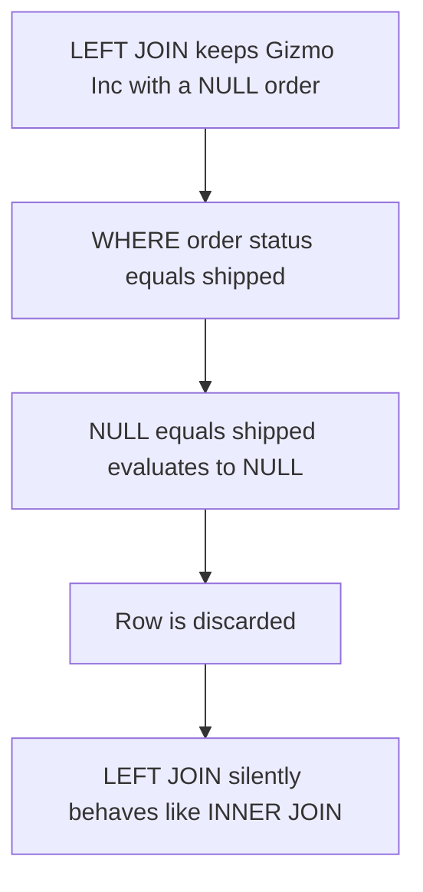

# Lecture 1 — Inner and Outer Joins

> **Duration:** ~2 hours. **Outcome:** You understand the join as a filtered Cartesian product, can write `INNER`, `LEFT`, `RIGHT`, and `FULL OUTER` joins, predict which rows each keeps, and choose between `ON`, `USING`, and `NATURAL JOIN`.

Everything you did in Week 1 touched one table. That was a lie of convenience. Real databases split data across many tables so each fact is stored exactly once — a customer's name lives in `customers`, their orders live in `orders`, and `orders` merely *points* at the customer with a `customer_id`. To show "customer name next to order date" you must reconnect those tables. That reconnection is the **join**, and once you see what it really is, every join type becomes obvious.

## 1. The mental model: a join is a filtered Cartesian product

Forget the keywords for a minute. Start with the most primitive combination of two tables: pair **every** row of the left table with **every** row of the right table. That all-pairs combination is the **Cartesian product**, and SQL spells it `CROSS JOIN`.

```sql
SELECT c.name AS customer, o.order_id
FROM customers c
CROSS JOIN orders o;
```

With 7 customers and 7 orders, this returns **49 rows** — every customer paired with every order, whether or not the order belongs to that customer. Almost all of those pairs are nonsense (Acme paired with Bolt Co's order). A join is just a Cartesian product with a **condition that keeps only the sensible pairs**:

```sql
SELECT c.name AS customer, o.order_id
FROM customers c
CROSS JOIN orders o
WHERE c.customer_id = o.customer_id;   -- keep only matching pairs
```

That returns 7 rows — each order beside its actual customer. **That is an inner join.** The modern syntax below means exactly the same thing; the `ON` clause is the filter:

```sql
SELECT c.name AS customer, o.order_id
FROM customers c
JOIN orders o ON c.customer_id = o.customer_id;
```

Hold onto this: **the join keyword picks which unmatched rows to keep; the `ON` condition picks which pairs count as a match.** Two independent decisions. Everything in this lecture is a combination of those two dials.


*A join is a Cartesian product narrowed down by the ON condition.*

| Table sizes | `CROSS JOIN` rows | After `ON c.id = o.cid` |
|-------------|------------------:|------------------------:|
| 7 × 7 | 49 | 7 |

## 2. `INNER JOIN` — the intersection

An **inner join** returns only rows that have a match on both sides. It is the join you'll write 90% of the time. `JOIN` with no qualifier *means* `INNER JOIN`; write the word `INNER` when you want to be explicit, drop it when the team prefers brevity — both are identical.

```sql
-- Every order, with the customer who placed it and the employee who took it.
SELECT o.order_id, c.name AS customer, e.name AS rep, o.status
FROM orders o
INNER JOIN customers c ON c.customer_id = o.customer_id
INNER JOIN employees e ON e.employee_id = o.employee_id
ORDER BY o.order_id;
```

Result (7 rows):

```
 order_id | customer | rep  | status
----------+----------+------+-----------
      101 | Acme     | Ben  | shipped
      102 | Acme     | Ben  | shipped
      103 | Bolt Co  | Cy   | pending
      104 | Cog Ltd  | Eve  | shipped
      105 | Dyeworks | Dot  | cancelled
      106 | Echo LLC | Eve  | shipped
      107 | Foxtrot  | Ben  | pending
```

Notice who is **missing**: customer 7 (Gizmo Inc) never placed an order, so an inner join between `customers` and `orders` drops it. That silent dropping is the defining behavior of the inner join — no match, no row. Sometimes that's what you want. Sometimes it hides exactly the rows you were looking for, which is why outer joins exist.

### Table aliases are not optional in practice

Every query above aliases tables (`customers c`, `orders o`). Once more than one table is in play, column names collide — both `customers` and `orders` might have an `id` — and aliases let you say precisely which one you mean (`c.customer_id` vs `o.customer_id`). **Qualify every column with its alias in a join**, even the unambiguous ones. It makes the query readable and future-proof: adding a table later won't suddenly make a bare column name ambiguous.

## 3. The three outer joins — keep the unmatched rows

An **outer join** keeps unmatched rows from one or both tables, filling the missing side with `NULL`. There are three, distinguished only by *which side* is "preserved."

| Join | Keeps unmatched rows from… | Missing side filled with |
|------|----------------------------|--------------------------|
| `LEFT [OUTER] JOIN` | the **left** table | `NULL` |
| `RIGHT [OUTER] JOIN` | the **right** table | `NULL` |
| `FULL [OUTER] JOIN` | **both** tables | `NULL` |

The word `OUTER` is optional and adds nothing — `LEFT JOIN` and `LEFT OUTER JOIN` are identical. Most people drop it.

### 3.1 `LEFT JOIN` — "all of the left, matches where they exist"

This is the outer join you'll actually use. "Give me **every** customer, and their orders **if they have any**":

```sql
SELECT c.name AS customer, o.order_id, o.status
FROM customers c
LEFT JOIN orders o ON o.customer_id = c.customer_id
ORDER BY c.customer_id, o.order_id;
```

Now Gizmo Inc appears, with `NULL`s where an order would be:

```
 customer  | order_id | status
-----------+----------+---------
 Acme      |      101 | shipped
 Acme      |      102 | shipped
 Bolt Co   |      103 | pending
 Cog Ltd   |      104 | shipped
 Dyeworks  |      105 | cancelled
 Echo LLC  |      106 | shipped
 Foxtrot   |      107 | pending
 Gizmo Inc |     NULL | NULL      ← kept because LEFT preserves customers
```

The left table (`customers`) is preserved in full; where no order matched, the order columns are `NULL`. This single pattern answers a huge class of questions: "all X, with their Y where present." Reports, dashboards, and — as you'll see in Lecture 2 — anti-joins all lean on it.

### 3.2 `RIGHT JOIN` — the mirror image

`RIGHT JOIN` preserves the **right** table instead. It is exactly a `LEFT JOIN` with the tables written in the other order, which is why many teams ban it: you can always rewrite `A RIGHT JOIN B` as `B LEFT JOIN A` and keep every join reading left-to-right. Still, you must recognize it.

"Every region, and any customers in it" — using `RIGHT JOIN` so `regions` (on the right) is preserved:

```sql
SELECT c.name AS customer, r.name AS region
FROM customers c
RIGHT JOIN regions r ON r.region_id = c.region_id
ORDER BY r.region_id;
```

Region 4 (West) has no customers, so it appears with a `NULL` customer:

```
 customer | region
----------+--------
 Acme     | North
 Bolt Co  | North
 Gizmo Inc| North
 Cog Ltd  | South
 Echo LLC | South
 Dyeworks | East
 NULL     | West     ← region kept, no customer matched
```

> **SQLite:** `RIGHT JOIN` needs SQLite **3.39+** (2022). On older builds, rewrite it as a `LEFT JOIN` with the tables swapped.

### 3.3 `FULL OUTER JOIN` — keep everything, both sides

`FULL OUTER JOIN` preserves unmatched rows from **both** tables at once. Use it when either side can lack a partner and you refuse to drop either. Pair `customers` with `regions` — customer 6 (Foxtrot) has a `NULL` region, and region 4 (West) has no customers, so both a customer-with-no-region *and* a region-with-no-customer surface:

```sql
SELECT c.name AS customer, r.name AS region
FROM customers c
FULL OUTER JOIN regions r ON r.region_id = c.region_id
ORDER BY r.region_id NULLS LAST;
```

You get every customer (Foxtrot with `NULL` region) **and** every region (West with `NULL` customer) in one result. A `FULL JOIN` is the tool for reconciliation questions: "show me everything on both sides and flag what didn't line up."

> **SQLite:** `FULL OUTER JOIN` also needs **3.39+**. The classic portable workaround is `LEFT JOIN` `UNION` `RIGHT-as-LEFT JOIN` — you'll build exactly that in Lecture 3.

## 4. Predicting the row count

Before you run a join, you should be able to guess its size. The rule for a one-to-many relationship joined on a key:

- **`INNER JOIN`**: one row per matching pair. If each order has exactly one customer, `orders INNER JOIN customers` has as many rows as there are *matched* orders.
- **`LEFT JOIN`**: at least as many rows as the left table (every left row appears ≥ once). More if a left row matches several right rows.
- **The multiplication trap:** if a left row matches *N* right rows, it appears *N* times. Join `orders` to `order_items` and each order fans out to one row **per item** — order 101 (2 items) becomes 2 rows. That's correct, but it means you can no longer trust `count(*)` to mean "number of orders." Watch for it; it's the #1 cause of inflated sums.

```sql
-- One row per order ITEM, not per order. 10 items → 10 rows.
SELECT o.order_id, oi.product_id, oi.quantity
FROM orders o
JOIN order_items oi ON oi.order_id = o.order_id;
```

## 5. Stating the match: `ON` vs `USING` vs `NATURAL`

There are three ways to express the join condition. They differ in convenience and in danger.

### `ON` — the general form (use this)

`ON` takes any boolean expression. It handles differently-named columns, multiple columns, ranges, inequalities — anything.

```sql
... JOIN orders o ON o.customer_id = c.customer_id
... JOIN t2 ON t2.a = t1.a AND t2.b = t1.b        -- composite key
... JOIN prices p ON e.event_date BETWEEN p.valid_from AND p.valid_to   -- range join
```

`ON` is explicit and works in every case. Reach for it by default.

### `USING` — shorthand when column names match

When both tables name the join column *identically*, `USING (col)` is a tidy shorthand. It also **merges** the two columns into one in the output, so you select `col` unqualified.

```sql
-- Works because BOTH tables call the column customer_id... but they don't here:
-- customers has customer_id, orders has customer_id → USING is legal:
SELECT customer_id, o.order_id
FROM customers
JOIN orders o USING (customer_id);   -- one merged customer_id column
```

`USING` is pleasant when a schema is consistently named. Its catch: it requires the names to be identical, and it collapses the column, so you can't say "`c.customer_id` from the left specifically" afterward.

### `NATURAL JOIN` — convenient, and a trap

`NATURAL JOIN` auto-joins on **every** column the two tables share by name, with no `ON` at all.

```sql
SELECT * FROM customers NATURAL JOIN orders;   -- joins on ALL common column names
```

That reads like magic and works right up until someone adds a column. If both tables later gain a `name` or `created_at` or `region_id` column, `NATURAL JOIN` silently starts matching on that too, quietly changing your results with no error. In `crunch_shop` it's an active landmine: `customers` and `employees` *both* have `region_id` **and** `name`, so `customers NATURAL JOIN employees` would try to match on both and return near-nothing.

**Rule: never ship a `NATURAL JOIN`.** It trades a few keystrokes for a query whose meaning depends on columns you can't see. Use `ON`, or `USING` when the names are stable.

| Form | Match condition | When to use |
|------|-----------------|-------------|
| `ON expr` | anything you write | default; always safe |
| `USING (col)` | named columns, must match exactly, output merged | consistent schemas, want brevity |
| `NATURAL JOIN` | all same-named columns, implicit | never (schema-change hazard) |

## 6. The classic outer-join bug: `WHERE` on the right table

This is the mistake that catches everyone once. You write a `LEFT JOIN` to keep all customers, then filter on a right-table column:

```sql
-- BROKEN: silently becomes an INNER JOIN.
SELECT c.name, o.status
FROM customers c
LEFT JOIN orders o ON o.customer_id = c.customer_id
WHERE o.status = 'shipped';
```

The `LEFT JOIN` dutifully produced a `NULL` row for Gizmo Inc — but then `WHERE o.status = 'shipped'` evaluates `NULL = 'shipped'`, which is `NULL` (not true), so that row is **discarded**. Your `LEFT JOIN` has been quietly demoted to an `INNER JOIN`. Two correct fixes, depending on intent:

```sql
-- (a) You want the condition to be part of the MATCH → put it in ON:
SELECT c.name, o.status
FROM customers c
LEFT JOIN orders o
  ON o.customer_id = c.customer_id AND o.status = 'shipped';
-- Gizmo Inc survives with NULL; customers whose only orders aren't shipped also survive.

-- (b) You genuinely want to keep the NULL rows AND filter → allow NULL explicitly:
SELECT c.name, o.status
FROM customers c
LEFT JOIN orders o ON o.customer_id = c.customer_id
WHERE o.status = 'shipped' OR o.status IS NULL;
```

**The rule of thumb:** conditions on the *outer* (preserved) side's optional partner belong in `ON`, not `WHERE`. A `WHERE` on a right-table column turns your outer join back into an inner join unless you explicitly spare the `NULL`s.


*Filtering a right-table column in WHERE quietly undoes the LEFT JOIN's NULL-preserving row.*

## 7. Check yourself

- A `CROSS JOIN` of a 5-row and an 8-row table returns how many rows? What single clause turns it into an inner join?
- Which rows does `A LEFT JOIN B` keep that `A INNER JOIN B` drops?
- Rewrite `A RIGHT JOIN B ON …` as a `LEFT JOIN` without changing the result.
- Why is `NATURAL JOIN customers/employees` dangerous in `crunch_shop` specifically?
- `SELECT … FROM a LEFT JOIN b ON a.k=b.k WHERE b.col = 5` returns fewer rows than you expected the `LEFT JOIN` to preserve. Why, and what are the two fixes?
- When can you use `USING (customer_id)` but not for a join between `orders` and `products`?

When those are automatic, do [Exercise 1](../exercises/exercise-01-two-table-joins.md) and [Exercise 2](../exercises/exercise-02-outer-joins-and-nulls.md), then read [Lecture 2](./02-self-cross-multi-and-anti-joins.md).

## Further reading

- **PostgreSQL — Joined tables (official):** <https://www.postgresql.org/docs/16/queries-table-expressions.html#QUERIES-JOIN>
- **SQLite — the `RIGHT`/`FULL` join support note (3.39):** <https://www.sqlite.org/lang_select.html#strict>
- **Visual join explainer (Venn-style, with SQL):** <https://joins.spathon.com/>
