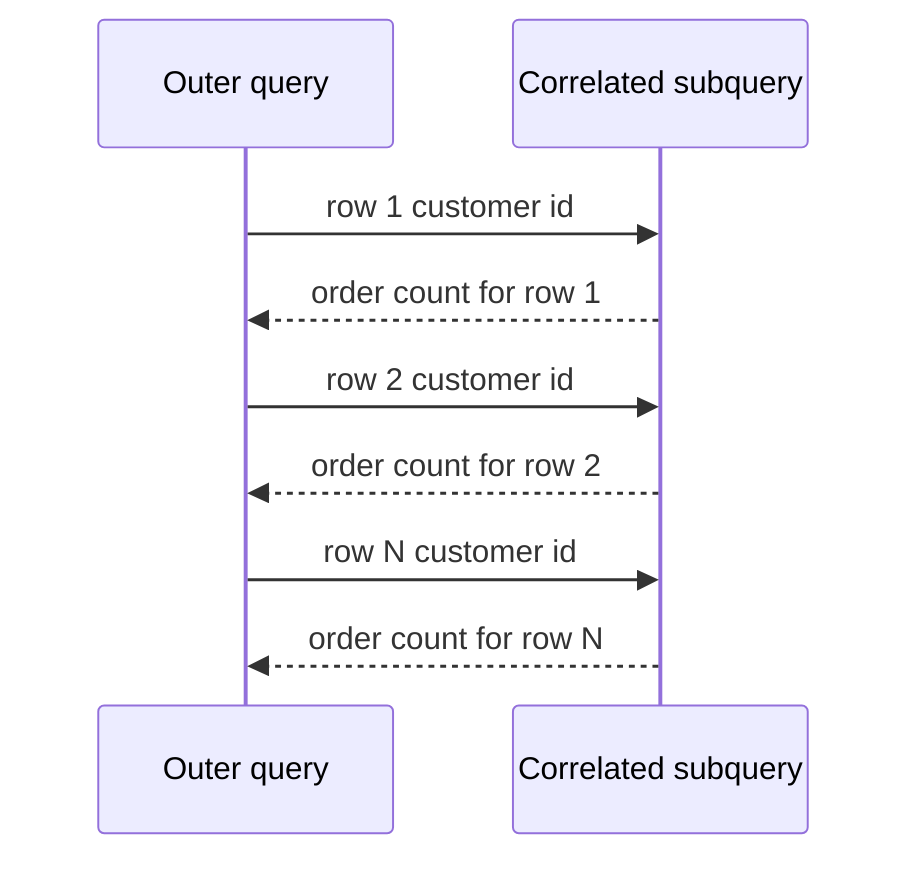

# Lecture 2 — Subqueries: scalar, IN, ANY/ALL, EXISTS, and correlated

> **Duration:** ~2 hours. **Outcome:** You can drop a query inside another query in every legal position — as a single value, as a list, as a truth test — and you can tell an *independent* subquery from a *correlated* one (the query that re-runs per outer row) and reason about which one the planner prefers.

A subquery is just a `SELECT` wrapped in parentheses and used inside another statement. That is the whole syntax. The skill is knowing **what shape** each position demands — one value, one column, or merely "does a row exist?" — and recognising when a subquery secretly depends on the outer query (a *correlated* subquery), because that changes both its meaning and its performance.

All examples run against `crunch_shop` (see `exercises/README.md`).

## 1. Three shapes of subquery

A subquery returns a result set, but the surrounding context decides how many rows and columns are *allowed*:

| Shape | Returns | Legal where a … is expected |
|-------|---------|-----------------------------|
| **Scalar** | exactly one row, one column | value: `SELECT`, `WHERE x = (…)`, an expression |
| **Row/column (list)** | one column, many rows | `WHERE x IN (…)`, `x = ANY (…)` |
| **Table** | many rows, many columns | `FROM (…) AS t`, a join |
| **Existence** | rows or no rows (values ignored) | `WHERE EXISTS (…)` |

Give the wrong shape and the engine complains: a scalar context that gets two rows back throws `more than one row returned by a subquery used as an expression`. Matching shape to position is 90% of getting subqueries right.

## 2. Scalar subqueries — one value, dropped anywhere a value fits

A scalar subquery returns a single value, so it can stand wherever a literal could. The classic use is comparing each row against a table-wide aggregate:

```sql
-- products priced above the overall average price
SELECT name, price
FROM products
WHERE price > (SELECT AVG(price) FROM products)
ORDER BY price DESC;
```

The inner `SELECT AVG(price) FROM products` runs **once**, produces one number, and the outer query compares every row against it. This is *not* correlated — the subquery does not mention the outer query at all, so the planner evaluates it a single time.

A scalar subquery also works in the `SELECT` list:

```sql
SELECT c.full_name,
       (SELECT COUNT(*) FROM orders o WHERE o.customer_id = c.customer_id) AS order_count
FROM customers c;
```

Here the subquery *does* reference `c.customer_id` from the outer row — so it is **correlated** and conceptually runs once per customer. Hold that thought for section 6; it is the single most important idea in this lecture.

> **Guard the "one value" contract.** If a scalar subquery might return more than one row, the statement fails at runtime. Add `LIMIT 1` with an `ORDER BY` when you genuinely want "the top one," or fix the query so it can only produce one row.

## 3. IN — membership in a list

`x IN (subquery)` is true when `x` equals *any* value the subquery returns. The subquery must be a single column.

```sql
-- customers who have placed at least one refunded order
SELECT full_name
FROM customers
WHERE customer_id IN (SELECT customer_id
                      FROM orders
                      WHERE status = 'refunded');
```

`NOT IN` is the negation — but it hides a genuinely dangerous NULL trap:

```sql
-- DANGER: if the subquery returns even ONE NULL customer_id,
-- this returns ZERO rows, silently.
SELECT full_name
FROM customers
WHERE customer_id NOT IN (SELECT customer_id FROM orders);
```

Why: `NOT IN` is defined in terms of `<>` against every value, and `x <> NULL` is `UNKNOWN`, never `TRUE`. One NULL in the list poisons the whole test to `UNKNOWN`, so no row qualifies. This bites people constantly. **Prefer `NOT EXISTS`** (section 5), which has no such NULL pathology, or filter the NULLs out explicitly (`WHERE customer_id IS NOT NULL`).

## 4. ANY and ALL — compare against every element

`IN` is really shorthand for `= ANY`. The general form pairs any comparison operator with `ANY` (true if it holds for *at least one* value) or `ALL` (true if it holds for *every* value):

```sql
-- products more expensive than EVERY product in category 3
SELECT name, price
FROM products
WHERE price > ALL (SELECT price FROM products WHERE category_id = 3);

-- products at least as expensive as SOME product in category 3
SELECT name, price
FROM products
WHERE price >= ANY (SELECT price FROM products WHERE category_id = 3);
```

| Written | Equivalent meaning |
|---------|--------------------|
| `x = ANY (s)` | `x IN (s)` |
| `x <> ALL (s)` | `x NOT IN (s)` |
| `x > ALL (s)` | `x` greater than the maximum of `s` |
| `x > ANY (s)` | `x` greater than the minimum of `s` |

`ANY`/`ALL` inherit the same NULL caution as `IN`/`NOT IN` — a NULL in `s` can make `> ALL` return `UNKNOWN`. When in doubt, an aggregate (`> (SELECT MAX(price) …)`) is often clearer *and* NULL-safe.

## 5. EXISTS — "does at least one row exist?"

`EXISTS (subquery)` is a pure truth test: it returns `TRUE` the moment the subquery produces **one** row, and it never looks at the values. Because of that, the convention is `SELECT 1` inside — the projected value is irrelevant.

```sql
-- customers who have ordered at least once
SELECT c.full_name
FROM customers c
WHERE EXISTS (SELECT 1
              FROM orders o
              WHERE o.customer_id = c.customer_id);
```

The subquery references `c.customer_id`, so `EXISTS` is almost always correlated. Its mirror, `NOT EXISTS`, is the safe way to ask "which rows have *no* match":

```sql
-- products that have NEVER been ordered
SELECT p.name
FROM products p
WHERE NOT EXISTS (SELECT 1
                  FROM order_items oi
                  WHERE oi.product_id = p.product_id);
```

### EXISTS vs IN — how to choose

| | `IN (subquery)` | `EXISTS (correlated subquery)` |
|--|-----------------|-------------------------------|
| Reads best when | the subquery is a simple, independent list | you're checking a relationship to the outer row |
| NULL behaviour | `NOT IN` is unsafe with NULLs | `NOT EXISTS` is always safe |
| Performance | planner may materialise the list once | planner can stop at the first match per outer row |

In PostgreSQL the planner often rewrites `IN` and `EXISTS` into the *same* semi-join plan, so for simple cases performance is a wash — choose whichever reads more clearly. The hard rule is: **when negating, reach for `NOT EXISTS`, not `NOT IN`.**

## 6. Correlated subqueries — the one that runs per row

An **independent** (non-correlated) subquery can be evaluated on its own; it never mentions the outer query. A **correlated** subquery references a column from the outer query, so — conceptually — it re-executes once for every outer row, with that row's values plugged in.

Spot the correlation by looking for an outer-table reference inside the subquery:

```sql
-- customers whose order count is above the AVERAGE order count per customer
SELECT c.full_name,
       (SELECT COUNT(*) FROM orders o WHERE o.customer_id = c.customer_id) AS orders
FROM customers c
WHERE (SELECT COUNT(*) FROM orders o WHERE o.customer_id = c.customer_id)
      > (SELECT COUNT(*) * 1.0 / COUNT(DISTINCT customer_id) FROM orders);
```

The first two subqueries mention `c.customer_id` → **correlated**, run per customer. The third (the average) mentions nothing outer → **independent**, run once.


*A correlated subquery conceptually re-runs once per outer row, using that row's values.*

A very common correlated pattern is "the latest child per parent":

```sql
-- each customer's most recent order date
SELECT c.full_name,
       (SELECT MAX(o.order_date)
        FROM orders o
        WHERE o.customer_id = c.customer_id) AS last_order
FROM customers c;
```

### The cost, and the honest caveat

The conceptual model is "runs once per outer row," and if you take it literally a correlated subquery over a million-row outer table sounds terrifying. In practice, modern planners (PostgreSQL especially) frequently **de-correlate** these into a single join or a grouped subquery, so the naive N×M blow-up often does not happen. But not always — a correlated subquery buried in a `SELECT` list, or one the planner cannot rewrite, really can run N times. Two rules of thumb:

1. If you can express the same thing as a **join + GROUP BY**, or (Week 8) a **window function**, benchmark it — that form is often faster and clearer.
2. When a query is slow, run `EXPLAIN` (Week 7) and look for a subplan marked as running many times. Do not guess.

Correlated subqueries are not "bad" — `EXISTS` is one and it is often the *best* choice. They are simply the case where you must know whether the engine runs the inner query once or many times.

## 7. Subqueries in FROM (derived tables)

A subquery in the `FROM` clause is a **derived table**: a throwaway result set you can join and filter like any table. It must be aliased.

```sql
-- rank countries by revenue, using a derived table to pre-aggregate
SELECT country, revenue
FROM (
    SELECT c.country,
           SUM(oi.quantity * oi.unit_price) AS revenue
    FROM orders o
    JOIN customers   c  ON c.customer_id = o.customer_id
    JOIN order_items oi ON oi.order_id  = o.order_id
    WHERE o.status = 'paid'
    GROUP BY c.country
) AS by_country
WHERE revenue > 1000
ORDER BY revenue DESC;
```

Derived tables let you aggregate first and then filter/join the *result* — the same job a CTE does with better readability, which is exactly where Lecture 3 picks up. Note that you can filter the aggregate here with a plain `WHERE revenue > 1000` because, to the outer query, `revenue` is just a column of the derived table.

## 8. Check yourself

- Name the four subquery shapes and one legal position for each.
- Why does `x NOT IN (subquery)` return no rows when the subquery contains a NULL? What should you use instead?
- Rewrite `WHERE price = ANY (SELECT …)` using a keyword you already know.
- How do you tell, by looking, whether a subquery is correlated?
- `EXISTS (SELECT 1 …)` — why `1` and not `*` or a column name? (Does it matter to the engine?)
- Give one query that is clearer as a correlated subquery and one that is clearer as a join + GROUP BY.
- What must every subquery in the `FROM` clause have that a subquery in `WHERE` does not need?

If you can answer all seven, move to Lecture 3 — CTEs.

## Further reading

- **PostgreSQL 16 — Subquery Expressions (`IN`, `ANY`, `ALL`, `EXISTS`):** <https://www.postgresql.org/docs/16/functions-subquery.html>
- **PostgreSQL 16 — Scalar Subqueries:** <https://www.postgresql.org/docs/16/sql-expressions.html#SQL-SYNTAX-SCALAR-SUBQUERIES>
- **SQLite — Subquery expressions & the `IN`/`EXISTS` operators:** <https://www.sqlite.org/lang_expr.html#the_in_and_not_in_operators>
