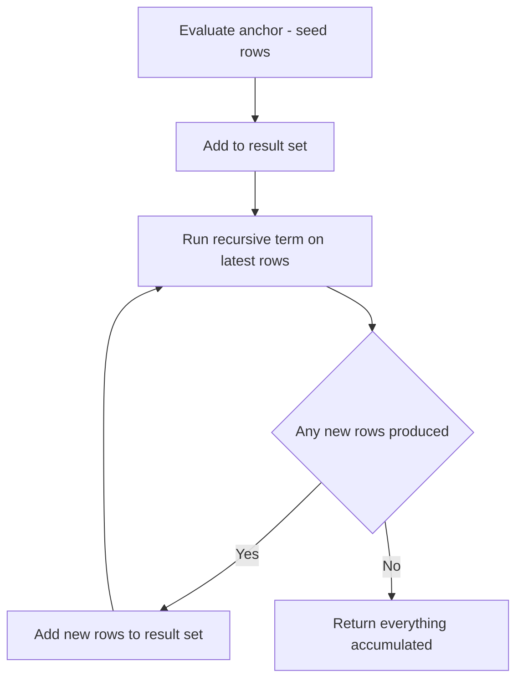
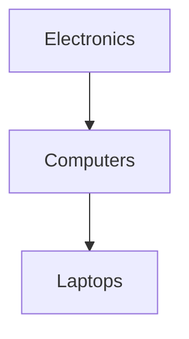

# Lecture 3 — Common Table Expressions (WITH), chaining, and recursion

> **Duration:** ~2 hours. **Outcome:** You can lift a subquery out into a named `WITH` block, chain several CTEs so each reads from the last, decide when a CTE is a *fence* the planner won't optimise across, and write a **recursive CTE** to walk a hierarchy (a category tree, an org chart) to any depth.

Everything a CTE does, you could technically do with nested subqueries. The point of a CTE is **readability**: it lets you name an intermediate result and build a query as a top-to-bottom pipeline instead of an inside-out nest. And recursive CTEs do something plain subqueries *cannot* — traverse a self-referencing hierarchy of unknown depth. This lecture covers both.

All examples run against `crunch_shop` (see `exercises/README.md`), whose `categories` and `employees` tables are deliberately self-referencing so we can recurse over them.

## 1. What a CTE is

A **Common Table Expression** is a named, temporary result set that exists only for the duration of one statement. You define it with `WITH`, then `SELECT` from it as if it were a table:

```sql
WITH paid_lines AS (
    SELECT o.customer_id,
           oi.quantity * oi.unit_price AS line_total
    FROM orders o
    JOIN order_items oi ON oi.order_id = o.order_id
    WHERE o.status = 'paid'
)
SELECT customer_id,
       SUM(line_total) AS revenue
FROM paid_lines
GROUP BY customer_id
ORDER BY revenue DESC;
```

`paid_lines` is defined once and queried below. Compare it to the derived-table version from Lecture 2: same result, but the logic reads **top to bottom** instead of inside-out. On a two-line query the win is small; on a ten-join analytics query it is the difference between maintainable and unreadable.

## 2. Chaining CTEs — a pipeline of named steps

You can define several CTEs in one `WITH`, separated by commas, and **each may reference the ones defined before it.** This is how you decompose a gnarly query into legible stages:

```sql
WITH paid_lines AS (
    SELECT o.customer_id,
           oi.quantity * oi.unit_price AS line_total
    FROM orders o
    JOIN order_items oi ON oi.order_id = o.order_id
    WHERE o.status = 'paid'
),
per_customer AS (                         -- reads from paid_lines
    SELECT customer_id,
           SUM(line_total) AS revenue,
           COUNT(*)        AS lines
    FROM paid_lines
    GROUP BY customer_id
),
ranked AS (                               -- reads from per_customer
    SELECT customer_id,
           revenue,
           AVG(revenue) OVER () AS avg_revenue   -- window fn: preview of Week 8
    FROM per_customer
)
SELECT c.full_name,
       r.revenue,
       ROUND(r.avg_revenue, 2) AS avg_revenue
FROM ranked r
JOIN customers c ON c.customer_id = r.customer_id
WHERE r.revenue > r.avg_revenue           -- above-average customers only
ORDER BY r.revenue DESC;
```

Read it as a data pipeline: raw paid lines → totals per customer → attach the average → keep the above-average ones. Each stage has a name, so you (and the next engineer) can reason about one step at a time. This decomposition is precisely the skill the week's mini-project rewards.

**Style rule:** name CTEs after *what they contain* (`paid_lines`, `per_customer`), never after *what step number* they are (`step1`, `t2`). The names are documentation.

## 3. The "optimisation fence" caveat — know your engine

Here is a subtlety that separates people who *use* CTEs from people who *understand* them.

Historically, PostgreSQL treated every CTE as an **optimisation fence**: it materialised the CTE's full result into a temporary work area before the outer query ran, and never pushed the outer query's `WHERE` conditions down into it. That could make a CTE dramatically slower than the equivalent subquery, because filters that *could* have run early instead ran late over the whole intermediate set.

**As of PostgreSQL 12**, this changed. A CTE that is (a) referenced only once and (b) not recursive and (c) side-effect-free is **inlined** by default — folded into the outer query and optimised together, just like a subquery. You can override the planner in either direction:

```sql
WITH recent AS MATERIALIZED   ( … )   -- force the old fence behaviour
WITH recent AS NOT MATERIALIZED ( … )   -- force inlining
```

| Engine | CTE optimisation behaviour |
|--------|----------------------------|
| PostgreSQL ≤ 11 | always materialised (a fence) — can be slow |
| PostgreSQL 12+ | inlined when referenced once; `MATERIALIZED` / `NOT MATERIALIZED` to control |
| SQLite | may flatten a CTE into the outer query; `MATERIALIZED` hints supported 3.35+ |

The practical takeaway: on modern Postgres you can reach for CTEs freely for readability **without** a performance penalty in the common case — but if a CTE-based query is mysteriously slow, remember the fence, check the version, and try `NOT MATERIALIZED` or rewriting as a subquery. This is a Week-7 (`EXPLAIN`) diagnosis; for now, just know the concept exists.

## 4. Recursive CTEs — walking a hierarchy

Self-referencing data — a category with a `parent_id`, an employee with a `manager_id` — forms a **tree** (or general graph) of unknown depth. You cannot flatten "all descendants of category X" with a fixed number of joins, because you don't know how deep it goes. A **recursive CTE** solves exactly this.

The shape is always the same. `WITH RECURSIVE name AS (...)` where the body is two queries joined by `UNION ALL`:

```
WITH RECURSIVE walk AS (
    <anchor>          -- the seed: the starting row(s), runs once
    UNION ALL
    <recursive term>  -- reads from `walk`, produces the next level, repeats
)
SELECT ... FROM walk;
```

The engine runs it as a loop:

| Step | What happens |
|-----:|--------------|
| 1 | Evaluate the **anchor**. Those rows go into `walk` *and* into a working set. |
| 2 | Run the **recursive term**, joining the working set against the base table to get the next level. |
| 3 | Add the new rows to `walk`; they become the next working set. |
| 4 | Repeat step 2–3 until the recursive term returns **no new rows**. |
| 5 | Return everything accumulated in `walk`. |


*A recursive CTE loops between the recursive term and the growing result set until no new rows appear.*

### Example: all descendants of a category

Suppose `categories` has `Electronics → Computers → Laptops`, each linked by `parent_id`. To list the whole subtree under `Electronics`:


*A category tree - the recursive CTE walks from Electronics down to Laptops one level at a time.*

```sql
WITH RECURSIVE subtree AS (
    -- anchor: the starting category
    SELECT category_id, name, parent_id, 0 AS depth
    FROM categories
    WHERE name = 'Electronics'

    UNION ALL

    -- recursive term: children of anything already in subtree
    SELECT c.category_id, c.name, c.parent_id, s.depth + 1
    FROM categories c
    JOIN subtree s ON c.parent_id = s.category_id
)
SELECT repeat('  ', depth) || name AS tree, depth
FROM subtree
ORDER BY depth, name;
```

`depth` is a counter we carry down each level — handy for indenting the output and for the loop-guard below. The `repeat('  ', depth) || name` trick renders an indented tree (in SQLite use `printf`/string concatenation with `||`).

### Example: an org chart (walking *up*)

Recursion works upward too — find every manager above an employee by following `manager_id`:

```sql
WITH RECURSIVE chain_of_command AS (
    SELECT employee_id, full_name, manager_id, 0 AS level
    FROM employees
    WHERE full_name = 'Dana Ito'          -- start from one employee

    UNION ALL

    SELECT e.employee_id, e.full_name, e.manager_id, coc.level + 1
    FROM employees e
    JOIN chain_of_command coc ON e.employee_id = coc.manager_id  -- climb to the manager
)
SELECT level, full_name
FROM chain_of_command
ORDER BY level;
```

Swap the join condition (`e.parent = current` vs `e.id = current.parent`) and you flip between walking *down* to descendants and *up* to ancestors. That single line is the whole difference.

### The rule you must never forget: guard against infinite loops

If the data has a cycle — category A's parent is B and B's parent is A — a naive recursive CTE **loops forever** (or until it exhausts memory). Two defences:

1. **A depth cap.** Carry the `depth`/`level` counter and stop:
   ```sql
   ... JOIN subtree s ON c.parent_id = s.category_id
   WHERE s.depth < 20        -- never recurse deeper than 20 levels
   ```
2. **Cycle detection.** PostgreSQL 14+ has a first-class `CYCLE` clause:
   ```sql
   WITH RECURSIVE subtree AS ( ... )
   CYCLE category_id SET is_cycle USING path
   SELECT ...;
   ```
   It tracks the visited path and marks a row when it would revisit a node, so you can stop. On SQLite (no `CYCLE` clause), the depth cap is your tool.

> **Always ship a recursive CTE with a loop guard** — a depth cap at minimum — even when you *believe* the data is a clean tree. Bad data is the norm, not the exception, and a runaway recursive query can take a production database down.

### UNION vs UNION ALL in recursion

Use `UNION ALL` (fast, no dedup) when the tree structure guarantees each node is reached once. Use `UNION` (deduplicates each iteration) when a node might be reached by multiple paths and you want it once — but be aware `UNION`'s per-step dedup does **not** by itself prevent an infinite cycle in truly cyclic data; you still want a guard.

## 5. When NOT to use a CTE

- A trivial one-liner rarely needs a CTE; it can add noise.
- If you need the *same* intermediate result across *several* statements, a CTE won't help — it lives for one statement only. Use a `VIEW` (Week 9) or a temp table.
- For "top-N per group" and running totals, a **window function** (Week 8) is usually cleaner than a CTE full of correlated subqueries — though the two combine beautifully, as the chaining example above hinted.

## 6. Check yourself

- What is the scope/lifetime of a CTE — how long does the name exist?
- In a chained `WITH a AS (…), b AS (…)`, can `a` reference `b`? Can `b` reference `a`?
- What did "optimisation fence" mean, and what changed in PostgreSQL 12?
- Name the two required parts of a recursive CTE and the operator between them.
- In the org-chart example, which single line would you change to walk *down* to subordinates instead of *up* to managers?
- Give two independent ways to stop a recursive CTE from looping forever on cyclic data.
- When is a window function (Week 8) a better tool than a CTE, and when do you use both together?

Answer all seven, then start the exercises.

## Further reading

- **PostgreSQL 16 — WITH Queries (Common Table Expressions):** <https://www.postgresql.org/docs/16/queries-with.html>
- **PostgreSQL 16 — Recursive Queries & the `CYCLE` clause:** <https://www.postgresql.org/docs/16/queries-with.html#QUERIES-WITH-RECURSIVE>
- **SQLite — WITH clause and RECURSIVE:** <https://www.sqlite.org/lang_with.html>
