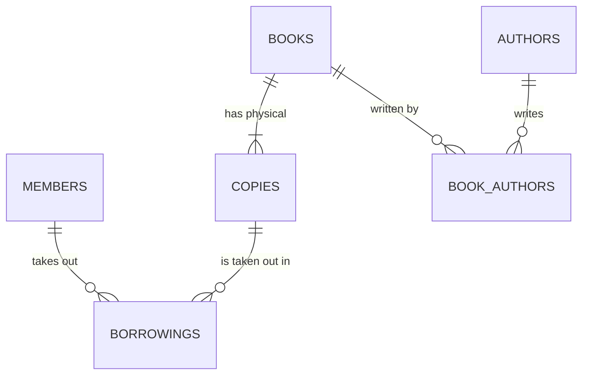

# Exercise 1 — Draw an ER Model

**Goal:** Turn a written domain description into an entity-relationship diagram — entities, attributes, keys, relationships, and cardinality — including the junction table that the many-to-many relationship requires. You produce a diagram, not SQL; SQL comes in Exercise 3.

**Estimated time:** 40 minutes.

## The domain (read twice)

You are modeling a small public library.

> A **member** has a name, an email (unique), and a join date. A **book** has a title, an ISBN (unique), and a publication year; the library owns one or more physical **copies** of each book, and each copy has a barcode (unique) and a shelf location. A member can **borrow** many copies over time, and any copy can be borrowed by many different members over its life; each borrowing records the date it was taken out and the date it was returned (which is empty while the book is still out). Each book has one or more **authors**, and an author may have written many books.

## Your task

Produce an ER diagram (Mermaid text is perfect, or Excalidraw/draw.io/paper-and-camera) that captures every entity, its attributes, its key(s), and every relationship with correct cardinality.

Work in these steps and record each in `er-model.md`:

1. **List the entities.** (Hint: five nouns carry data. One of them exists only to resolve a many-to-many.)
2. **List each entity's attributes**, and mark the **primary key** (surrogate or natural — your call, but justify it) and any **alternate/unique keys**.
3. **List the relationships** as sentences, and label each with its cardinality: 1:1, 1:N, or M:N.
4. **Resolve every M:N** into a junction table. Name it, and decide what (if any) attributes belong *on the relationship* rather than on either entity.
5. **Draw it.** Boxes for entities, lines with crow's-foot ends (or Mermaid `||--o{` style) for relationships.

## Expected result

Your diagram should have at least **six** tables once M:N relationships are resolved: `members`, `books`, `copies`, `authors`, plus **two junction tables** (one for member↔copy borrowings, one for book↔author). A model that has fewer than two junction tables has missed a many-to-many — go back and find it.

A correct Mermaid skeleton looks like this (fill in and correct the attributes yourself — this is a partial hint, not the answer):

For each relationship, write one sentence justifying the cardinality you chose. For example: *"member→borrowing is 1:N because one member can have many borrowings but each borrowing belongs to exactly one member."*

## Done when…

- [ ] `er-model.md` lists all entities with attributes, PKs, and any UNIQUE keys.
- [ ] Both many-to-many relationships (member↔copy, book↔author) are resolved into **named junction tables**.
- [ ] The borrowing junction carries the relationship attributes `borrowed_on` and `returned_on` (they belong to the *pairing*, not to member or copy).
- [ ] Every relationship line is annotated with cardinality, and each has a one-sentence justification.
- [ ] The diagram renders (if Mermaid) or is legible (if drawn), showing at least six boxes.

## Stretch

- The spec says a copy "can be borrowed by many members **over its life**" — but only by **one member at a time**. Does your model prevent two *open* (un-returned) borrowings on the same copy simultaneously? Sketch how a `UNIQUE` or `EXCLUDE` constraint could enforce "one active loan per copy". (You'll build this kind of constraint in Exercise 3.)
- Add a `fine` concept: an overdue borrowing accrues a fine. Where does `fine_amount` live — on `borrowings`, or a new entity? Justify.

## Submission

Commit `er-model.md` (and any image export) to `c33-week-04/exercise-01/`.
