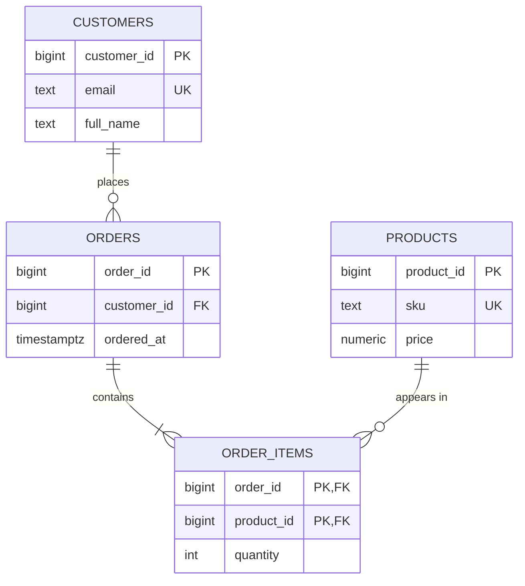

# Lecture 1 — Keys, Relationships, and ER Modeling

> **Duration:** ~2 hours. **Outcome:** You can name and choose every kind of key (primary, candidate, surrogate vs. natural, foreign), model the three relationship cardinalities (1:1, 1:N, M:N) including the junction table that M:N requires, and sketch an entity-relationship diagram that a teammate could turn into `CREATE TABLE`s.

For three weeks you have *queried* schemas other people designed. This week you flip sides of the table: you become the person who decides what tables exist, what columns they hold, and how they connect. Get the model right and every future query is short and correct. Get it wrong and you spend the rest of the project papering over the mistake with `DISTINCT`, defensive `WHERE` clauses, and cleanup scripts.

A data model is a set of promises about your data: *this value is unique*, *this row must point at a real customer*, *an order can't exist without a customer*. Keys and relationships are how you write those promises down so the database enforces them for you — 24/7, across every application, forever. That is the whole game.

## 1. Entities, attributes, and relationships

Before keys, the vocabulary.

- **Entity** — a thing you store data *about*: a customer, an order, a product, a payment. In a relational database, one entity type becomes one **table**; one instance becomes one **row**.
- **Attribute** — a property of an entity: a customer's email, an order's total. Becomes a **column**.
- **Relationship** — a meaningful association between entities: a customer *places* an order; an order *contains* products.

The craft of modeling is (1) list your entities, (2) list each entity's attributes, (3) draw the relationships and their cardinality, then (4) translate to tables and keys. Sections 2–5 give you the tools; Section 6 does a full worked example.

A quick rule of thumb: **entities are usually nouns; relationships are usually verbs.** "A *customer* *places* an *order*" → two entities (customer, order) and one relationship (places).

## 2. Keys — the vocabulary that trips people up

A **key** is a column, or set of columns, used to identify rows. The word gets overloaded, so learn the exact terms.

| Term | Definition | Example |
|------|------------|---------|
| **Superkey** | Any set of columns that uniquely identifies a row (may include extras). | `(customer_id, email)` — unique, but `email` is redundant |
| **Candidate key** | A *minimal* superkey — remove any column and it stops being unique. | `email`, or `customer_id` — each alone identifies a customer |
| **Primary key (PK)** | The one candidate key you *choose* to be the row's official identity. NOT NULL + unique. | `customer_id` |
| **Alternate key** | A candidate key you did *not* pick as PK (still enforce it `UNIQUE`). | `email` |
| **Foreign key (FK)** | A column that references the PK of another (or the same) table. | `orders.customer_id` → `customers.customer_id` |
| **Composite key** | Any key made of *more than one* column. | `(order_id, product_id)` in an order-line table |

The two ideas that matter most: a table can have **several candidate keys** but exactly **one primary key**, and a foreign key is how one table *points at* another.

### Natural vs. surrogate keys

A **natural key** is a real-world attribute that is already unique: an email address, an ISBN, a US Social Security Number, a country's ISO code. A **surrogate key** is a meaningless identifier you invent purely to be the PK — an auto-incrementing integer, or a UUID — that carries no business meaning.

| | Natural key | Surrogate key |
|---|-------------|---------------|
| Source | Real-world attribute | Generated by the DB |
| Example | `email`, `isbn`, `country_code` | `id BIGINT GENERATED ALWAYS AS IDENTITY`, `uuid` |
| Pro | No extra column; human-readable | Never changes; compact; joins are fast |
| Con | Can change (people change email); may be large; privacy-sensitive | Meaningless; needs a UNIQUE constraint on the *real* key too |

**The senior default: use a surrogate PK, and still put a `UNIQUE` constraint on the natural key.** Why? Because real-world "unique" values change (someone's email changes; a country renames itself) and if that value is your PK, every foreign key pointing at it must change too — a cascading nightmare. A surrogate `id` is stable forever. But you must *still* enforce the natural key's uniqueness with `UNIQUE`, or you'll get duplicate customers with different `id`s.

In PostgreSQL 16 the modern way to declare a surrogate key is the SQL-standard identity column:

```sql
CREATE TABLE customers (
    customer_id BIGINT GENERATED ALWAYS AS IDENTITY PRIMARY KEY,
    email       TEXT NOT NULL UNIQUE,          -- the natural key, still enforced
    full_name   TEXT NOT NULL
);
```

`GENERATED ALWAYS AS IDENTITY` is preferred over the old `SERIAL` pseudo-type (which creates a separate sequence and has surprising ownership/permission quirks). In **SQLite**, the equivalent surrogate is a column typed `INTEGER PRIMARY KEY`, which aliases the internal `rowid` and auto-increments:

```sql
CREATE TABLE customers (
    customer_id INTEGER PRIMARY KEY,          -- auto-increments in SQLite
    email       TEXT NOT NULL UNIQUE,
    full_name   TEXT NOT NULL
);
```

### What makes a *good* primary key

1. **Unique** — by definition.
2. **Not NULL** — a PK can never be NULL (enforced automatically).
3. **Stable** — its value should never need to change. (This is why natural keys make risky PKs.)
4. **Minimal** — as few columns as will do the job.

## 3. Foreign keys — the glue

A foreign key says: "the value in *this* column must exist as a primary key over *there*." It is the database enforcing **referential integrity** — the guarantee that you never have an order pointing at a customer who doesn't exist (an "orphan" row).

```sql
CREATE TABLE orders (
    order_id    BIGINT GENERATED ALWAYS AS IDENTITY PRIMARY KEY,
    customer_id BIGINT NOT NULL REFERENCES customers(customer_id),
    ordered_at  TIMESTAMPTZ NOT NULL DEFAULT now()
);
```

With that constraint in place, `INSERT INTO orders (customer_id) VALUES (999999)` fails if no customer `999999` exists. You cannot create the orphan. That is a *promise the schema keeps for you*, no matter how buggy the app is.

The **referenced** column must be a PK or have a `UNIQUE` constraint — the database has to be able to find *exactly one* matching row. The **referencing** column should almost always share the referenced column's type (both `BIGINT` here).

> **SQLite gotcha:** foreign key enforcement is **off by default** for backward compatibility. You must run `PRAGMA foreign_keys = ON;` at the start of *every* connection, or SQLite will happily let you insert orphans. PostgreSQL enforces FKs always.

We cover `ON DELETE` / `ON UPDATE` referential actions (CASCADE, SET NULL, RESTRICT) in Lecture 3 — they decide what happens to the children when a parent is deleted.

## 4. Relationships and cardinality

Cardinality answers: *how many* of A relate to *how many* of B? There are three shapes.

### 1:1 — one-to-one

Each row in A relates to at most one row in B and vice versa. Genuinely rare; usually a sign the two tables could be one. Legitimate uses: splitting off rarely-used or sensitive columns (a `users` table and a `user_secrets` table), or extending a table you don't own.

Implement it by putting a FK that is *also* `UNIQUE` on one side:

```sql
CREATE TABLE user_profiles (
    user_id BIGINT PRIMARY KEY REFERENCES users(user_id),   -- PK doubles as FK → forces 1:1
    bio     TEXT,
    avatar_url TEXT
);
```

Because `user_id` is the PK of `user_profiles`, each user can appear at most once. Result: one profile per user, at most.

### 1:N — one-to-many

The workhorse. One row in A relates to many rows in B; each B belongs to one A. A customer has many orders; each order belongs to one customer. **Implement it by putting the FK on the "many" side.**

```
customers (1) ──< (N) orders
```

`orders.customer_id` points back at `customers`. There is no array, no list — the "many" is expressed by *many rows in `orders` sharing the same `customer_id`*. This is the single most common relationship in every real schema.

### M:N — many-to-many

Many A relate to many B. A student enrolls in many courses; a course has many students. A product appears in many orders; an order contains many products. **A relational table cannot express M:N directly** — there is nowhere to put "many" FKs. You resolve it with a third table: the **junction table** (also called an associative, bridge, or join table).

```
students (1) ──< (N) enrollments (N) >── (1) courses
```

```sql
CREATE TABLE enrollments (
    student_id BIGINT NOT NULL REFERENCES students(student_id),
    course_id  BIGINT NOT NULL REFERENCES courses(course_id),
    enrolled_at DATE NOT NULL DEFAULT CURRENT_DATE,
    grade      TEXT,
    PRIMARY KEY (student_id, course_id)        -- composite PK: one enrollment per (student, course)
);
```

Two things to notice:

1. The junction table turns one M:N into **two 1:N** relationships (students→enrollments, courses→enrollments). That is *always* how M:N is implemented.
2. The **composite primary key** `(student_id, course_id)` prevents a student from enrolling in the same course twice, and gives you a natural place to hang *relationship attributes* like `enrolled_at` and `grade` — data that belongs to the *pairing*, not to either entity alone.

| Cardinality | Where the FK goes | Example |
|-------------|-------------------|---------|
| 1:1 | On either side, made `UNIQUE` (often the PK) | user ↔ profile |
| 1:N | On the "many" side | customer → orders |
| M:N | In a junction table (two FKs, composite PK) | students ↔ courses |

## 5. ER diagrams — drawing the model

An **entity-relationship diagram (ERD)** is the picture of all this. You draw entities as boxes, attributes inside them, and relationships as lines between boxes, annotated with cardinality. Two notations dominate:

- **Chen notation** — entities are rectangles, relationships are diamonds, attributes are ovals. Academic, verbose, good for teaching.
- **Crow's-foot notation** — entities are boxes with an attribute list; the *ends* of the connecting lines carry symbols showing cardinality. This is what practitioners actually use.

Crow's-foot line-endings you must recognize:

| Symbol at line end | Meaning |
|--------------------|---------|
| `┃` (single bar) | exactly **one** |
| `○` (circle) | **zero** (optional) |
| `<` (crow's foot) | **many** |
| `○<` | zero or many |
| `┃<` | one or many |
| `┃┃` | exactly one (and mandatory) |

So a line reading `customers ┃───○< orders` means: each order belongs to exactly one customer (the `┃` end at customers), and a customer has zero or many orders (the `○<` end at orders).

You can write ER diagrams as text with **Mermaid**, which renders on GitHub and in many editors:



Read the relationship lines: `||--o{` is "one to zero-or-many"; `||--|{` is "one to one-or-many". `PK` = primary key, `FK` = foreign key, `UK` = unique (alternate) key. `ORDER_ITEMS` is the junction table resolving the M:N between `ORDERS` and `PRODUCTS`, and its composite PK is `(order_id, product_id)`.

## 6. A full worked example — a small e-commerce model

Let's model a tiny store, end to end, so you see the whole pipeline.

**Requirements (the spec):** Customers place orders. An order is made by exactly one customer and contains one or more products, each with a quantity. Products have a SKU, a name, and a price. We must be able to store the price *at the time of the order*, because product prices change.

**Step 1 — entities:** `customer`, `order`, `product`. Plus the junction we'll need for the order↔product M:N: `order_item`.

**Step 2 — attributes:** listed in the tables below.

**Step 3 — relationships & cardinality:**
- customer → order is **1:N** (a customer places many orders; each order has one customer).
- order ↔ product is **M:N** (an order has many products; a product is in many orders) → junction table `order_item`.

**Step 4 — translate to tables + keys:**

```sql
CREATE TABLE customers (
    customer_id BIGINT GENERATED ALWAYS AS IDENTITY PRIMARY KEY,
    email       TEXT NOT NULL UNIQUE,
    full_name   TEXT NOT NULL
);

CREATE TABLE products (
    product_id  BIGINT GENERATED ALWAYS AS IDENTITY PRIMARY KEY,
    sku         TEXT   NOT NULL UNIQUE,
    name        TEXT   NOT NULL,
    price       NUMERIC(10,2) NOT NULL CHECK (price >= 0)
);

CREATE TABLE orders (
    order_id    BIGINT GENERATED ALWAYS AS IDENTITY PRIMARY KEY,
    customer_id BIGINT NOT NULL REFERENCES customers(customer_id),
    ordered_at  TIMESTAMPTZ NOT NULL DEFAULT now()
);

CREATE TABLE order_items (
    order_id     BIGINT NOT NULL REFERENCES orders(order_id),
    product_id   BIGINT NOT NULL REFERENCES products(product_id),
    quantity     INT    NOT NULL CHECK (quantity > 0),
    price_at_sale NUMERIC(10,2) NOT NULL,      -- captured price, immune to later price changes
    PRIMARY KEY (order_id, product_id)
);
```

Notice how the "price at the time of the order" requirement forced a decision: we *copied* the price into `order_items.price_at_sale` rather than joining back to `products.price` at read time. That is a deliberate, correct redundancy — a historical fact that must not change when the product's price later changes. (We revisit "good redundancy vs. bad redundancy" as *denormalization* in Lecture 3; the difference is that this value records a *different fact*, not a duplicate of the same fact.)

That is a normalized four-table schema derived straight from a written spec — exactly the skill this week's challenges and mini-project test.

## 7. Common modeling mistakes (learn to smell these)

- **Comma-separated values in a column** — `tags = 'red,blue,green'`. This is an M:N pretending to be one column. It breaks the moment you try to query "all products tagged blue". Model it as a junction table.
- **No primary key** — a table without a PK lets duplicate rows accumulate silently. Every table gets a PK.
- **Natural key as PK when it can change** — email as PK, then the customer changes email, and every FK breaks. Use a surrogate.
- **A "many" modeled as repeated columns** — `phone1`, `phone2`, `phone3`. What about the fourth phone? This is a 1:N; give phones their own table.
- **The M:N with no junction table** — you literally cannot; if you find yourself wanting FKs on both sides, you need the third table.

Each of these is a normalization violation in disguise — which is precisely what Lecture 2 formalizes.

## 8. Check yourself

- What is the difference between a candidate key and the primary key?
- Give one concrete reason to prefer a surrogate key over a natural key — and one thing you must *still* do to the natural key.
- Where does the foreign key go in a 1:N relationship — on the "one" side or the "many" side?
- Why can't a plain relational table represent an M:N relationship, and what fixes it?
- In the junction table `enrollments(student_id, course_id, grade)`, why is `grade` there and not in `students` or `courses`?
- What does `PRAGMA foreign_keys = ON;` do, and why do you never need it in PostgreSQL?

If those are solid, Lecture 2 takes the *same* skill — spotting where data is duplicated or dependent on the wrong thing — and turns it into the formal ladder of normal forms.
