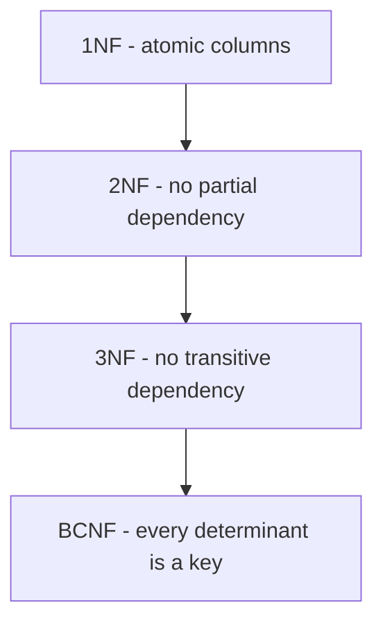

# Lecture 2 — Normalization: 1NF → 2NF → 3NF → BCNF

> **Duration:** ~2.5 hours. **Outcome:** You can take a messy, wide "everything in one table" design and normalize it step by step to Boyce-Codd Normal Form, naming the specific *anomaly* each step removes and the *functional dependency* that caused it.

Normalization is a *procedure*, discovered by Edgar Codd in the 1970s, for eliminating redundancy from a relational schema. Its promise: **every fact is stored exactly once, in exactly one place.** When that's true, you cannot get contradictory copies of the same fact, and you cannot lose a fact by accident. When it's false, your data slowly rots.

This lecture is the theoretical heart of the week. It is also the part students most often memorize without understanding. So we lead with *why* — the anomalies — before the *how*.

## 1. Why redundancy is dangerous: the three anomalies

Consider this deliberately bad table. One wide table storing courses, the instructor teaching each, and the instructor's department and office:

| student | course | instructor | instr_dept | instr_office | grade |
|---------|--------|------------|------------|--------------|-------|
| Alice | Databases | Dr. Chen | CS | Room 401 | A |
| Bob | Databases | Dr. Chen | CS | Room 401 | B |
| Alice | Networks | Dr. Ruiz | CS | Room 403 | A |
| Carol | Ethics | Dr. Okoye | PHIL | Room 210 | B |

"Dr. Chen is in CS, Room 401" is stored **twice**. That single redundancy creates three distinct failure modes:

1. **Update anomaly.** Dr. Chen moves to Room 402. You must update *every* row mentioning Dr. Chen. Miss one and the database now claims Chen is in two rooms at once. The data contradicts itself.
2. **Insertion anomaly.** You hire Dr. Novak and assign her Room 500, but she isn't teaching anyone yet. You *cannot record her office* — there's no row to put it in without inventing a fake student/course. Facts about instructors are held hostage by the existence of enrollments.
3. **Deletion anomaly.** Carol drops Ethics and you delete her row. That was the *only* row mentioning Dr. Okoye — so you just *lost the fact* that Dr. Okoye exists and works in PHIL/Room 210. Deleting an enrollment silently deleted an instructor.

Every normalization step exists to kill one or more of these. Keep this table in mind — we normalize it fully by the end.

## 2. The tool: functional dependencies

To reason about normalization precisely you need one concept: the **functional dependency (FD)**.

> `X → Y` ("X determines Y") means: for any two rows with the same value of X, they must have the same value of Y.

Read `A → B` as "A determines B" or "B depends on A". Examples from the table above:

- `instructor → instr_dept` — knowing the instructor tells you the department. (Chen ⇒ CS, always.)
- `instructor → instr_office` — knowing the instructor tells you the office.
- `(student, course) → grade` — a student's grade in a course is determined by *the pair*.
- `(student, course) → instructor` — which instructor taught that student that course.

A dependency is **partial** if it depends on only *part* of a composite key (e.g., `course → instructor` depends on just `course`, not the whole `(student, course)` key). It is **transitive** if it goes through a non-key column (e.g., `(student,course) → instructor → instr_dept`: department depends on the key only *via* instructor).

Normalization is, precisely, the act of reorganizing tables so that **every non-key column depends on the key, the whole key, and nothing but the key.** That one sentence *is* 2NF + 3NF, and people memorize it as "the key, the whole key, and nothing but the key, so help me Codd." Let's earn it one form at a time.

## 3. First Normal Form (1NF) — atomic values, no repeating groups

**Rule:** every column holds a single, atomic value; there are no repeating groups or arrays; each row is unique (there is a key).

Violations look like this:

| order_id | customer | items |
|----------|----------|-------|
| 1 | Alice | "2× widget, 1× gadget" |
| 2 | Bob | "3× sprocket" |

The `items` column packs a *list* into one cell. You cannot ask "how many widgets did we sell?" without string-parsing. Also a violation: repeating columns like `item1`, `item2`, `item3`.

**Fix:** one row per atomic fact. Give the list its own table (one row per item):

| order_id | customer |
|----------|----------|
| 1 | Alice |
| 2 | Bob |

| order_id | product | quantity |
|----------|---------|----------|
| 1 | widget | 2 |
| 1 | gadget | 1 |
| 2 | sprocket | 3 |

Now "how many widgets?" is `SELECT sum(quantity) WHERE product='widget'`. 1NF is the price of admission to relational querying: **the comma-separated-values column is the single most common real-world 1NF violation.**

## 4. Second Normal Form (2NF) — no partial dependencies

**Precondition:** already in 1NF. **Rule:** no non-key column depends on only *part* of a composite key. (If your PK is a single column, you are automatically in 2NF — partial dependency needs a *composite* key to be partial *of*.)

Consider an order-line table keyed on `(order_id, product_id)`:

| order_id | product_id | quantity | product_name | product_price |
|----------|-----------|----------|--------------|---------------|
| 1 | 10 | 2 | Widget | 9.99 |
| 1 | 11 | 1 | Gadget | 19.99 |
| 2 | 10 | 3 | Widget | 9.99 |

The key is `(order_id, product_id)`. Look at the FDs:

- `(order_id, product_id) → quantity` ✓ depends on the *whole* key (a line's quantity needs both).
- `product_id → product_name` ✗ **partial** — the name depends on `product_id` alone.
- `product_id → product_price` ✗ **partial** — same.

`product_name` and `product_price` are stored redundantly (Widget/9.99 appears in every line that includes product 10). That's the update anomaly again: change Widget's name in one line, contradict it in another.

**Fix:** split the partially-dependent columns into a table keyed on the part they actually depend on.

```sql
-- product facts depend on product_id alone → their own table
CREATE TABLE products (
    product_id   BIGINT PRIMARY KEY,
    product_name TEXT NOT NULL,
    product_price NUMERIC(10,2) NOT NULL
);

-- the line table keeps only what depends on the WHOLE key
CREATE TABLE order_items (
    order_id   BIGINT NOT NULL REFERENCES orders(order_id),
    product_id BIGINT NOT NULL REFERENCES products(product_id),
    quantity   INT NOT NULL,
    PRIMARY KEY (order_id, product_id)
);
```

Now Widget's name lives in exactly one row.

## 5. Third Normal Form (3NF) — no transitive dependencies

**Precondition:** already in 2NF. **Rule:** no non-key column depends on *another non-key column*. Every non-key column must depend *directly* on the key, not by way of some other non-key column.

Back to the courses table from Section 1, reduced to the instructor part:

| course_id | instructor | instr_dept | instr_office |
|-----------|------------|------------|--------------|
| DB101 | Dr. Chen | CS | Room 401 |
| NET201 | Dr. Ruiz | CS | Room 403 |
| PHIL10 | Dr. Okoye | PHIL | Room 210 |

Key is `course_id`. The FDs:

- `course_id → instructor` ✓ direct.
- `instructor → instr_dept` and `instructor → instr_office` — but `instructor` is *not* a key. So `instr_dept` depends on `course_id` only **transitively**: `course_id → instructor → instr_dept`.

That transitive dependency is the redundancy that caused all three anomalies in Section 1. **Fix:** pull the transitively-dependent columns into a table keyed on the intermediate determinant (`instructor`):

```sql
CREATE TABLE instructors (
    instructor_id BIGINT PRIMARY KEY,
    name        TEXT NOT NULL,
    dept        TEXT NOT NULL,
    office      TEXT NOT NULL
);

CREATE TABLE courses (
    course_id   TEXT PRIMARY KEY,
    instructor_id BIGINT NOT NULL REFERENCES instructors(instructor_id)
);
```

Now "Dr. Chen is in CS, Room 401" lives in exactly one row. Move her office: one `UPDATE`, one row, no possible contradiction. Hire an instructor teaching nobody: `INSERT` into `instructors`, done. Delete the last course an instructor taught: the instructor row survives. **All three anomalies are gone.** 3NF is the practical target for the vast majority of real schemas — "normalized" in casual conversation almost always means 3NF.

## 6. Boyce-Codd Normal Form (BCNF) — the stricter 3NF

**Rule:** for *every* functional dependency `X → Y` in the table, `X` must be a **superkey**. (3NF permits a narrow exception BCNF removes; BCNF is "3NF with no loopholes.")

3NF and BCNF agree on almost every table. They diverge only when a table has **overlapping candidate keys** and a non-key column determines part of a key. The classic teaching example: course scheduling where each course-slot has one instructor, and each instructor teaches one course.

| student | course | instructor |
|---------|--------|------------|

Suppose the business rules are: (a) each `(student, course)` pair has exactly one instructor — `(student, course) → instructor`; and (b) each instructor teaches exactly one course — `instructor → course`. Candidate keys are `(student, course)` and `(student, instructor)`. Now look at the FD `instructor → course`: its left side, `instructor`, is *not* a superkey (an instructor alone doesn't identify a row). This table satisfies 3NF (because `course` is part of a candidate key — the loophole) but **violates BCNF**, and it still has an update anomaly: if an instructor switches courses you must update many rows.

**Fix:** decompose so every determinant is a key:

```sql
CREATE TABLE teaches (           -- instructor → course
    instructor TEXT PRIMARY KEY,
    course     TEXT NOT NULL
);
CREATE TABLE enrolled (          -- (student, instructor) → enrollment
    student    TEXT NOT NULL,
    instructor TEXT NOT NULL REFERENCES teaches(instructor),
    PRIMARY KEY (student, instructor)
);
```

Now every FD's left side is a key. BCNF achieved.

> **Practical note:** BCNF violations require overlapping composite candidate keys, which are uncommon. In day-to-day work you aim for **3NF**, and reach for BCNF only when you actually see this overlapping-key shape. Don't over-decompose real schemas chasing a form you'll rarely violate — but *do* recognize the shape when you see it.

## 7. The ladder, summarized

| Form | Rule (informal) | Anomaly it removes | Requires |
|------|-----------------|--------------------|----------|
| **1NF** | Atomic columns; no repeating groups; a key exists. | Can't even query cleanly. | — |
| **2NF** | No partial dependency on a composite key. | Redundancy from part-key facts. | 1NF + composite key |
| **3NF** | No transitive dependency (non-key → non-key). | Update/insert/delete anomalies from indirect facts. | 2NF |
| **BCNF** | Every determinant is a superkey. | The 3NF loophole with overlapping keys. | 3NF |

Mnemonic for 2NF + 3NF: **every non-key column depends on _the key, the whole key, and nothing but the key_.** "The whole key" is 2NF (no *part* of the key). "Nothing but the key" is 3NF (no *other non-key* column).


*Each higher normal form assumes the ones before it and removes one more class of redundancy.*

There are higher forms (4NF handles multi-valued dependencies, 5NF handles join dependencies), briefly noted in Lecture 3's further reading. They matter rarely; 3NF/BCNF is where the daily work lives.

## 8. Worked example — normalizing the courses table all the way

Start (the Section 1 table, one wide relation):

`enrollment(student, course, instructor, instr_dept, instr_office, grade)`

**1NF?** Values are atomic, no repeating groups. Key is `(student, course)`. ✓ Already 1NF.

**2NF?** Key is `(student, course)`. Check partial deps: `course → instructor`, `course → instr_dept`, `course → instr_office` all depend on `course` *alone* (assuming one instructor per course). Partial dependency → **fails 2NF**. Decompose:

- `enrollment(student, course, grade)` — PK `(student, course)`; `grade` needs the whole key. ✓
- `course_info(course, instructor, instr_dept, instr_office)` — PK `course`.

**3NF?** Look at `course_info`. `course → instructor` ✓ direct, but `instructor → instr_dept` and `instructor → instr_office` are transitive (`course → instructor → instr_dept`). **Fails 3NF.** Decompose again:

- `courses(course, instructor)` — PK `course`, FK `instructor`.
- `instructors(instructor, dept, office)` — PK `instructor`.

**Final schema (3NF, and BCNF here since no overlapping keys):**

```sql
CREATE TABLE instructors (
    instructor TEXT PRIMARY KEY,
    dept       TEXT NOT NULL,
    office     TEXT NOT NULL
);
CREATE TABLE courses (
    course     TEXT PRIMARY KEY,
    instructor TEXT NOT NULL REFERENCES instructors(instructor)
);
CREATE TABLE enrollment (
    student TEXT NOT NULL,
    course  TEXT NOT NULL REFERENCES courses(course),
    grade   TEXT,
    PRIMARY KEY (student, course)
);
```

Trace the three anomalies against this schema and confirm each is now impossible. That trace *is* the exercise this week (`exercise-02`).

## 9. Check yourself

- Name the three anomalies and give a one-sentence example of each from your own experience.
- What is a functional dependency `X → Y` in plain English?
- Which normal form does a single-column-PK table automatically satisfy, and why?
- What's the difference between a *partial* and a *transitive* dependency? Which form removes each?
- State the "key, whole key, nothing but the key" mnemonic and map each clause to a normal form.
- When does BCNF differ from 3NF? What table shape is required?
- Given `orders(order_id, customer_id, customer_email, product_id, product_name)`, list the FDs and say which forms it violates.

Solid? Lecture 3 turns these normalized designs into real, constrained DDL — and covers the one time you *deliberately* walk back down the ladder: denormalization.
