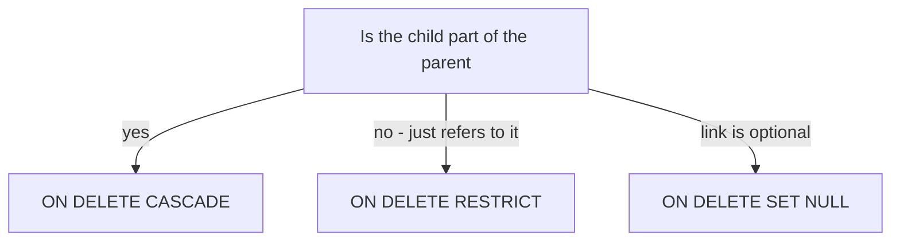

# Lecture 3 — DDL, Constraints, and Deliberate Denormalization

> **Duration:** ~2 hours. **Outcome:** You can turn an ER model into runnable `CREATE TABLE` DDL with the full constraint toolkit (NOT NULL, UNIQUE, CHECK, PRIMARY KEY, FOREIGN KEY with the right `ON DELETE` action), evolve a live schema with `ALTER TABLE`, and decide — with reasons — when to *denormalize* on purpose.

Lectures 1 and 2 were design. This is construction. **DDL** — Data Definition Language — is the subset of SQL that creates and changes the *shape* of the database: `CREATE`, `ALTER`, `DROP`. And constraints are where design becomes enforcement: a normalized model on paper prevents nothing; a `FOREIGN KEY` in the database prevents orphans on every insert, forever.

The mantra for this lecture: **push every rule you can into the schema.** Application code is written by many people, changes constantly, and has bugs. A constraint is checked by the database on every write, from every client, with no exceptions. A rule enforced in the schema is a rule that cannot be violated.

## 1. CREATE TABLE — the anatomy

```sql
CREATE TABLE customers (
    customer_id  BIGINT GENERATED ALWAYS AS IDENTITY PRIMARY KEY,
    email        TEXT        NOT NULL UNIQUE,
    full_name    TEXT        NOT NULL,
    country_code CHAR(2)     NOT NULL DEFAULT 'US',
    credit_limit NUMERIC(10,2) NOT NULL DEFAULT 0 CHECK (credit_limit >= 0),
    created_at   TIMESTAMPTZ NOT NULL DEFAULT now()
);
```

Each line is `column_name  type  [constraints...]`. Read the pieces:

- **The type** comes first and matters — Section 2.
- **Column constraints** (`NOT NULL`, `UNIQUE`, `CHECK`, `DEFAULT`, `PRIMARY KEY`, `REFERENCES`) attach to a single column.
- **Table constraints** (written on their own line, usually at the end) can span multiple columns — a composite PK, a multi-column UNIQUE, or a CHECK involving several columns.

## 2. Choosing column types (PostgreSQL 16)

The type is your first and cheapest constraint: a `DATE` column *cannot* hold "banana". Pick the narrowest type that fits the data.

| Need | PostgreSQL type | Notes |
|------|-----------------|-------|
| Whole numbers | `INT` (4-byte), `BIGINT` (8-byte), `SMALLINT` | Use `BIGINT` for surrogate keys — you'll exceed 2.1 billion someday. |
| Auto surrogate key | `BIGINT GENERATED ALWAYS AS IDENTITY` | SQL-standard; prefer over `SERIAL`. |
| Money / exact decimals | `NUMERIC(precision, scale)` | **Never `FLOAT` for money** — floats can't represent 0.10 exactly. |
| Approximate reals | `REAL`, `DOUBLE PRECISION` | Scientific data, not currency. |
| Text | `TEXT` | In Postgres, `TEXT` and `VARCHAR(n)` perform identically; use `TEXT` + a `CHECK` for length if needed. |
| True/false | `BOOLEAN` | `TRUE`/`FALSE`/`NULL`. |
| Date only | `DATE` | |
| Timestamp | `TIMESTAMPTZ` | **Prefer `TIMESTAMPTZ`** (with time zone) over `TIMESTAMP`; store UTC. |
| Fixed choices | an `ENUM` type, or `TEXT` + `CHECK (x IN (...))` | CHECK is easier to evolve than an enum. |
| Structured blob | `JSONB` | For genuinely schemaless data; do not use it to dodge normalization. |
| Unique id (distributed) | `UUID` | When ids must be generated without the DB. |

**SQLite is different and looser.** SQLite has only five *storage classes* (`NULL`, `INTEGER`, `REAL`, `TEXT`, `BLOB`) and uses **type affinity** — a column typed `VARCHAR(10)` will still store the string "banana" of any length, and `NUMERIC` won't enforce precision. This is why examples default to PostgreSQL for schema work: **Postgres actually enforces types; SQLite mostly suggests them.** (SQLite 3.37+ added `STRICT` tables — `CREATE TABLE t (...) STRICT;` — which *do* enforce a small set of declared types. Use `STRICT` when practicing modeling in SQLite.)

## 3. The five workhorse constraints

### NOT NULL

The column must have a value. This is a *semantic* decision: is "unknown/absent" ever legitimate for this fact? An order's `customer_id` — never NULL (an order must belong to someone). A customer's `middle_name` — NULL is fine (some people have none).

```sql
full_name TEXT NOT NULL
```

Remember NULL's arithmetic from Week 1: `NULL = NULL` is *not true*, `NULL` propagates through expressions, and aggregates skip it. A stray NULL you didn't intend is a bug generator. Default to `NOT NULL` and relax it only when absence is meaningful.

### UNIQUE

No two rows share this value. This is how you enforce **alternate/candidate keys** that aren't the PK.

```sql
email TEXT NOT NULL UNIQUE
```

A multi-column UNIQUE is a table constraint — "no two rows share this *combination*":

```sql
CREATE TABLE room_bookings (
    room_id BIGINT NOT NULL,
    slot    TSTZRANGE NOT NULL,
    UNIQUE (room_id, slot)          -- one booking per room per slot
);
```

Note: multiple NULLs do *not* collide under a UNIQUE constraint by default (each NULL is "unknown", so they're not considered equal) — PostgreSQL 15+ lets you change that with `UNIQUE NULLS NOT DISTINCT`.

### CHECK

An arbitrary boolean rule the row must satisfy. Your general-purpose enforcement tool.

```sql
price        NUMERIC(10,2) NOT NULL CHECK (price >= 0),
quantity     INT NOT NULL CHECK (quantity > 0),
status       TEXT NOT NULL CHECK (status IN ('pending','paid','shipped','cancelled')),
discount_pct NUMERIC NOT NULL DEFAULT 0 CHECK (discount_pct BETWEEN 0 AND 100)
```

A multi-column CHECK is a table constraint:

```sql
CHECK (ends_at > starts_at)          -- an interval can't end before it starts
```

CHECK constraints encode business rules the database will then *guarantee*. Every "price can't be negative" bug your app might have is impossible if the schema forbids it.

### PRIMARY KEY

Covered in Lecture 1: NOT NULL + UNIQUE + "the official identity". As a table constraint it can be composite:

```sql
PRIMARY KEY (order_id, product_id)
```

Each table should have exactly one. In Postgres a PK automatically creates a unique B-tree index (relevant to Week 6's indexing).

### FOREIGN KEY + referential actions

A FK enforces that the referenced row exists (Lecture 1). What it *also* controls: **what happens to the child rows when the parent is deleted or its key updated.** That is the `ON DELETE` / `ON UPDATE` clause, and choosing it correctly is a genuine design decision.

```sql
CREATE TABLE order_items (
    order_id   BIGINT NOT NULL REFERENCES orders(order_id) ON DELETE CASCADE,
    product_id BIGINT NOT NULL REFERENCES products(product_id) ON DELETE RESTRICT,
    quantity   INT NOT NULL CHECK (quantity > 0),
    PRIMARY KEY (order_id, product_id)
);
```

| `ON DELETE` action | When the parent is deleted… | Use when |
|--------------------|-----------------------------|----------|
| `NO ACTION` (default) | The delete **fails** if children exist (checked at end of statement). | Safe default; forces you to deal with children explicitly. |
| `RESTRICT` | The delete **fails** immediately if children exist. | You never want to lose a referenced product. |
| `CASCADE` | Children are **deleted too**. | Children can't exist without the parent — order items *are part of* the order. |
| `SET NULL` | Children's FK column becomes `NULL`. | The link is optional — e.g., an employee's `manager_id` when the manager leaves. (Column must be nullable.) |
| `SET DEFAULT` | Children's FK becomes its column DEFAULT. | Rare; the default must itself reference a real parent. |

The judgment: **`CASCADE` for "part-of" (composition) relationships, `RESTRICT`/`NO ACTION` for "refers-to" (association) relationships.** Deleting an order *should* delete its line items (they're part of it). Deleting a product that appears in past orders should *fail* — you'd be destroying order history. Getting these right prevents both orphans and accidental mass deletions.


*Choosing the ON DELETE action depends on whether the child is composed of the parent or merely refers to it.*

## 4. ALTER TABLE — evolving a live schema

Schemas change. `ALTER TABLE` modifies an existing table without recreating it — essential because in production you can't drop and rebuild a table holding real data.

```sql
-- add a column (with a default so existing rows get a value)
ALTER TABLE customers ADD COLUMN phone TEXT;

-- add a constraint after the fact
ALTER TABLE customers ADD CONSTRAINT chk_phone
    CHECK (phone ~ '^\+?[0-9 -]{7,20}$');

-- add a foreign key to an existing column
ALTER TABLE orders ADD CONSTRAINT fk_customer
    FOREIGN KEY (customer_id) REFERENCES customers(customer_id);

-- rename, retype, drop
ALTER TABLE customers RENAME COLUMN full_name TO name;
ALTER TABLE customers ALTER COLUMN credit_limit TYPE NUMERIC(12,2);
ALTER TABLE customers DROP COLUMN phone;

-- change nullability
ALTER TABLE customers ALTER COLUMN name SET NOT NULL;
```

> **Production caution (preview of later weeks):** some `ALTER`s rewrite the whole table and hold a lock — adding a `NOT NULL` column *with* a volatile default on a huge table, or changing a column's type, can lock out writers for the duration. Postgres has optimized many common cases (adding a nullable column, or a `NOT NULL` column with a *constant* default, is instant since PG 11). Adding a FK or CHECK to a big table validates every existing row unless you add it `NOT VALID` and `VALIDATE CONSTRAINT` later. You'll manage this properly in Week 12; for now, know that `ALTER` is not always free.

**SQLite note:** SQLite's `ALTER TABLE` is limited — it supports `ADD COLUMN`, `RENAME`, and `DROP COLUMN` (3.35+), but *cannot* add or drop most constraints on an existing table. The classic workaround is the "12-step" recreate: build a new table with the constraints, `INSERT INTO new SELECT * FROM old`, drop the old, rename the new. Another reason schema work leans on Postgres.

## 5. Deliberate denormalization — walking back down the ladder

Normalization (Lecture 2) minimizes redundancy so writes stay consistent. But it can make *reads* expensive: fully-normalized data means joins, and lots of them. **Denormalization** is the deliberate reintroduction of redundancy — for read performance — accepting the cost of keeping the copies in sync.

The key word is *deliberate*. Denormalization is not "I was too lazy to normalize." It is "I normalized, measured a real read bottleneck, and am trading write-complexity for read-speed with my eyes open."

Common, legitimate denormalizations:

| Technique | What it is | The cost you accept |
|-----------|------------|---------------------|
| **Derived/precomputed column** | Store `order.total` instead of summing `order_items` every read. | Must recompute on every item change (often via a trigger — Week 9). |
| **Duplicated attribute** | Copy `customer_name` onto `orders` to avoid a join in reports. | Must update copies when the source changes (or accept staleness). |
| **Historical snapshot** | `order_items.price_at_sale` copies the price. | *None* — see below; this isn't really denormalization. |
| **Summary/rollup table** | A nightly-built `daily_sales` table. | Data is stale until the next rebuild. |
| **Pre-joined/materialized view** | Postgres `MATERIALIZED VIEW` caching a big join. | Must `REFRESH`; stale between refreshes. |

**A crucial distinction: snapshots are not denormalization.** `order_items.price_at_sale` from Lecture 1 looks like duplicated data but records a *different fact* — "the price **at the moment of sale**", which is independent of the product's current price. A duplicated `customer_name` on `orders` records the *same fact* twice and can drift out of sync; that's true denormalization. Snapshots of point-in-time values are just correct modeling of temporal facts.

The decision rule:

1. **Normalize first.** Always start at 3NF. It is the correct default and the easy thing to reason about.
2. **Measure.** Denormalize only in response to a *measured* read problem (Week 7 teaches you to measure with `EXPLAIN ANALYZE`), never a guessed one.
3. **Keep copies honest.** If you duplicate a fact, you now own a synchronization problem — solve it with a trigger, a scheduled job, or an explicit "this is a cache, it may be stale" contract. Undocumented drift is how denormalized schemas rot.

Denormalization trades a *write-time* cost and a *correctness risk* for a *read-time* gain. Make the trade consciously, document it, and never as a first move.

## 6. Putting it together — a fully-constrained schema

Here is a small, complete, production-shaped schema that uses every tool from this lecture:

```sql
CREATE TABLE customers (
    customer_id  BIGINT GENERATED ALWAYS AS IDENTITY PRIMARY KEY,
    email        TEXT NOT NULL UNIQUE,
    full_name    TEXT NOT NULL,
    created_at   TIMESTAMPTZ NOT NULL DEFAULT now()
);

CREATE TABLE products (
    product_id   BIGINT GENERATED ALWAYS AS IDENTITY PRIMARY KEY,
    sku          TEXT NOT NULL UNIQUE,
    name         TEXT NOT NULL,
    price        NUMERIC(10,2) NOT NULL CHECK (price >= 0),
    is_active    BOOLEAN NOT NULL DEFAULT TRUE
);

CREATE TABLE orders (
    order_id     BIGINT GENERATED ALWAYS AS IDENTITY PRIMARY KEY,
    customer_id  BIGINT NOT NULL REFERENCES customers(customer_id) ON DELETE RESTRICT,
    status       TEXT NOT NULL DEFAULT 'pending'
                 CHECK (status IN ('pending','paid','shipped','cancelled')),
    ordered_at   TIMESTAMPTZ NOT NULL DEFAULT now()
);

CREATE TABLE order_items (
    order_id      BIGINT NOT NULL REFERENCES orders(order_id) ON DELETE CASCADE,
    product_id    BIGINT NOT NULL REFERENCES products(product_id) ON DELETE RESTRICT,
    quantity      INT NOT NULL CHECK (quantity > 0),
    price_at_sale NUMERIC(10,2) NOT NULL CHECK (price_at_sale >= 0),
    PRIMARY KEY (order_id, product_id)
);
```

Trace the enforcement: you cannot create an order for a non-existent customer, cannot delete a customer who has orders (RESTRICT), *can* delete an order and have its items vanish (CASCADE), cannot delete a product that's been sold (RESTRICT), cannot record a zero-or-negative quantity, cannot set an invalid status, and cannot duplicate a product within one order (composite PK). Every one of those rules is guaranteed by the database, not hoped for by the app. **That is what a well-constrained schema buys you.**

## 7. Check yourself

- Why prefer `NUMERIC` over `FLOAT`/`DOUBLE PRECISION` for a `price` column?
- Give a rule that belongs in a `CHECK` constraint and explain why the schema, not the app, should own it.
- You delete an `order`. Its `order_items` should vanish. You delete a `product`. That should *fail* if it's been ordered. Which `ON DELETE` action goes on each FK, and why?
- What's the difference between a *snapshot* like `price_at_sale` and a *denormalized duplicate* like a copied `customer_name`?
- Name the three-step decision rule for when to denormalize.
- Why is `ALTER TABLE` sometimes expensive on a large production table, and how does SQLite's `ALTER` differ from Postgres's?
- Write the DDL for a `reviews` table: a surrogate PK, a FK to `products` that CASCADEs on delete, a `rating` between 1 and 5, and no product reviewed twice by the same customer.

If you can answer all of those, you have the full modeling toolchain — design (L1), normalize (L2), and build with constraints (L3). Now go do the reps.
