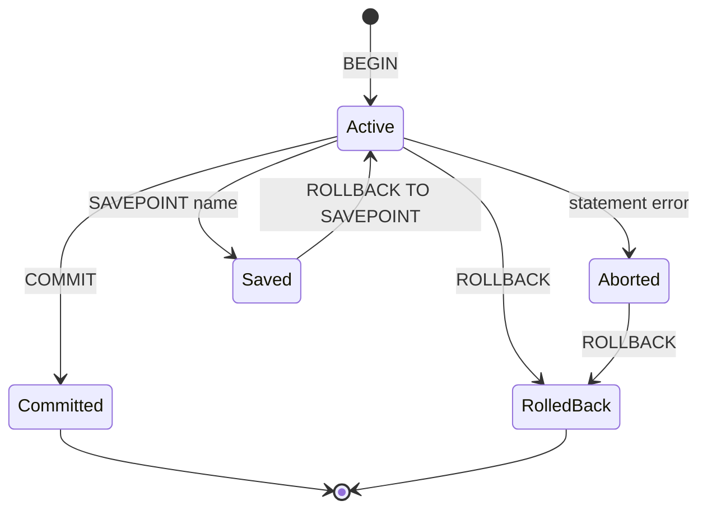

# Lecture 1 — Transactions and ACID

> **Duration:** ~2 hours. **Outcome:** You can explain each letter of ACID as a distinct promise, drive a transaction by hand with `BEGIN`/`COMMIT`/`ROLLBACK`, and use `SAVEPOINT` to undo part of a transaction without throwing away the rest.

Almost every real-world change to a database is really *several* changes that must all happen or none happen. Move $100 from Alice to Bob: subtract 100 from one row, add 100 to another. If the database applies the first and then the power dies, you have destroyed $100. A **transaction** is the tool that makes those two writes a single indivisible unit. This lecture is about that unit and the four guarantees the database makes about it.

## 1. What a transaction *is*

A transaction is a group of SQL statements that the database treats as one atomic operation: it either **commits** (all effects become permanent, visible to everyone) or **rolls back** (all effects vanish as if nothing happened). There is no in-between visible to other sessions.

You mark the boundaries explicitly:

```sql
BEGIN;                                  -- open a transaction
UPDATE accounts SET balance = balance - 100 WHERE id = 1;   -- Alice
UPDATE accounts SET balance = balance + 100 WHERE id = 2;   -- Bob
COMMIT;                                 -- make both permanent
```

If anything goes wrong between `BEGIN` and `COMMIT` — a constraint violation, a crash, or you simply typing `ROLLBACK` — **neither** update survives. The $100 is never in a half-moved state that anyone else can observe.

### Autocommit: the transaction you didn't know you were in

When you run a bare `UPDATE` at a `psql` prompt without a `BEGIN`, it still runs inside a transaction — a one-statement transaction that commits automatically the instant it finishes. This is **autocommit**, and it is the default in `psql`, in most drivers, and in SQLite. It is why beginners never notice transactions exist: every statement is its own tiny transaction.

The lesson: you are *always* in a transaction. `BEGIN` doesn't start using transactions — it just widens the boundary so more than one statement fits inside.

```sql
-- These three are three separate transactions (autocommit):
UPDATE accounts SET balance = balance - 100 WHERE id = 1;
UPDATE accounts SET balance = balance + 100 WHERE id = 2;
-- ^ if the process dies here, the first line already committed. Money gone.
```

Wrap them in `BEGIN … COMMIT` and that failure mode disappears.

## 2. ACID — four separate promises

ACID is an acronym for the four guarantees a transactional database makes. People recite it as one word; that hides that these are *four independent properties*, each of which can be violated on its own. Learn them separately.

| Letter | Name | The promise | What breaks without it |
|--------|------|-------------|------------------------|
| **A** | Atomicity | All statements in the transaction succeed, or none do. | Half-applied changes — the $100 disappears mid-transfer. |
| **C** | Consistency | The transaction moves the database from one valid state to another; all constraints hold at commit. | Broken invariants — negative balances, orphaned rows, duplicate keys. |
| **I** | Isolation | Concurrent transactions don't see each other's uncommitted, in-progress work. | Anomalies — dirty reads, lost updates (Lectures 2–3). |
| **D** | Durability | Once committed, the change survives a crash, power loss, or reboot. | Committed data vanishes after a restart. |

### A — Atomicity

Atomicity is "all or nothing." The database achieves it with a **write-ahead log (WAL)**: before changing the actual data pages, it records the intended change in an append-only log. On `COMMIT`, it flushes the log. If the system crashes mid-transaction, recovery replays committed transactions and discards incomplete ones. You get atomicity for free — as long as you draw the transaction boundary correctly.

### C — Consistency

Consistency means every committed transaction leaves the database obeying all its declared rules: primary keys, foreign keys, `CHECK` constraints, `NOT NULL`, unique indexes. If a statement would violate one, the transaction is rejected. Note that **consistency is a partnership**: the database enforces the constraints you *declared* (Week 4), but only you can declare the right ones. A `CHECK (balance >= 0)` is what turns "don't overdraw" into a promise the database keeps for you.

```sql
ALTER TABLE accounts ADD CONSTRAINT balance_nonneg CHECK (balance >= 0);
-- Now any transaction that would push a balance negative is rejected at COMMIT.
```

### I — Isolation

Isolation is the subject of the rest of this week, so we only name it here: it governs *what one in-progress transaction can see of another's in-progress work*. Perfect isolation ("serializable") makes concurrent transactions behave as if they ran one at a time. Perfect isolation is also the most expensive, so databases offer weaker **isolation levels** that permit certain anomalies in exchange for speed. Lecture 2 is entirely about that dial.

### D — Durability

Durability means: once `COMMIT` returns success, the data is safe even if the server loses power one millisecond later. Postgres guarantees this by `fsync`-ing the WAL to disk before `COMMIT` returns (controlled by the `synchronous_commit` setting). "The commit returned, therefore it's on disk" is the contract your application relies on.

## 3. `BEGIN`, `COMMIT`, `ROLLBACK` in practice

Set up a tiny bank to follow along. Create it once:

```sql
CREATE TABLE accounts (
    id      int PRIMARY KEY,
    owner   text NOT NULL,
    balance numeric NOT NULL CHECK (balance >= 0)
);
INSERT INTO accounts VALUES (1, 'Alice', 500), (2, 'Bob', 300);
```

Now a transfer, watching it step by step:

```sql
BEGIN;
UPDATE accounts SET balance = balance - 100 WHERE id = 1;
UPDATE accounts SET balance = balance + 100 WHERE id = 2;
SELECT id, owner, balance FROM accounts;   -- YOU see the new balances…
```

At this moment your session sees Alice=400, Bob=400. **A second session sees Alice=500, Bob=300** — your changes are invisible to it until you commit (that's isolation). Finish it:

```sql
COMMIT;   -- now everyone sees Alice=400, Bob=400
```

Or change your mind:

```sql
ROLLBACK; -- balances snap back to Alice=500, Bob=300. As if it never happened.
```

### Errors abort the transaction

In PostgreSQL, once *any* statement in a transaction raises an error, the whole transaction enters an **aborted** state. Every subsequent statement fails with `current transaction is aborted, commands ignored until end of transaction block` until you `ROLLBACK` (or `COMMIT`, which Postgres turns into a rollback because the transaction is poisoned).

```sql
BEGIN;
UPDATE accounts SET balance = balance - 100 WHERE id = 1;
INSERT INTO accounts VALUES (1, 'Dup', 0);   -- ERROR: duplicate key
SELECT * FROM accounts;                        -- ERROR: transaction is aborted
ROLLBACK;                                       -- the only way out
```

This is deliberate: rather than let you keep working on top of a failed step, Postgres forces you to acknowledge the failure. (SQLite differs — a failed statement rolls back just that statement by default, not the whole transaction. Portable code should not rely on either behavior; check for errors and decide.)

## 4. Savepoints — partial rollback

Sometimes you want to undo *part* of a transaction and keep the rest. A **savepoint** is a named marker inside a transaction you can roll back *to*, discarding everything after it while keeping everything before it — and keeping the transaction open.

```sql
BEGIN;
INSERT INTO accounts VALUES (3, 'Carol', 1000);

SAVEPOINT before_risky;
UPDATE accounts SET balance = balance - 5000 WHERE id = 3;   -- oops, overdraft
-- CHECK constraint fails; the transaction is now aborted BUT…
ROLLBACK TO SAVEPOINT before_risky;   -- rewind to the savepoint; transaction lives on

UPDATE accounts SET balance = balance - 50 WHERE id = 3;      -- a sane amount
COMMIT;   -- Carol exists with balance 950; the bad update never happened
```

Three commands manage them:

| Command | Effect |
|---------|--------|
| `SAVEPOINT name` | Place a named marker at the current point. |
| `ROLLBACK TO SAVEPOINT name` | Undo everything after the marker; keep the transaction open and un-aborted. |
| `RELEASE SAVEPOINT name` | Forget the marker (its work stays); you can no longer roll back to it. |

Savepoints are how a driver implements "try this statement, and if it fails, recover without losing the batch." They nest: you can set a savepoint after another savepoint. Rolling back to an outer one discards any inner ones created after it. This is exactly the mechanism behind Postgres's error recovery — internally, some drivers wrap each statement in an implicit savepoint so one failure doesn't poison the batch.


*A transaction moves from Active to Committed or Aborted; a savepoint lets you rewind part of the work without leaving Active.*

## 5. Read-only and other transaction modes

You can declare a transaction's intent, which lets the engine optimize and protects you from mistakes:

```sql
BEGIN TRANSACTION READ ONLY;
-- any INSERT/UPDATE/DELETE here raises an error
SELECT sum(balance) FROM accounts;
COMMIT;
```

`READ ONLY` is a good habit for reporting queries: it documents intent and guards against a typo that mutates data. You can also set the isolation level right on `BEGIN` — `BEGIN ISOLATION LEVEL REPEATABLE READ;` — which is the bridge into Lecture 2.

## 6. SQLite in one breath

SQLite has the same verbs — `BEGIN`, `COMMIT`, `ROLLBACK`, `SAVEPOINT`, `RELEASE` — but a very different engine underneath. It is effectively **serializable by default** because it allows only one writer at a time for the whole database file. Its `BEGIN` has three flavors that decide *when* it grabs the write lock:

| `BEGIN` flavor | Locks the database… |
|----------------|---------------------|
| `BEGIN` / `BEGIN DEFERRED` | lazily, on the first write (default) |
| `BEGIN IMMEDIATE` | right away, blocking other writers |
| `BEGIN EXCLUSIVE` | right away, blocking writers *and* (in rollback-journal mode) readers |

We return to SQLite's model in Lecture 3 as a deliberate contrast to Postgres's MVCC. For now: same transaction verbs, radically simpler concurrency, at the cost of write throughput.

## 7. Check yourself

- Why is a bare `UPDATE` (no `BEGIN`) still a transaction? What is that behavior called?
- Name each letter of ACID and, in one sentence each, what breaks if it's violated.
- Which two letters is *your* schema design responsible for, and which two does the engine give you almost for free?
- After a statement errors inside a Postgres transaction, why does the next `SELECT` also fail? How do you get out?
- What does `ROLLBACK TO SAVEPOINT s` keep, and what does it discard?
- In SQLite, what's the difference between `BEGIN` and `BEGIN IMMEDIATE`?

When those are easy, do [Exercise 1 — transactions and savepoints](../exercises/exercise-01-transactions-and-savepoints.md).

## Further reading

- **PostgreSQL — Transactions (tutorial):** <https://www.postgresql.org/docs/16/tutorial-transactions.html>
- **PostgreSQL — `SAVEPOINT`:** <https://www.postgresql.org/docs/16/sql-savepoint.html>
- **PostgreSQL — Reliability and the WAL:** <https://www.postgresql.org/docs/16/wal-intro.html>
- **SQLite — Transaction control:** <https://www.sqlite.org/lang_transaction.html>
