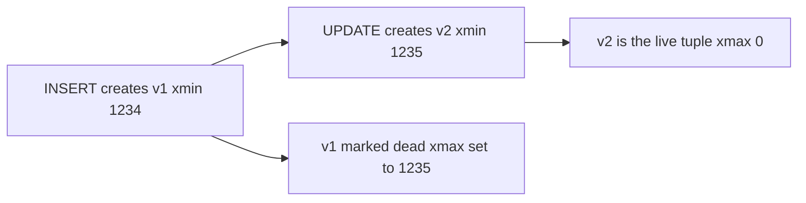
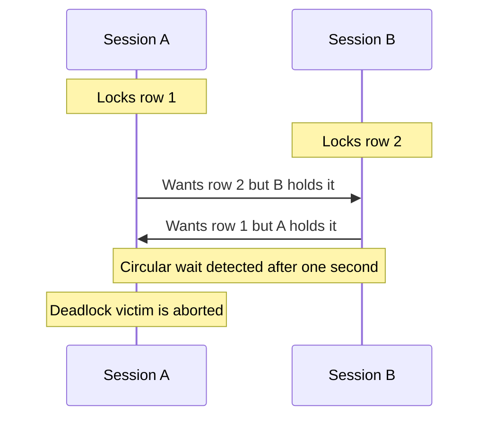

# Lecture 3 — MVCC, Locking, and Deadlocks

> **Duration:** ~2.5 hours. **Outcome:** You can explain how PostgreSQL's MVCC produces the isolation you saw in Lecture 2, read the `xmin`/`xmax` system columns and a snapshot, take row and table locks on purpose, cause and diagnose a deadlock, and write a retry loop that survives serialization failures.

Lecture 2 told you *what* each isolation level guarantees. This lecture tells you *how* PostgreSQL delivers it — and once you see the mechanism, the anomalies (and the way to defend against them) stop being magic. The mechanism has a name: **MVCC**, Multi-Version Concurrency Control. When that isn't enough, you reach for explicit **locks**. When locks collide the wrong way, you get **deadlocks**. All three are here.

## 1. The problem MVCC solves

Naïvely, to keep readers from seeing half-written data you'd lock every row a writer touches so no reader can read it until the writer commits. That works and it's simple — it's roughly what SQLite does. But it means **readers block writers and writers block readers**, and on a busy system everything grinds.

PostgreSQL's answer: **never overwrite a row in place.** Instead, every `UPDATE` writes a *new version* of the row and leaves the old version in place, marked with when it stopped being valid. A `DELETE` just marks the old version dead. Now readers and writers don't fight: a reader looks at whichever *version* was valid as of its snapshot, while a writer creates a newer version alongside. This is Multi-Version Concurrency Control. Its slogan:

> **Readers don't block writers, and writers don't block readers.**

(Writers still block *other writers* of the same row — you can't have two live "current" versions. That's what Section 5's locks are about.)

## 2. Tuple versions: `xmin` and `xmax`

A row version in Postgres is called a **tuple**. Every table secretly has system columns you can select. The two that matter:

| System column | Meaning |
|---------------|---------|
| `xmin` | The transaction ID (**xid**) that *created* this tuple version. |
| `xmax` | The xid that *deleted or superseded* this version (0 if still live). |
| `ctid` | The physical location `(page, offset)` of this version — changes when the row moves. |

Watch a version get born and retired. In one session:

```sql
CREATE TABLE demo (id int PRIMARY KEY, v text);
INSERT INTO demo VALUES (1, 'first');

SELECT xmin, xmax, ctid, * FROM demo;
--  xmin | xmax | ctid  | id |   v
--  1234 |    0 | (0,1) |  1 | first     ← created by xid 1234, still live

UPDATE demo SET v = 'second' WHERE id = 1;

SELECT xmin, xmax, ctid, * FROM demo;
--  xmin | xmax | ctid  | id |   v
--  1235 |    0 | (0,2) |  1 | second    ← a NEW tuple at (0,2), created by xid 1235
```

The `UPDATE` didn't edit the old tuple — it wrote a brand-new tuple at a new `ctid` and marked the old one's `xmax` = 1235 (that old version is now invisible to new snapshots, but it's still physically there on the page). Your current transaction id is `SELECT pg_current_xact_id();` (or the older `SELECT txid_current();`).


*An UPDATE never edits in place — it writes a new tuple version and marks the old one dead.*

## 3. Snapshots and visibility

A **snapshot** is Postgres's record of "which transactions had committed at the instant I took it." A tuple is visible to a snapshot, roughly, when:

- its `xmin` is a transaction that had **committed** before the snapshot, **and**
- its `xmax` is 0, or is a transaction that had **not** committed as of the snapshot (i.e., nobody visible has deleted it yet).

That single rule produces *everything* you saw in Lecture 2:

- **READ COMMITTED** takes a **new snapshot at the start of every statement**. So a second `SELECT` sees rows committed since the first — that's the non-repeatable read and the phantom.
- **REPEATABLE READ** and **SERIALIZABLE** take **one snapshot at the transaction's first query** and reuse it for the whole transaction. So committed changes from other transactions stay invisible — no non-repeatable reads, no phantoms.
- **Dirty reads are impossible** because the rule requires `xmin` to have *committed*. An uncommitted tuple's creator hasn't committed, so it's never visible. That's why Lecture 2's 4d could never dirty-read.

You can inspect the current snapshot's boundaries with `SELECT pg_current_snapshot();` — it prints `xmin:xmax:xip_list`, the lowest still-running xid, the next-to-be-assigned xid, and the list of in-progress xids in between.

## 4. VACUUM — the price of never overwriting

If every `UPDATE` and `DELETE` leaves old tuples lying around, the table only grows. Those obsolete tuples are **dead tuples**, and the space they occupy is **bloat**. Something has to reclaim them once no snapshot could possibly still need them. That something is **`VACUUM`**.

| Command | What it does |
|---------|--------------|
| `VACUUM demo;` | Marks dead tuples' space reusable for future inserts *in the same table*. Non-blocking; runs alongside normal traffic. |
| `VACUUM (ANALYZE) demo;` | Same, plus refreshes the planner statistics (Week 7 leans on these). |
| `VACUUM FULL demo;` | Rewrites the whole table to physically shrink it and return space to the OS. Takes an `ACCESS EXCLUSIVE` lock — **blocks everything**. Use rarely. |

You almost never run `VACUUM` by hand: **autovacuum**, a background process, does it automatically based on how many rows changed. But you must know it exists, because two classic production problems come straight from MVCC:

1. **Table bloat** — a table that gets many updates but rarely vacuums grows far larger than its live data, slowing every scan.
2. **Transaction ID wraparound** — xids are a finite (32-bit) counter. Very old tuples must be "frozen" (marked as always-visible) by vacuum before the counter laps them. A database that never vacuums can be forced into a protective read-only shutdown. Autovacuum exists largely to prevent this.

Check dead-tuple counts:

```sql
SELECT relname, n_live_tup, n_dead_tup, last_autovacuum
FROM pg_stat_user_tables ORDER BY n_dead_tup DESC;
```

**The takeaway:** MVCC's "never overwrite" is what buys you non-blocking readers, and `VACUUM` is the bill. Postgres pays it automatically, but a DBA who forgets it exists eventually meets bloat or wraparound.

## 5. Explicit locking — when MVCC isn't enough

MVCC handles *reads* beautifully. But some logic needs to *reserve* a row: "I'm about to read this balance and write it back, and I need to guarantee nobody else does the same in between." Snapshots alone won't stop that (that's the lost update). You need a **lock**.

### Row-level locks

Take a lock on the rows a `SELECT` returns and hold it to the end of the transaction:

| Clause | Lock strength | Use it when |
|--------|---------------|-------------|
| `FOR UPDATE` | strongest row lock | you intend to `UPDATE`/`DELETE` these rows; blocks other `FOR UPDATE`/writes on them |
| `FOR NO KEY UPDATE` | slightly weaker | you'll update non-key columns; allows concurrent `FOR KEY SHARE` |
| `FOR SHARE` | shared | you need the row to *stay put* but only read it; others can also `FOR SHARE` but not `UPDATE` |
| `FOR KEY SHARE` | weakest | you rely on the row's key existing (e.g., an FK parent) but don't care about other columns |

The pattern that kills the lost update — **read, lock, then write**:

```sql
BEGIN;
SELECT balance FROM accounts WHERE id = 1 FOR UPDATE;   -- lock the row NOW
-- another session doing the same SELECT … FOR UPDATE now BLOCKS here, waiting
UPDATE accounts SET balance = balance - 100 WHERE id = 1;
COMMIT;   -- lock released; the waiting session unblocks and reads the NEW value
```

Because the second session blocks at its `FOR UPDATE` until the first commits, it can never compute its new balance from a stale read. This is **pessimistic locking**. Add `NOWAIT` to error instead of wait, or `SKIP LOCKED` to skip already-locked rows (the standard trick for a work-queue where many workers each grab different jobs):

```sql
SELECT * FROM jobs WHERE state='queued' ORDER BY id
FOR UPDATE SKIP LOCKED LIMIT 1;   -- each worker grabs a different job, none wait
```

### Table-level locks

Some operations lock the whole table. You rarely take these by hand, but you should recognize them, because DDL does. Locks are ordered by strength; two are compatible if their cells don't conflict.

| Lock mode | Taken by | Conflicts with |
|-----------|----------|----------------|
| `ACCESS SHARE` | plain `SELECT` | only `ACCESS EXCLUSIVE` |
| `ROW SHARE` | `SELECT … FOR UPDATE` | `EXCLUSIVE`, `ACCESS EXCLUSIVE` |
| `ROW EXCLUSIVE` | `INSERT`/`UPDATE`/`DELETE` | share-ish modes and above |
| `SHARE` | `CREATE INDEX` (non-concurrent) | writes |
| `ACCESS EXCLUSIVE` | `ALTER TABLE`, `DROP TABLE`, `VACUUM FULL` | **everything**, including plain `SELECT` |

This is why a careless `ALTER TABLE` on a busy table can freeze an entire application: it wants `ACCESS EXCLUSIVE`, which conflicts with every running `SELECT`, so it queues behind them — and every new query queues behind *it*. See what's locked and what's waiting:

```sql
SELECT pid, mode, relation::regclass, granted FROM pg_locks
WHERE relation IS NOT NULL ORDER BY relation, granted;
```

## 6. Deadlocks

A **deadlock** is two transactions each holding a lock the other needs, each waiting forever. The textbook cause is **acquiring locks in different orders**:

| Step | Session A | Session B |
|-----:|-----------|-----------|
| 1 | `BEGIN;` | `BEGIN;` |
| 2 | `UPDATE accounts SET balance=balance-10 WHERE id=1;` *(locks row 1)* | `UPDATE accounts SET balance=balance-10 WHERE id=2;` *(locks row 2)* |
| 3 | `UPDATE … WHERE id=2;` → **waits for B** | `UPDATE … WHERE id=1;` → **waits for A** |

Now A holds row 1 and wants row 2; B holds row 2 and wants row 1. Neither can proceed. PostgreSQL notices: a background check runs every `deadlock_timeout` (default **1 second**) and, if it finds a cycle in the wait graph, it **aborts one transaction** (the "victim") with:

```
ERROR:  deadlock detected
DETAIL:  Process 123 waits for ShareLock on transaction 456; blocked by process 789.
SQLSTATE: 40P01
```


*A and B each hold the row the other wants — Postgres detects the cycle and aborts one transaction.*

The victim's transaction is rolled back; the other proceeds. Two things to internalize:

1. **The database breaks deadlocks for you** — it will not hang forever. But it breaks them by *killing a transaction*, so your app must handle the abort.
2. **You prevent deadlocks by always acquiring locks in a consistent order.** If every transaction touches accounts in ascending `id` order, the cross-cycle in the table above can't form. That single discipline — "lock rows in a canonical order" — eliminates the most common deadlocks. We drill it in [Exercise 3](../exercises/exercise-03-cause-and-resolve-a-deadlock.md).

## 7. The retry loop — the thing every concurrent app needs

Serialization failures (`40001`) and deadlocks (`40P01`) are **not bugs to prevent — they are outcomes to handle.** At SERIALIZABLE, Postgres is *supposed* to abort transactions that would violate serializability; that's how it protects you. The contract is: the database aborts, and your application **retries the whole transaction.** In pseudocode:

```python
import psycopg
from psycopg.errors import SerializationFailure, DeadlockDetected

def run_txn(conn, work):
    for attempt in range(5):
        try:
            with conn.transaction():          # BEGIN … COMMIT
                conn.execute("SET TRANSACTION ISOLATION LEVEL SERIALIZABLE")
                work(conn)                    # your reads and writes
            return                            # committed — done
        except (SerializationFailure, DeadlockDetected):
            if attempt == 4:
                raise                         # give up after 5 tries
            # optional: back off a few ms before retrying
    # loop retries with a fresh snapshot each time
```

Two rules for retryable transactions: **(1)** keep them short so retries are cheap, and **(2)** make the work *idempotent from the database's point of view* — since the whole transaction is re-run, it must recompute from current data, not from values cached before the failure. Get this right and SERIALIZABLE becomes practical: you write straightforward logic, and the retry loop absorbs the rare conflict.

## 8. SQLite as the contrast

SQLite doesn't need MVCC row versions or a rich lock menu because it allows **one writer at a time for the whole database**. A second writer gets `SQLITE_BUSY` and must wait or retry — effectively a database-level lock instead of row-level. WAL mode (`PRAGMA journal_mode=WAL;`) adds a single shared snapshot so readers don't block the writer, which is a *slice* of what Postgres MVCC does. The trade is stark: SQLite gives you serializability and near-zero configuration, but its write throughput is capped at one-writer-at-a-time. Postgres gives you concurrent writers and tunable isolation, at the cost of MVCC bloat, vacuum, and the locking subtleties in this lecture. Neither is "better" — they're built for different scales.

## 9. Check yourself

- State the MVCC slogan. Which pair of operations *does* still block under MVCC?
- What do `xmin` and `xmax` record? After an `UPDATE`, why does `ctid` change?
- In snapshot terms, why can Postgres never produce a dirty read?
- Why does MVCC make `VACUUM` necessary? Name the two problems that follow from never vacuuming.
- Which `SELECT` clause prevents a lost update, and *why* does it work?
- What does Postgres do when it detects a deadlock, and after how long? What's the one discipline that prevents most deadlocks?
- Why must an app that uses SERIALIZABLE include a retry loop, and what two properties should a retryable transaction have?

When those are solid, do [Exercise 3 — cause and resolve a deadlock](../exercises/exercise-03-cause-and-resolve-a-deadlock.md) and start the [mini-project](../mini-project/README.md).

## Further reading

- **PostgreSQL — Concurrency Control (MVCC):** <https://www.postgresql.org/docs/16/mvcc.html>
- **PostgreSQL — Explicit Locking (row & table lock modes):** <https://www.postgresql.org/docs/16/explicit-locking.html>
- **PostgreSQL — Routine Vacuuming & wraparound:** <https://www.postgresql.org/docs/16/routine-vacuuming.html>
- **PostgreSQL wiki — Serializable (SSI) and the retry pattern:** <https://wiki.postgresql.org/wiki/SSI>
- **SQLite — File locking and concurrency / WAL:** <https://www.sqlite.org/wal.html>
