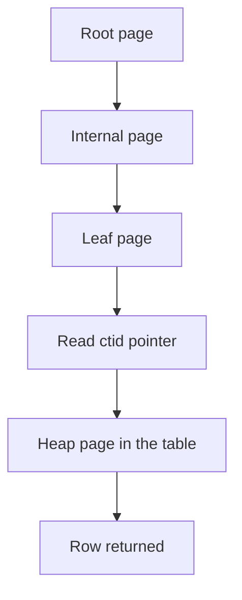
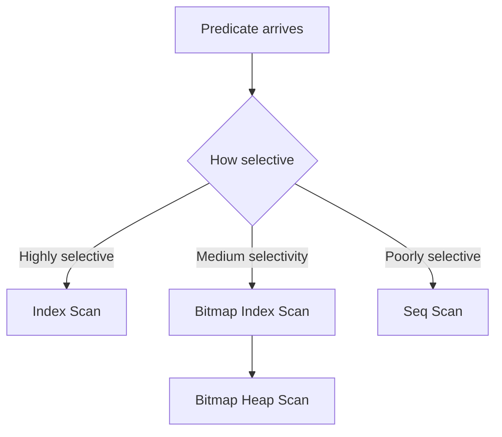

# Lecture 1 — How a B-tree index works (and when the planner uses it)

> **Duration:** ~2 hours. **Outcome:** You can draw a B-tree, explain why one structure serves point lookups, range scans, and `ORDER BY` alike, and predict whether the planner will use an index for a given query using two words: *selectivity* and *sargability*.

## 0. Build the seed dataset first

Everything this week runs against one `shop` database. Build it now — it takes about a minute and creates ~4 million rows.

```bash
createdb shop
psql shop
```

```sql
-- customers: ~100k rows
CREATE TABLE customers (
    id          bigint GENERATED ALWAYS AS IDENTITY PRIMARY KEY,
    email       text NOT NULL,
    country     text NOT NULL,
    created_at  timestamptz NOT NULL
);

INSERT INTO customers (email, country, created_at)
SELECT
    'user' || g || '@example.com',
    (ARRAY['US','GB','DE','FR','BR','IN','JP','NG'])[1 + (g % 8)],
    timestamptz '2020-01-01' + (g % 1500) * interval '1 day'
FROM generate_series(1, 100000) AS g;

-- orders: ~2 million rows
CREATE TABLE orders (
    id           bigint GENERATED ALWAYS AS IDENTITY PRIMARY KEY,
    customer_id  bigint NOT NULL REFERENCES customers(id),
    status       text NOT NULL,
    total_cents  integer NOT NULL,
    created_at   timestamptz NOT NULL
);

INSERT INTO orders (customer_id, status, total_cents, created_at)
SELECT
    1 + (g % 100000),
    (ARRAY['pending','paid','shipped','delivered','cancelled'])[1 + (g % 5)],
    (100 + (g % 90000)),
    timestamptz '2022-01-01' + (g % 900) * interval '1 day' + (g % 86400) * interval '1 second'
FROM generate_series(1, 2000000) AS g;

-- refresh planner statistics so cost estimates are accurate
ANALYZE customers;
ANALYZE orders;
```

`ANALYZE` matters: the planner decides whether to use an index based on **statistics** it keeps about each column. Freshly loaded tables have none until you `ANALYZE` (autovacuum will eventually do it, but do not wait). We come back to statistics in §6.

## 1. Why indexes exist: the sequential scan

Ask a question with no useful index:

```sql
EXPLAIN (ANALYZE, BUFFERS)
SELECT * FROM orders WHERE id = 1875432;
```

Even though `id` is the primary key (which *is* indexed), pretend for a second it were not. To find one row, the database would read **every** row and check each — a **sequential scan** (`Seq Scan`). For 2 million rows that is millions of comparisons and every data page pulled off disk.

An index turns that linear search into something close to logarithmic. The primary key already has one, so the real plan is an `Index Scan` returning in a fraction of a millisecond. The rest of this lecture is *how* that structure pulls off the trick.

## 2. Anatomy of a B-tree

Postgres's default index (`CREATE INDEX` with no `USING` clause) is a **B-tree** — specifically a B⁺-tree. Picture a shallow, wide, sorted tree:

```
                     [ ... | 500000 | ... | 1000000 | ... ]        <- root (1 page)
                    /                 |                  \
        [ ...|250000|... ]      [ ...|750000|... ]     [ ...|1500000|... ]   <- internal pages
           /     |    \            /    |    \             /     |    \
    [leaf][leaf][leaf]  ...   [leaf][leaf][leaf] ...  [leaf][leaf][leaf]     <- leaf pages
```

Key properties, each of which earns its keep:

| Property | Consequence |
|----------|-------------|
| **Sorted** — keys are in order within every node | Range queries (`BETWEEN`, `<`, `>`) and `ORDER BY` are cheap: walk the leaves. |
| **Balanced** — every leaf is the same depth from the root | Every lookup costs the same: the tree's *height*, typically **3–4 levels** even for hundreds of millions of rows. |
| **Wide** — each page (8 KB in Postgres) holds hundreds of keys | The tree stays shallow. A 4-level tree indexes billions of rows. |
| **Leaves are linked** — each leaf page points to the next | After finding the start of a range, you *scan sideways* through leaves without revisiting the root. |
| **Leaves hold pointers, not rows** — each entry is `(key, ctid)` | The `ctid` is the physical location `(page, offset)` of the row in the table (the "heap"). |

### The two-step lookup

A B-tree index lookup on the `orders` table is really two steps:

1. **Descend the tree** from root to the leaf holding your key — 3 or 4 page reads.
2. **Follow the `ctid`** into the heap to fetch the actual row — 1 more page read.

That last step is the **heap fetch**. It matters enormously later (it is why *covering* indexes and *index-only scans* exist — Lecture 3). For now, note that an index scan touches both the index *and* the table.


*A B-tree lookup is two steps: descend the index to a leaf, then follow the ctid pointer into the heap to fetch the row.*

### Height in practice

You can see the height:

```sql
CREATE EXTENSION IF NOT EXISTS pageinspect;   -- superuser only
SELECT level, count(*)
FROM generate_series(0, 0) AS _;               -- (illustrative; see pageinspect docs)
```

Rule of thumb without extensions: a B-tree over an 8-byte integer stays at **height ≤ 4** until well past a billion rows. This is why "just add an index" turns a scan of millions of rows into four page reads.

## 3. What one B-tree can do

A single B-tree on `orders(created_at)` serves *all* of these, because they all reduce to "find a position in sorted order, then walk":

| Query shape | How the B-tree serves it |
|-------------|--------------------------|
| Equality: `created_at = '2023-06-01'` | Descend to the exact key. |
| Range: `created_at BETWEEN a AND b` | Descend to `a`, walk leaves until `b`. |
| Open range: `created_at > a` | Descend to `a`, walk to the end. |
| Sorting: `ORDER BY created_at` | Read the leaves in order — no separate sort step. |
| `ORDER BY created_at DESC` | Read the leaves backwards. |
| `MIN`/`MAX`: `MAX(created_at)` | Jump to the last (or first) leaf entry. |
| Prefix match: `email LIKE 'anna%'` | A left-anchored prefix is a range. (See §5 — the collation caveat.) |

What a B-tree **cannot** help with:

- `LIKE '%anna'` — no left anchor, so no starting position in sorted order.
- `WHERE lower(email) = ...` — the index stores `email`, not `lower(email)` (unless you build an *expression index*).
- Membership in an unsorted set that is most of the table — if a predicate keeps 90% of rows, scanning is cheaper (see §4).

## 4. Selectivity: the planner's core decision

An index is not always worth using even when it exists. The planner asks: **how many rows will this predicate keep?** That fraction is **selectivity**.

- **Highly selective** (keeps few rows, e.g. 0.001%) → index wins big. Find the few, fetch them.
- **Poorly selective** (keeps most rows, e.g. 60%) → **sequential scan wins**. If you are going to read most of the table anyway, reading it in physical order (one big streaming read) beats bouncing between the index and thousands of scattered heap pages.

Watch the planner flip its decision. First, a rare value:

```sql
EXPLAIN (ANALYZE, BUFFERS)
SELECT * FROM orders WHERE status = 'cancelled' AND total_cents > 89000;
```

Then, a common one:

```sql
EXPLAIN (ANALYZE, BUFFERS)
SELECT * FROM orders WHERE status = 'paid';
```

`status` has only 5 distinct values across 2M rows, so any single status keeps ~20% of the table — poorly selective. Even with an index on `status`, the planner will usually choose a `Seq Scan`, and it is *right* to. This is the single most common "why isn't my index being used?!" surprise, and the answer is almost always "because using it would be slower." We diagnose exactly this in Challenge 2.

### The random-vs-sequential cost

Why does 20% tip toward a scan? Because heap fetches from an index scan are **random I/O** — scattered pages — while a sequential scan is one long **sequential read**. Postgres models this with two cost parameters:

| Parameter | Default | Meaning |
|-----------|--------:|---------|
| `seq_page_cost` | 1.0 | Cost to read one page sequentially. |
| `random_page_cost` | 4.0 | Cost to read one page at a random location. |

The 4:1 ratio dates from spinning disks. On SSDs, random reads are much cheaper, so a common tuning change is `SET random_page_cost = 1.1;` — which makes the planner *more* willing to use indexes. Try it and re-run the `status = 'paid'` query; you may see the plan change. (More on this in Week 7.)

### The Bitmap Heap Scan: the in-between

For "medium" selectivity — too many rows for a plain index scan, too few for a full seq scan — Postgres has a third mode: the **Bitmap Heap Scan**.

```sql
EXPLAIN (ANALYZE, BUFFERS)
SELECT * FROM orders WHERE created_at BETWEEN '2023-01-01' AND '2023-02-01';
```

It works in two passes: first scan the index and build an in-memory **bitmap** of which heap *pages* contain matches; then read those pages **in physical order**, turning scattered random reads into a sorted, near-sequential sweep. Seeing `Bitmap Index Scan` feeding a `Bitmap Heap Scan` is the planner telling you "the index helped narrow it down, but there were enough matches that I re-sorted the fetches for efficiency."


*The planner picks Index Scan, Bitmap Heap Scan, or Seq Scan based on how many rows the predicate is expected to keep.*

## 5. Sargability: can the predicate use an index at all?

**Sargable** (Search-ARGument-able) means a predicate is written so the index *can* be used. The rule is simple and worth tattooing on your forearm:

> **Wrap the column in a function and you lose the index. Keep the column bare on one side of the operator.**

The index on `orders(created_at)` stores raw `created_at` values in sorted order. If you transform the column, the stored order no longer matches what you are asking for.

| Non-sargable (index unusable) | Sargable rewrite (index usable) |
|-------------------------------|----------------------------------|
| `WHERE date(created_at) = '2023-06-01'` | `WHERE created_at >= '2023-06-01' AND created_at < '2023-06-02'` |
| `WHERE total_cents / 100 > 500` | `WHERE total_cents > 50000` |
| `WHERE lower(email) = 'a@b.com'` | `WHERE email = 'a@b.com'` *(or build an index on `lower(email)`)* |
| `WHERE email LIKE '%@example.com'` | *(no rewrite — trailing wildcard cannot use a B-tree; consider a trigram GIN — Lecture 2)* |
| `WHERE created_at + interval '1 day' > now()` | `WHERE created_at > now() - interval '1 day'` |

Prove it. This is non-sargable and forces a scan:

```sql
EXPLAIN (ANALYZE, BUFFERS)
SELECT * FROM orders WHERE date(created_at) = '2023-06-01';
```

This is sargable and (with an index on `created_at`) uses it:

```sql
CREATE INDEX ix_orders_created_at ON orders (created_at);
EXPLAIN (ANALYZE, BUFFERS)
SELECT * FROM orders
WHERE created_at >= '2023-06-01' AND created_at < '2023-06-02';
```

### When you *must* transform: the expression index

Sometimes you genuinely need `lower(email)` or `date(created_at)`. You can index the expression itself:

```sql
CREATE INDEX ix_customers_lower_email ON customers (lower(email));
-- now this is sargable:
SELECT * FROM customers WHERE lower(email) = 'user42@example.com';
```

The index stores the *computed* value. The query's expression must match the index's expression exactly for the planner to use it.

### The `LIKE 'prefix%'` collation caveat

`email LIKE 'anna%'` is a range and *can* use a B-tree — **but only if the index uses the `C` collation** (or you add `text_pattern_ops`), because the default locale's sort order is not the same as byte order:

```sql
CREATE INDEX ix_customers_email_pattern ON customers (email text_pattern_ops);
-- now LIKE 'anna%' can index-scan
```

Without `text_pattern_ops`, a prefix `LIKE` on a locale-collated column falls back to a scan. This trips up nearly everyone once.

## 6. Statistics: how the planner *estimates* selectivity

The planner does not run your query to count matching rows — it *estimates*, using statistics gathered by `ANALYZE` and stored in the catalog. Look at them:

```sql
SELECT attname, n_distinct, most_common_vals, most_common_freqs
FROM pg_stats
WHERE tablename = 'orders' AND attname IN ('status', 'customer_id');
```

- `n_distinct` — number of distinct values. For `status` it is ~5; for `customer_id` ~100k. High `n_distinct` → the planner expects a predicate on it to be selective.
- `most_common_vals` / `most_common_freqs` — the histogram of frequent values, so the planner knows `status = 'paid'` keeps ~20% but a rare status keeps far less.

**Stale statistics are the second most common cause of bad plans** (after non-sargable SQL). If you bulk-load data and query before autovacuum catches up, the planner may still think the table is empty and pick a terrible plan. Fix: `ANALYZE tablename;`. You can also raise the resolution of the histogram for a skewed column:

```sql
ALTER TABLE orders ALTER COLUMN status SET STATISTICS 1000;
ANALYZE orders;
```

## 7. Reading a plan: the four scan nodes you must recognize

You will see these all week. Learn to tell them apart at a glance:

| Node | Meaning | Good sign or bad sign? |
|------|---------|------------------------|
| `Seq Scan` | Read every row. | Fine for small tables or low-selectivity predicates; a red flag on a big table with a selective `WHERE`. |
| `Index Scan` | Descend the index, fetch each matching row from the heap. | Good for selective predicates. |
| `Index Only Scan` | Answer entirely from the index — no heap fetch. | Best case. Requires a covering index + a visible tuple (Lecture 3). |
| `Bitmap Heap Scan` | Index builds a page bitmap, then heap read in physical order. | Good for medium selectivity. |

Always read plans with **`EXPLAIN (ANALYZE, BUFFERS)`**, not bare `EXPLAIN`:

- `ANALYZE` actually **runs** the query and shows *real* row counts and timings next to the *estimates*. A big gap between `rows=estimated` and `actual rows=` means the statistics are lying — investigate.
- `BUFFERS` shows how many 8 KB pages were read (`shared hit` = from cache, `read` = from disk). This is the truest measure of work: a query can look fast because the data was cached and be slow on a cold cache. Buffer counts do not lie.

```sql
EXPLAIN (ANALYZE, BUFFERS)
SELECT * FROM orders WHERE created_at >= '2023-06-01' AND created_at < '2023-06-02';
```

Read the output bottom-up: the innermost (most indented) node runs first. `actual time=X..Y` is start..stop in milliseconds; `loops=N` means the node ran N times (multiply for total).

## 8. Check yourself

- Draw a B-tree from memory. Why is it always shallow, and why does that bound lookup cost?
- One B-tree on `created_at` serves equality, range, `ORDER BY`, and `MAX`. Explain each in one sentence.
- `WHERE status = 'paid'` has an index but the planner does a `Seq Scan`. Give the one-word reason and say why the planner is correct.
- Rewrite `WHERE date(created_at) = '2023-06-01'` to be sargable.
- What does `text_pattern_ops` fix, and for which kind of query?
- What is the difference between an `Index Scan` and a `Bitmap Heap Scan`, and when does the planner prefer the latter?
- Why must you always use `EXPLAIN (ANALYZE, BUFFERS)` and not bare `EXPLAIN` when judging a real query?

If you can answer all seven without scrolling up, go to Lecture 2.

## Further reading

- **PostgreSQL docs — Indexes:** <https://www.postgresql.org/docs/current/indexes.html>
- **PostgreSQL docs — Index types:** <https://www.postgresql.org/docs/current/indexes-types.html>
- **Markus Winand, "Use The Index, Luke" — Anatomy of an Index:** <https://use-the-index-luke.com/sql/anatomy>
- **PostgreSQL docs — Row Estimation Examples:** <https://www.postgresql.org/docs/current/row-estimation-examples.html>
