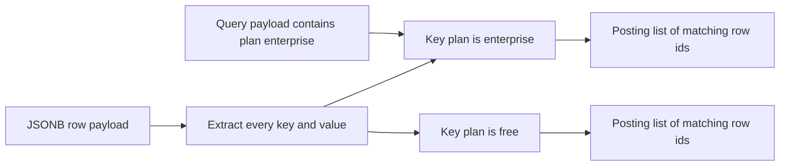
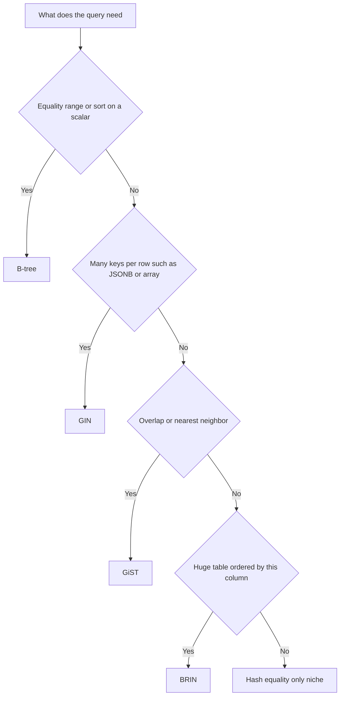

# Lecture 2 — The other index types: hash, GIN, GiST, BRIN

> **Duration:** ~2 hours. **Outcome:** You can name Postgres's five index access methods, say what data shape and query operator each one is *for*, and pick the right one for JSONB, full-text, arrays, geometry, and giant append-only tables — instead of reaching for a B-tree every time.

## 1. Why more than one index type?

A B-tree is a sorted structure. That is its strength (ranges, ordering) and its limit: it can only answer questions that reduce to *"where does this value fall in a total order?"* Huge classes of queries do not fit that mold:

- "Which events' JSONB payload **contains** `{"plan":"pro"}`?" — containment, not ordering.
- "Which documents **match** the search terms `postgres & index`?" — full-text match.
- "Which delivery zones **overlap** this map rectangle?" — geometric intersection.
- "Which rows fall in this time range, in a 400 GB append-only log?" — a range, but a B-tree index would itself be enormous.

Postgres ships **five index access methods**, each a different data structure tuned to a different family of operators.

| Method | Structure | Built for | Operators it accelerates |
|--------|-----------|-----------|--------------------------|
| **B-tree** | Balanced sorted tree | Scalar values with a total order | `=`, `<`, `<=`, `>`, `>=`, `BETWEEN`, `IN`, `ORDER BY`, prefix `LIKE` |
| **Hash** | Hash table | Scalar equality only | `=` |
| **GIN** | Inverted index | Composite values with many keys per row | `@>`, `?`, `@@`, `&&` (JSONB, full-text, arrays) |
| **GiST** | Balanced tree of bounding boxes | Overlap / nearest-neighbor / ranges | `&&`, `<@`, `<->` (geometry, ranges, trigrams, full-text) |
| **BRIN** | Per-block min/max summaries | Huge tables physically ordered by the column | `<`, `<=`, `=`, `>=`, `>` on naturally-clustered data |

The command is always `CREATE INDEX ... USING <method> (...)`. Default (no `USING`) is `btree`.

## 2. Hash indexes — equality, and only equality

A hash index stores `hash(value) → ctid`. It answers `column = value` and nothing else — no ranges, no ordering, no sorting.

```sql
CREATE INDEX ix_customers_email_hash ON customers USING hash (email);
```

Since PostgreSQL 10, hash indexes are **crash-safe and WAL-logged** (before that they were a footgun and everyone avoided them). Even so, they are rarely worth it:

- A B-tree *also* does equality, *plus* ranges and ordering, so a B-tree is almost always the better default.
- Hash indexes can be **smaller** than a B-tree for very long keys (they store a 4-byte hash, not the whole value), which is their one genuine niche: equality lookups on long text or on columns you will *never* range-query or sort.

**Verdict:** reach for a B-tree unless you have measured that a hash index's smaller size matters. Know it exists; rarely deploy it.

## 3. GIN — the inverted index for "contains one of many"

**GIN** = Generalized Inverted iNdex. An *inverted index* maps each **key** to the list of rows that contain it — the same structure a search engine uses. It shines when a single column holds **many** searchable keys per row: the words in a document, the elements of an array, the key/value pairs of a JSONB blob.


*GIN stores one entry per key with the list of rows that contain it, so a containment query jumps straight to the posting list.*

### 3a. JSONB containment

Recall the `events` table from the seed. Build it now if you skipped it:

```sql
CREATE TABLE events (
    id       bigint GENERATED ALWAYS AS IDENTITY PRIMARY KEY,
    payload  jsonb NOT NULL
);

INSERT INTO events (payload)
SELECT jsonb_build_object(
    'user_id', 1 + (g % 100000),
    'plan',    (ARRAY['free','pro','team','enterprise'])[1 + (g % 4)],
    'action',  (ARRAY['login','click','purchase','logout'])[1 + (g % 4)],
    'tags',    to_jsonb(ARRAY['t' || (g % 50), 't' || (g % 37)])
)
FROM generate_series(1, 2000000) AS g;
ANALYZE events;
```

Without an index, a containment query scans all 2M rows:

```sql
EXPLAIN (ANALYZE, BUFFERS)
SELECT count(*) FROM events WHERE payload @> '{"plan":"enterprise"}';
```

The `@>` ("contains") operator is what GIN accelerates. Add the index:

```sql
CREATE INDEX ix_events_payload_gin ON events USING gin (payload);
ANALYZE events;
```

Re-run the query — now a `Bitmap Index Scan` on the GIN index. GIN indexed every key and value in every JSONB doc, so it can jump straight to the rows containing `plan=enterprise`.

**Operator-class tuning:** the default GIN opclass for JSONB (`jsonb_ops`) indexes every key *and* value, supporting `@>`, `?`, `?|`, `?&`. If you only ever use `@>` (containment), the smaller, faster **`jsonb_path_ops`** opclass is better:

```sql
CREATE INDEX ix_events_payload_gin ON events USING gin (payload jsonb_path_ops);
```

It builds a smaller index and speeds up `@>`, at the cost of not supporting the key-existence operators (`?`). Pick it when containment is your only access pattern.

### 3b. Full-text search

Full-text search converts a document into a `tsvector` (normalized, stemmed lexemes) and matches it against a `tsquery` with the `@@` operator. GIN is the standard index for it.

```sql
-- add a searchable text column to customers for the demo
ALTER TABLE customers ADD COLUMN bio text;
UPDATE customers SET bio =
    'Customer from ' || country || ' who enjoys ' ||
    (ARRAY['hiking','cooking','postgres','music','travel'])[1 + (id % 5)];

-- index the computed tsvector as an expression index
CREATE INDEX ix_customers_bio_fts
ON customers USING gin (to_tsvector('english', bio));

ANALYZE customers;

EXPLAIN (ANALYZE, BUFFERS)
SELECT id, bio FROM customers
WHERE to_tsvector('english', bio) @@ to_tsquery('english', 'postgres & hiking');
```

The `@@` match uses the GIN index. For production you would usually store the `tsvector` in its own generated column and index that, so the expression is computed once at write time, not per query — Week 9 covers generated columns and triggers.

### 3c. Arrays

GIN indexes array columns for the "overlaps / contains" operators `&&`, `@>`, `<@`:

```sql
-- events.payload->'tags' is JSONB, but a real text[] column works the same way:
CREATE INDEX ix_events_tags_gin ON events USING gin ((payload -> 'tags'));
SELECT count(*) FROM events WHERE payload -> 'tags' @> '["t5"]';
```

### The GIN trade-off

GIN indexes are **slow to update and large**, because inserting one row may touch many key-postings. Postgres softens this with a **`fastupdate`** pending list (buffering new entries, flushed in bulk), tunable via the `gin_pending_list_limit` storage parameter. The lesson: GIN is superb for read-heavy, write-light data (a document store you query constantly, load occasionally) and painful for high-churn columns.

## 4. GiST — overlap, nearest-neighbor, and ranges

**GiST** = Generalized Search Tree. It is a *framework* for balanced trees where each internal node stores a **bounding box** that contains everything below it. That makes it ideal for questions of **overlap** and **distance** rather than equality:

- **Geometry** (via PostGIS): "which shapes intersect this rectangle?" `&&`, `<@`.
- **Range types**: "which reservations overlap `[14:00, 16:00)`?" `&&` on a `tstzrange`.
- **Nearest-neighbor**: "the 10 closest points to here," using the distance operator `<->` in `ORDER BY` — a *KNN* index scan, which a B-tree simply cannot do.
- **Trigrams / fuzzy text** (via `pg_trgm`): similarity and `LIKE '%middle%'`.

Range-overlap example — exactly the pattern behind an exclusion constraint that prevents double-booking:

```sql
CREATE TABLE bookings (
    room_id  int NOT NULL,
    during   tstzrange NOT NULL
);
CREATE INDEX ix_bookings_during_gist ON bookings USING gist (during);

-- "does anything overlap 2pm-4pm on this day?" -> GiST index scan
SELECT * FROM bookings
WHERE during && tstzrange('2026-07-16 14:00', '2026-07-16 16:00');
```

Trigram example — accelerate an unanchored `LIKE`, which no B-tree can do:

```sql
CREATE EXTENSION IF NOT EXISTS pg_trgm;
CREATE INDEX ix_customers_email_trgm ON customers USING gist (email gist_trgm_ops);
SELECT * FROM customers WHERE email LIKE '%42@example%';   -- now index-assisted
```

(`pg_trgm` also works with GIN — GIN for pure containment/`LIKE`, GiST when you also want similarity ranking with `<->`.)

**GIN vs GiST, the one-line rule:** GIN is *faster to search, slower to build, larger*; GiST is *faster to build, smaller, supports distance/`<->` and overlap*. For static full-text data, prefer GIN. For frequently-updated data or geometry/ranges/nearest-neighbor, prefer GiST.

## 5. BRIN — a tiny index for enormous, ordered tables

**BRIN** = Block Range INdex. Instead of one index entry per row, BRIN stores a **summary (min/max) per block range** — by default, per 128 table pages. For our 2M-row `orders`, a B-tree on `created_at` might be ~40 MB; a BRIN on the same column is a few *kilobytes*.

BRIN works only when the column's values are **physically correlated** with row order on disk — which is exactly true for append-only, time-ordered data like logs, events, and orders inserted over time. `created_at` fits perfectly.

```sql
CREATE INDEX ix_orders_created_brin ON orders USING brin (created_at);
ANALYZE orders;

EXPLAIN (ANALYZE, BUFFERS)
SELECT count(*) FROM orders
WHERE created_at BETWEEN '2023-06-01' AND '2023-06-08';
```

How it answers: for each block range, BRIN checks "could this range contain a `created_at` in my window?" using the stored min/max. Ranges that cannot are skipped entirely; the rest are scanned. When data is well-ordered, it skips almost everything.

| | B-tree on `created_at` | BRIN on `created_at` |
|-|------------------------|----------------------|
| Size | Tens of MB | A few KB |
| Build/maintenance cost | Higher | Almost free |
| Best when | Any selectivity, need exact lookups | Column correlates with physical order; huge table; range queries |
| Fails when | — | Data inserted in random order (min/max per range becomes the whole domain — useless) |

**The correlation caveat:** if you check `SELECT correlation FROM pg_stats WHERE tablename='orders' AND attname='created_at';` and it is near ±1, BRIN will fly. Near 0, BRIN is worthless. You can restore correlation with `CLUSTER orders USING ix_orders_created_at;` (physically reorders the table — see Lecture 3 on the cost).


*A rough decision path from query shape to the right index access method.*

## 6. A decision table you can actually use

| You need to… | Column shape | Use |
|--------------|--------------|-----|
| Equality, range, sort, `MIN`/`MAX`, prefix `LIKE` | scalar (int, text, timestamp) | **B-tree** (the default; 95% of indexes) |
| Equality on a very long key, never ranged/sorted | long text/bytea | **Hash** (niche; measure first) |
| JSONB containment `@>` | `jsonb` | **GIN** (`jsonb_path_ops` if only `@>`) |
| Full-text `@@` | `tsvector` / text | **GIN** (static) or **GiST** (churny) |
| Array overlap/contains `&&`, `@>` | `int[]`, `text[]` | **GIN** |
| Unanchored `LIKE '%x%'` / fuzzy match | text | **GIN or GiST** with `pg_trgm` |
| Geometry / range overlap, nearest-neighbor `<->` | geometry, `tstzrange` | **GiST** |
| Range scans on a giant append-only, time-ordered table | timestamp/serial | **BRIN** |

## 7. Check yourself

- Why can't a B-tree answer `payload @> '{"plan":"pro"}'`? What structure does, and why?
- When is `jsonb_path_ops` the right GIN opclass, and what do you give up to get it?
- Give one query a GiST index can serve that a GIN index cannot.
- A colleague adds a hash index "for speed" on a column they also sort by. What is your feedback?
- BRIN is 1000× smaller than the equivalent B-tree. What single property of the data must hold for it to work, and how do you check it?
- Your team runs unanchored `LIKE '%error%'` on a 50M-row log table. Name two index approaches and which you would try first.

If you can answer all six, go to Lecture 3.

## Further reading

- **PostgreSQL docs — Index Types (btree/hash/gin/gist/brin/spgist):** <https://www.postgresql.org/docs/current/indexes-types.html>
- **PostgreSQL docs — GIN:** <https://www.postgresql.org/docs/current/gin.html> · **GiST:** <https://www.postgresql.org/docs/current/gist.html> · **BRIN:** <https://www.postgresql.org/docs/current/brin.html>
- **PostgreSQL docs — JSON indexing (`jsonb_path_ops`):** <https://www.postgresql.org/docs/current/datatype-json.html#JSON-INDEXING>
- **PostgreSQL docs — Full Text Search / GIN & GiST:** <https://www.postgresql.org/docs/current/textsearch-indexes.html>
- **`pg_trgm` extension:** <https://www.postgresql.org/docs/current/pgtrgm.html>
