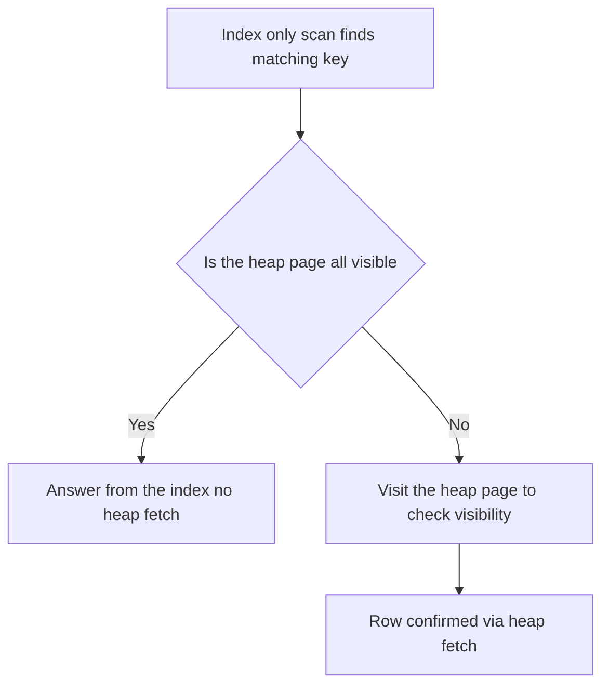
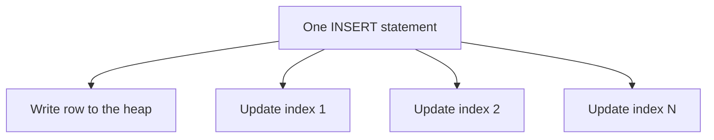

# Lecture 3 — Composite, partial, and covering indexes (and the cost of indexes)

> **Duration:** ~2 hours. **Outcome:** You can order the columns of a composite index correctly, cut an index down to size with a partial `WHERE`, trigger an index-only scan with `INCLUDE`, and — the mark of a senior engineer — argue for *deleting* an index because you understand what it costs on every write.

## 1. Composite indexes: more than one column

A **composite** (multi-column) index sorts rows by the first column, then breaks ties with the second, then the third — exactly like sorting a spreadsheet by column A, then B, then C.

```sql
CREATE INDEX ix_orders_cust_created ON orders (customer_id, created_at);
```

This index is sorted by `customer_id`, and *within* each `customer_id` by `created_at`. That ordering is the whole story of when it helps.

### The leftmost-prefix rule

A composite index can serve a query only if the query uses a **leftmost prefix** of the index columns. For `(customer_id, created_at)`:

| Query predicate | Uses the index? | Why |
|-----------------|:---------------:|-----|
| `WHERE customer_id = 42` | ✅ Yes | Uses the first column — a prefix. |
| `WHERE customer_id = 42 AND created_at > '2023-01-01'` | ✅ Yes (best case) | Uses both, in order. |
| `WHERE customer_id = 42 ORDER BY created_at` | ✅ Yes | Prefix filters, second column already sorted — no sort step. |
| `WHERE created_at > '2023-01-01'` | ⚠️ Rarely | Skips the first column; the index is sorted by `customer_id` first, so `created_at` is scattered. |
| `WHERE created_at > '2023-01-01' AND customer_id = 42` | ✅ Yes | Order in SQL doesn't matter — the planner reorders; the *index* column order does. |

The analogy: a phone book sorted by (last name, first name) is great for "find Smith" and "find Smith, John," useless for "find everyone named John." The **first column must be usable** or the index is mostly dead weight.

### Column-ordering rules of thumb

1. **Equality columns before range columns.** Put columns you filter with `=` first, and the column you filter with a range (`>`, `BETWEEN`) or sort by last. `(customer_id, created_at)` beats `(created_at, customer_id)` for "one customer's recent orders," because once you range-scan `created_at` you cannot use a later column efficiently.
2. **Most selective equality column first** — usually. It shrinks the search fastest. (Caveats exist around `ORDER BY` and index-only scans; measure.)
3. **Match your `ORDER BY`.** If you frequently `ORDER BY created_at DESC`, a matching composite index removes the sort node entirely.

Watch the difference:

```sql
-- serves "recent orders for one customer" perfectly:
EXPLAIN (ANALYZE, BUFFERS)
SELECT * FROM orders
WHERE customer_id = 42 AND created_at >= '2023-06-01'
ORDER BY created_at DESC;
```

You should see an `Index Scan` on `ix_orders_cust_created` with **no separate `Sort` node** — the index already delivers rows in the requested order.

## 2. Partial indexes: index only the rows you query

A **partial index** carries a `WHERE` clause. It indexes only the subset of rows matching that clause — smaller on disk, cheaper to maintain, and faster because it holds only rows you actually query.

Classic case: a status column where you almost always query one rare value. Most orders end up `delivered`, but your dashboards constantly ask for the few `pending` ones:

```sql
CREATE INDEX ix_orders_pending
ON orders (created_at)
WHERE status = 'pending';
```

Now the index contains *only* pending orders — perhaps 20% the size of a full index, and every insert of a non-pending order skips it entirely. The planner uses it when the query's `WHERE` implies the index's predicate:

```sql
EXPLAIN (ANALYZE, BUFFERS)
SELECT * FROM orders
WHERE status = 'pending' AND created_at >= '2023-06-01';
```

Where partial indexes win:

| Pattern | Partial index |
|---------|---------------|
| "Active/open/pending" rows queried constantly, but a minority | `WHERE status = 'pending'` |
| Soft-deletes | `WHERE deleted_at IS NULL` |
| Enforce uniqueness on a subset | `CREATE UNIQUE INDEX ... WHERE is_primary` |
| Skip indexing cheap-but-huge NULLs | `WHERE some_col IS NOT NULL` |

The catch: the query's predicate must be provably implied by the index's `WHERE`, or the planner won't use it. `WHERE status = 'pending'` matches; `WHERE status IN ('pending','paid')` does not.

## 3. Covering indexes and the index-only scan

Recall from Lecture 1: an index scan is *two* steps — find the entry in the index, then **fetch the row from the heap** to get the columns you `SELECT`ed. That heap fetch is random I/O and often the slow part.

An **index-only scan** eliminates the heap fetch: if *every* column the query needs is already **in the index**, the database answers from the index alone and never touches the table. This is the fastest read Postgres can do.

Two ways to make an index cover a query:

**(a) Put the extra columns in the key.** Works, but bloats the tree and imposes sort order on columns you don't filter by.

**(b) Use `INCLUDE` — the covering index.** Since Postgres 11, `INCLUDE` adds columns to the index's *leaf* entries as payload only — not part of the sorted key, just carried along so the index can answer without a heap trip.

```sql
-- query: "for one customer, list order dates and totals"
CREATE INDEX ix_orders_cover
ON orders (customer_id, created_at) INCLUDE (total_cents);

EXPLAIN (ANALYZE, BUFFERS)
SELECT created_at, total_cents
FROM orders
WHERE customer_id = 42;
```

You should see an **`Index Only Scan`**. The `WHERE` uses the key (`customer_id`), the `ORDER`/range could use `created_at`, and `total_cents` rides along via `INCLUDE` — so every selected column lives in the index. No heap fetch.

### The visibility-map asterisk

Index-only scans have one honest catch. Indexes do **not** store row visibility (MVCC — Week 5), so to know a row is visible to your transaction, Postgres checks the table's **visibility map** — a bitmap of pages known to be all-visible. If the page is flagged all-visible, no heap fetch. If not (recently updated), Postgres must visit the heap anyway, partially defeating the point.


*An index-only scan skips the heap only when the visibility map marks the page all-visible.*

Look for `Heap Fetches:` in the plan. A high number means the visibility map is stale — the fix is **`VACUUM`**, which refreshes it:

```sql
VACUUM orders;
-- re-run the index-only-scan query; Heap Fetches should drop toward 0
```

This is a concrete reason routine `VACUUM` (autovacuum) keeps read performance high, and a bridge back to Week 5: dead tuples from updates/deletes are what dirty the visibility map.

## 4. The cost of an index — why you don't index everything

Beginners add indexes until queries are fast. Seniors add the *fewest* indexes that make queries fast, because every index has three running costs.

### 4a. Write amplification

Every `INSERT`, `UPDATE`, and `DELETE` must update **every index** on the table. A table with 6 indexes turns one row insert into one heap write **plus six index writes**. Watch it:

```sql
-- time a bulk insert with few indexes vs many
\timing on
INSERT INTO orders (customer_id, status, total_cents, created_at)
SELECT 1 + (g % 100000), 'pending', 500, now()
FROM generate_series(1, 100000) AS g;
```

Drop half the indexes and repeat: the insert is measurably faster. On write-heavy tables (event ingestion, queues), each extra index is a tax on *every* write, forever.


*Every index on a table adds one more write to each insert update or delete.*

### 4b. Bloat

Indexes accumulate dead entries as rows are updated and deleted (MVCC keeps old versions until `VACUUM`). Over time an index can grow far larger than the live data it points to. Measure it:

```sql
SELECT
    indexrelname,
    pg_size_pretty(pg_relation_size(indexrelid)) AS size,
    idx_scan AS times_used
FROM pg_stat_user_indexes
WHERE relname = 'orders'
ORDER BY pg_relation_size(indexrelid) DESC;
```

`idx_scan = 0` after the database has been running a while is the smoking gun of a **useless index**: it costs you on every write and returns nothing. Rebuild a bloated but useful index without downtime using:

```sql
REINDEX INDEX CONCURRENTLY ix_orders_created_at;
```

### 4c. Maintenance and planning overhead

More indexes = more for the planner to consider (marginal), more disk and memory (real), and more to keep warm in cache. Cache is finite; an unused index still competes for buffer space.

### The senior move: find and drop dead indexes

```sql
-- indexes never used since stats were last reset, largest first
SELECT relname AS table, indexrelname AS index,
       pg_size_pretty(pg_relation_size(indexrelid)) AS size,
       idx_scan
FROM pg_stat_user_indexes
WHERE idx_scan = 0
  AND indexrelid NOT IN (SELECT conindid FROM pg_constraint)  -- keep PK/unique
ORDER BY pg_relation_size(indexrelid) DESC;
```

Before dropping, confirm the stats have been collecting long enough to be meaningful (a fresh `pg_stat_reset` hides real usage). Then:

```sql
DROP INDEX CONCURRENTLY ix_orders_some_dead_index;
```

`CONCURRENTLY` (for both `CREATE` and `DROP`) avoids taking a heavy lock that would block writes — essential on production. It is slower and cannot run inside a transaction block, but it does not stop the world.

## 5. A build-vs-buy checklist for any proposed index

Before you `CREATE INDEX`, answer:

1. **Is the predicate sargable?** If not, fix the query first (Lecture 1) — an index won't be used.
2. **Is it selective enough?** If it keeps >20–30% of rows, the planner will scan anyway. Don't bother.
3. **What's the column order?** Equality before range; match the `ORDER BY`.
4. **Can it be partial?** If you only query a subset, add a `WHERE`.
5. **Can it be covering?** If a few extra `INCLUDE` columns yield an index-only scan for a hot query, do it.
6. **What does it cost on write?** How write-heavy is this table? Is there already a similar index this could replace?
7. **Did you prove it?** `EXPLAIN (ANALYZE, BUFFERS)` before and after. No proof, no merge.

## 6. Check yourself

- Given `(customer_id, created_at)`, which of these use the index: `WHERE customer_id = 5`; `WHERE created_at > x`; `WHERE customer_id = 5 ORDER BY created_at`? Explain each.
- Why put equality columns before range columns in a composite index?
- Write a partial index for "open support tickets" where `status = 'open'` is a small minority, and give the query that would use it.
- What is the difference between adding a column to an index's key and adding it with `INCLUDE`?
- An index-only scan shows `Heap Fetches: 48213`. What is wrong and what fixes it?
- Give three distinct costs every index imposes, and the query you'd run to find an index that isn't earning its keep.
- Why `CONCURRENTLY`, and what's the price of using it?

If you can answer all seven, you're ready for the exercises.

## Further reading

- **PostgreSQL docs — Multicolumn Indexes:** <https://www.postgresql.org/docs/current/indexes-multicolumn.html>
- **PostgreSQL docs — Partial Indexes:** <https://www.postgresql.org/docs/current/indexes-partial.html>
- **PostgreSQL docs — Index-Only Scans and Covering Indexes:** <https://www.postgresql.org/docs/current/indexes-index-only-scans.html>
- **PostgreSQL docs — `CREATE INDEX` (INCLUDE, CONCURRENTLY):** <https://www.postgresql.org/docs/current/sql-createindex.html>
- **Markus Winand, "Use The Index, Luke" — The Where Clause / Ordering:** <https://use-the-index-luke.com/sql/where-clause>
