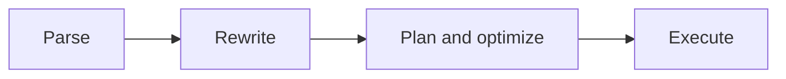
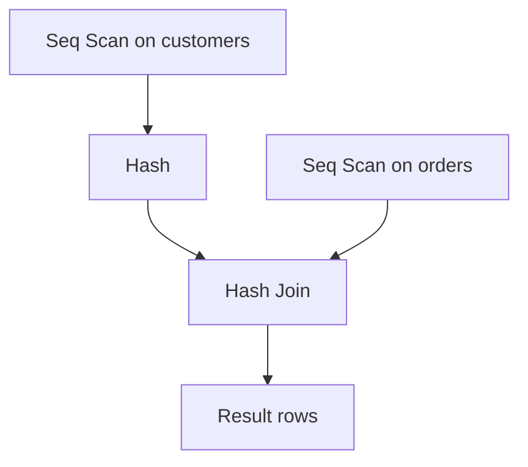

# Lecture 1 — EXPLAIN and Reading the Plan Tree

> **Duration:** ~2 hours. **Outcome:** You can run all three `EXPLAIN` variants, read the plan tree in the right order, and find the single node where the planner's estimate diverges from reality — the starting point of every tuning session.

You cannot tune what you cannot see. When a query is slow, the amateur move is to start adding indexes and rewriting joins by feel. The professional move is to ask the database *what it is actually doing* — and PostgreSQL will tell you, in complete detail, for free. That report is the **execution plan**, and `EXPLAIN` is how you read it. This lecture is about reading it correctly, which is a skill most engineers never actually learn. Do learn it. It pays for the rest of your career.

## 1. What the planner does (the 30-second version)

When you send a `SELECT`, PostgreSQL does not just "run it." It runs a small pipeline:

1. **Parse** — turn text into a syntax tree.
2. **Rewrite** — apply view definitions and rules.
3. **Plan/optimize** — this is the interesting part. The **planner** generates candidate *plans* (different orders of scans and joins), estimates the **cost** of each, and picks the cheapest.
4. **Execute** — run the winning plan.

The key word is *estimate*. The planner never runs your query to decide how to run it — that would be circular. Instead it guesses, using **statistics** it collected earlier about your tables. Most bad plans are bad guesses. So the whole game of optimization is: *see the plan, find the bad guess, fix the guess.*


*The four-stage pipeline every SELECT passes through before you see a row.*

## 2. The three EXPLAIN variants

There are three commands you will use constantly. Know exactly what each does — the difference is not cosmetic.

| Command | Runs the query? | Shows | Use it when |
|---------|:---------------:|-------|-------------|
| `EXPLAIN q` | **No** | Estimated cost, rows, plan shape | Fast look; safe on any query including huge `UPDATE`/`DELETE` |
| `EXPLAIN (ANALYZE) q` | **Yes** | Above **+** actual rows, actual time, loops | You want the truth, and the query is safe to actually run |
| `EXPLAIN (ANALYZE, BUFFERS) q` | **Yes** | Above **+** shared/local buffer hits and reads | You suspect I/O is the bottleneck (almost always worth adding) |

Plain `EXPLAIN` only *estimates*. `EXPLAIN (ANALYZE)` **actually executes the query** and reports what really happened. This matters enormously:

```sql
EXPLAIN ANALYZE DELETE FROM orders WHERE id = 42;
```

That **really deletes the row.** `ANALYZE` here is the EXPLAIN *option*, unrelated to the `ANALYZE` statement that collects statistics (Lecture 2) — an unfortunate name collision. To EXPLAIN-ANALYZE a data-modifying statement without changing anything, wrap it in a transaction and roll back:

```sql
BEGIN;
EXPLAIN (ANALYZE) UPDATE orders SET status = 'x' WHERE id = 42;
ROLLBACK;
```

The modern option syntax uses parentheses and lets you combine options freely:

```sql
EXPLAIN (ANALYZE, BUFFERS, FORMAT TEXT) SELECT ...;
EXPLAIN (ANALYZE, BUFFERS, VERBOSE, SETTINGS) SELECT ...;
```

Useful options:

| Option | Effect |
|--------|--------|
| `ANALYZE` | Actually execute; report real rows and time |
| `BUFFERS` | Report buffer (page) hits, reads, dirtied, written |
| `VERBOSE` | Show output column lists, schema-qualified names |
| `SETTINGS` | Show any planner GUCs set away from default |
| `WAL` | Report WAL records generated (for writes) |
| `FORMAT` | `TEXT` (default), `JSON`, `YAML`, `XML` — JSON feeds tools |

## 3. Anatomy of a plan node

Run this against the seed data:

```sql
EXPLAIN SELECT * FROM orders WHERE customer_id = 1234;
```

```
Index Scan using orders_customer_id_idx on orders  (cost=0.43..18.62 rows=12 width=64)
  Index Cond: (customer_id = 1234)
```

Every line that starts with an operation name (`Index Scan`, `Seq Scan`, `Hash Join`, `Sort`, …) is a **node**. The parenthesized numbers are the planner's estimate for that node:

| Field | Meaning |
|-------|---------|
| `cost=0.43..18.62` | **Startup cost .. total cost**, in abstract "cost units" (not ms, not rows) |
| `rows=12` | Estimated number of rows this node will **output** |
| `width=64` | Estimated average row width in **bytes** |

- **Startup cost** (`0.43`) is the estimated cost before the *first* row can be emitted. For a sort, this is high — you must read everything before you can emit the smallest value. For a sequential scan, it is near zero.
- **Total cost** (`18.62`) is the estimated cost to emit the *last* row. This is the number the planner minimizes overall.

The cost unit is arbitrary but consistent: it is roughly "the cost of reading one sequential page." A total cost of 18.62 means "about as expensive as reading ~19 sequential pages." You never convert cost to milliseconds — you use it only to compare plans *against each other*.

## 4. The plan is a tree — read it inside-out

Real plans are trees. Indentation shows parent/child structure. Consider:

```
Hash Join  (cost=289.00..2401.00 rows=5000 width=96)
  Hash Cond: (o.customer_id = c.id)
  ->  Seq Scan on orders o  (cost=0.00..1600.00 rows=100000 width=64)
  ->  Hash  (cost=164.00..164.00 rows=10000 width=32)
        ->  Seq Scan on customers c  (cost=0.00..164.00 rows=10000 width=32)
```

**Data flows up.** The children run first and feed their parent:

1. `Seq Scan on customers` runs, producing 10,000 rows.
2. `Hash` consumes them and builds an in-memory hash table.
3. `Seq Scan on orders` runs, producing 100,000 rows.
4. `Hash Join` probes the hash table with each order and emits matches.

So you read a plan **bottom-up and inside-out**: the most-indented nodes execute first, the top node produces the final result. The top node's `rows` is your result-set size estimate; the top node's `cost` total is the whole query's estimated cost.

A quick rule for the eye: find the deepest indentation, start there, walk outward.


*Children run first; data flows up the tree to the root node.*

## 5. Estimated vs. actual — the whole ballgame

Plain `EXPLAIN` shows only estimates. Add `ANALYZE` and each node gains a second set of numbers — the *reality*:

```sql
EXPLAIN (ANALYZE) SELECT * FROM orders WHERE customer_id = 1234;
```

```
Index Scan using orders_customer_id_idx on orders
  (cost=0.43..18.62 rows=12 width=64)
  (actual time=0.031..0.052 rows=11 loops=1)
  Index Cond: (customer_id = 1234)
Planning Time: 0.140 ms
Execution Time: 0.081 ms
```

Now you have two sets of parentheses per node:

| Field | Meaning |
|-------|---------|
| `actual time=0.031..0.052` | **Real startup .. total time in milliseconds**, *per loop* |
| `rows=11` | **Real** rows this node emitted (per loop) |
| `loops=1` | How many times this node ran |

The single most valuable diagnostic in all of query tuning is this comparison:

> **estimated `rows` vs. actual `rows`.**

Here it is 12 vs. 11 — essentially perfect. The planner understood the data, so it picked a good plan. When they match, trust the plan. When they diverge by 10×, 100×, 1000× — you have found your bug. The planner built its entire strategy on a number that was wrong, so every choice downstream is suspect.

Example of a *bad* estimate:

```
Nested Loop  (cost=0.42..842.00 rows=1 width=8)
             (actual time=0.05..9184.2 rows=48213 loops=1)
```

Estimated 1 row, got 48,213. The planner chose a Nested Loop because it thought the inner side would run *once*. It ran 48,213 times. That is how a query that "should be instant" takes nine seconds. Fixing it (Lecture 3) means fixing the estimate.

### The `loops` multiplier

`actual time` and `rows` are reported **per loop, not totalled.** If a node shows `actual time=0.2..0.5 rows=3 loops=10000`, the *real* total time it consumed is roughly `0.5 ms × 10000 = 5 seconds`, and it produced `3 × 10000 = 30000` rows. Always multiply by `loops` before trusting a per-node time. Newcomers stare at "0.5 ms" and miss the 10,000 loops. Don't.

## 6. BUFFERS — following the I/O

Time tells you *how long*; buffers tell you *why*. Add `BUFFERS`:

```sql
EXPLAIN (ANALYZE, BUFFERS) SELECT * FROM orders WHERE total > 100;
```

```
Seq Scan on orders  (cost=0.00..1600.00 rows=90000 width=64)
  (actual time=0.02..142.9 rows=89934 loops=1)
  Filter: (total > 100)
  Rows Removed by Filter: 10066
  Buffers: shared hit=812 read=13188
```

- `shared hit=812` — pages found already in PostgreSQL's buffer cache (fast, RAM).
- `read=13188` — pages that had to be fetched from the OS/disk (slow).
- A page is 8 KB. `read=13188` means ~103 MB pulled off disk for this one scan.

`Buffers` turns a vague "it's slow" into "it read 100 MB from disk." Two runs of the same query differ wildly: the first is *cold* (high `read`), the second is *warm* (high `hit`). Always run twice and read the warm numbers for steady-state behavior — but note the cold numbers to understand worst case.

`Rows Removed by Filter: 10066` is another gift: the scan looked at 100,000 rows and threw away 10,066. If that number is huge relative to what you kept, an index could have skipped the wasted work.

## 7. Extra lines under a node

Nodes carry annotations that are diagnostic gold:

| Line | Meaning |
|------|---------|
| `Index Cond:` | Condition satisfied *by the index itself* (efficient) |
| `Filter:` | Condition checked *after* fetching the row (less efficient) |
| `Rows Removed by Filter: N` | Rows fetched then discarded — wasted work |
| `Heap Fetches: N` | Index-only scan still had to touch the heap N times |
| `Sort Method: quicksort  Memory: 25kB` | Sort fit in memory |
| `Sort Method: external merge  Disk: 4096kB` | Sort **spilled to disk** — `work_mem` too small (Lecture 3) |
| `Workers Planned/Launched:` | Parallel query used N worker processes |

`Index Cond` vs `Filter` is a distinction worth internalizing: a condition in `Index Cond` was used to *navigate* the index (cheap); a condition in `Filter` was applied to rows the node already had to fetch (you paid to fetch them first).

## 8. SQLite: the same idea, smaller

SQLite has the same concept with a leaner report. Use `EXPLAIN QUERY PLAN` (the plain `EXPLAIN` in SQLite dumps bytecode you rarely want):

```sql
EXPLAIN QUERY PLAN
SELECT * FROM orders WHERE customer_id = 1234;
```

```
QUERY PLAN
`--SEARCH orders USING INDEX orders_customer_id_idx (customer_id=?)
```

- `SEARCH ... USING INDEX` ≈ PostgreSQL's Index Scan (targeted).
- `SCAN <table>` ≈ Seq Scan (reads the whole table).
- Nesting and `USING TEMP B-TREE` (for sorts/group-by) mirror the tree idea.

SQLite has no `ANALYZE`-style timing inside the plan; you time with `.timer on` in the shell. The mental model transfers completely: *targeted SEARCH good, full SCAN suspect (unless the table is tiny or you truly want all rows).*

## 9. A repeatable reading routine

When you open any plan, go in this fixed order. Do it the same way every time until it is muscle memory:

1. **Read `Execution Time`** at the bottom. Is it actually slow? (Sometimes it isn't.)
2. **Find the deepest node** and read the tree outward to understand the shape.
3. **Scan every node for estimated vs. actual `rows`.** Circle the worst divergence.
4. **Multiply per-node time by `loops`** to find where the milliseconds actually go.
5. **Check `Buffers`** on the expensive node: is it disk I/O or CPU?
6. **Read the annotations:** `Filter` throwing away lots of rows? Sort spilling to disk?
7. **Only now** form a hypothesis: better index, better estimate, or a rewrite.

That routine is the entire lecture in seven lines. The three lectures this week just deepen each step.

## 10. Check yourself

- What is the difference between `EXPLAIN` and `EXPLAIN (ANALYZE)`, and why is the second one dangerous on a `DELETE`?
- In `cost=0.43..18.62`, which number is startup cost and which is total? What does startup cost mean for a `Sort` node?
- Data in a plan tree flows which direction — up or down? Which node runs first, the most-indented or the least?
- A node shows `rows=1` estimated but `rows=50000` actual. Why is this the first thing you'd investigate?
- A node shows `actual time=0.4..0.9 rows=2 loops=20000`. Roughly how much total time did it consume?
- What is the difference between a condition appearing under `Index Cond:` versus under `Filter:`?
- In `Buffers: shared hit=812 read=13188`, which count do you want to be large, and why does running the query twice change them?

When all seven are easy, move to [Lecture 2 — Scans, Joins, and the Cost Model](./02-scans-joins-and-the-cost-model.md).

## Further reading

- **PostgreSQL — Using EXPLAIN (official):** <https://www.postgresql.org/docs/current/using-explain.html>
- **PostgreSQL — EXPLAIN command reference:** <https://www.postgresql.org/docs/current/sql-explain.html>
- **SQLite — EXPLAIN QUERY PLAN:** <https://www.sqlite.org/eqp.html>
- **Depesz — the classic plan explainer/visualizer:** <https://explain.depesz.com/>
