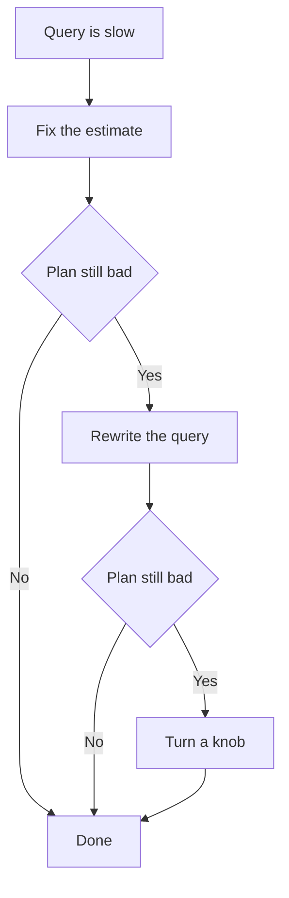

# Lecture 3 — Rewriting Queries and Tuning Knobs

> **Duration:** ~2 hours. **Outcome:** You can recognize the query patterns that defeat the planner, rewrite them into optimizable forms, fix bad estimates with statistics, and turn the small set of knobs (`work_mem`, `ANALYZE`, extended statistics) that actually move the needle.

You now read plans (Lecture 1) and predict them (Lecture 2). This lecture is the payoff: what to *do* when the plan is bad. There are three moves, and you try them in this order — because they go from cheapest and safest to most invasive:

1. **Fix the estimate** — the plan is bad because the planner's row counts are wrong. Update statistics.
2. **Rewrite the query** — the SQL is written in a form the planner can't optimize. Rephrase it.
3. **Turn a knob** — the plan is right but a resource limit (memory) is forcing a slow path.

Reaching for #3 first is the classic junior mistake. Most "slow query" tickets are #1.


*Try the cheapest fix first; only turn a knob after ruling out bad estimates and bad SQL.*

## 1. Stale statistics — the most common bad plan

The planner's estimates are only as fresh as the last `ANALYZE`. After a big data change — a bulk load, a large `DELETE`, a migration — the stats describe a table that no longer exists, and every estimate is wrong. Symptom: estimated rows off by orders of magnitude, a Nested Loop where you expected a Hash Join, a query that was fast yesterday and slow today with no code change.

The fix is one command:

```sql
ANALYZE orders;              -- one table
ANALYZE;                     -- the whole database
VACUUM (ANALYZE) orders;     -- reclaim dead rows AND refresh stats
```

Autovacuum runs auto-analyze automatically, but it triggers on a *fraction* of rows changed (default 10% + a threshold), so a huge table can drift for a long time before it fires, and a bulk load is invisible until enough time passes. **After any bulk load or big migration, run `ANALYZE` yourself.** Don't wait for autovacuum.

To see when a table was last analyzed:

```sql
SELECT relname, last_analyze, last_autoanalyze, n_live_tup, n_dead_tup
FROM pg_stat_user_tables
WHERE relname = 'orders';
```

If `last_analyze` and `last_autoanalyze` are both old and the table has changed a lot, that's your bug. Fix it before touching anything else.

## 2. Non-sargable predicates — when you hide the column from the index

"Sargable" (Search-ARGument-able) means a predicate can use an index. The cardinal sin is **wrapping the indexed column in a function or expression** — the index is on `column`, but you asked about `f(column)`, so the index can't be walked:

```sql
-- NON-sargable: index on created_at is useless here
WHERE date_trunc('day', created_at) = '2026-07-16'
WHERE EXTRACT(year FROM created_at) = 2026
WHERE lower(email) = 'a@b.com'
WHERE total + tax > 100

-- Sargable rewrites: the column is left bare
WHERE created_at >= '2026-07-16' AND created_at < '2026-07-17'
WHERE created_at >= '2026-01-01' AND created_at < '2027-01-01'
WHERE total > 100 - tax   -- if that makes sense; else index the expression
```

Rewrite the predicate so the bare indexed column faces the constant. When you genuinely need the function form (case-insensitive email lookups are common), build an **expression index** to match:

```sql
CREATE INDEX ON users (lower(email));
-- now WHERE lower(email) = 'a@b.com' is sargable
```

Other non-sargable traps: leading wildcards (`LIKE '%foo'` can't use a normal B-tree; `LIKE 'foo%'` can), and implicit type casts (`WHERE varchar_col = 123` may cast the column, not the literal).

## 3. `NOT IN` with NULLs — the correctness-and-speed double trap

`NOT IN (subquery)` is dangerous on two fronts. First, **if the subquery returns even one NULL, the entire result becomes empty** — three-valued logic means `x NOT IN (1, 2, NULL)` is never TRUE. Second, the planner often can't turn `NOT IN` into an efficient anti-join and falls back to a slow plan.

```sql
-- Fragile and often slow
SELECT * FROM orders
WHERE customer_id NOT IN (SELECT id FROM banned_customers);

-- Robust and optimizable — an anti-join
SELECT o.* FROM orders o
WHERE NOT EXISTS (
  SELECT 1 FROM banned_customers b WHERE b.id = o.customer_id
);
```

`NOT EXISTS` is NULL-safe and the planner reliably executes it as an **Anti Join** (you'll see `Hash Anti Join` in the plan). Prefer `NOT EXISTS` over `NOT IN` essentially always. Likewise prefer `EXISTS` over `IN` when the subquery is large.

## 4. `OR` across columns — the optimization barrier

An `OR` spanning *different columns* often blocks index use, because no single index covers both branches:

```sql
-- Planner may Seq Scan: no one index serves both sides
SELECT * FROM orders WHERE customer_id = 42 OR coupon_code = 'SAVE10';
```

Two rewrites help. If each branch has its own index, a `UNION` lets the planner use *both* indexes and combine the results:

```sql
SELECT * FROM orders WHERE customer_id = 42
UNION
SELECT * FROM orders WHERE coupon_code = 'SAVE10';
```

(Use `UNION` to dedupe or `UNION ALL` if the branches can't overlap.) Alternatively, for `OR` on the *same* column, `IN` is cleaner and index-friendly: `WHERE status IN ('a','b')` beats `WHERE status='a' OR status='b'`. Note PostgreSQL *can* sometimes turn column `OR`s into a `BitmapOr` of two index scans on its own — check the plan before rewriting; don't rewrite blindly.

## 5. Correlated columns — when one estimate isn't enough

The planner assumes columns are **independent**. It estimates `WHERE a = 1 AND b = 2` by multiplying the two selectivities. When the columns are correlated, that multiplication is badly wrong. Classic example: `city` and `country`. `WHERE city = 'Paris' AND country = 'France'` — the planner multiplies `P(Paris) × P(France)` and gets a tiny number, but nearly every Paris *is* in France, so the real count is much higher. The under-estimate then triggers a Nested Loop that blows up.

The fix is **extended statistics** — you explicitly tell PostgreSQL these columns travel together:

```sql
CREATE STATISTICS orders_city_country (dependencies, ndistinct)
  ON city, country FROM orders;
ANALYZE orders;
```

- `dependencies` captures functional dependencies (city → country).
- `ndistinct` captures the true number of *combinations* of the columns.
- `mcv` (a third kind) captures the most common *combinations* for even better estimates.

After this, `AND` estimates across those columns become accurate, and the plan corrects itself. Extended statistics are one of the most powerful, least-known tools for fixing mis-estimated multi-column plans.

## 6. `work_mem` — the knob for sorts and hashes

`work_mem` is the memory each sort or hash *node* may use before spilling to disk. Default is a conservative `4MB`. When a sort or hash join exceeds it, PostgreSQL writes temp files — orders of magnitude slower. You saw the tells in Lecture 1:

```
Sort Method: external merge  Disk: 84656kB   -- spilled: work_mem too small
Sort Method: quicksort  Memory: 3072kB       -- stayed in RAM: fine
```

```
Hash Join ...  Batches: 8  ...                -- Batches > 1 means the hash spilled
```

When you see a disk spill on an important query, raise `work_mem` for that session and re-test:

```sql
SET work_mem = '256MB';   -- session only; measure before making global
EXPLAIN (ANALYZE) SELECT ... ORDER BY ...;
```

**Critical caveat:** `work_mem` is *per node, per connection*, not per server. A query with three sorts and 100 connections can allocate `3 × 100 × work_mem`. Setting it to `256MB` globally can OOM your server. The professional pattern is a modest global default and a targeted `SET work_mem` inside the transaction that runs the one heavy analytical query. Don't set it high globally to fix one report.

## 7. The other knobs, and how to reach for them

| Knob | Default | When to touch it |
|------|--------:|------------------|
| `random_page_cost` | `4.0` | Lower to `1.1`–`2.0` on SSD so index scans are costed fairly |
| `effective_cache_size` | `4GB` | Set to ~50–75% of RAM so the planner knows how much data is likely cached |
| `default_statistics_target` | `100` | Raise (200–1000) for columns with skew or many distinct values |
| `work_mem` | `4MB` | Raise per-query when a sort/hash spills to disk |
| `jit` | `on` | Consider `off` for OLTP; JIT compile time can exceed savings on short queries |
| `enable_seqscan`, `enable_nestloop`, … | `on` | **Diagnostic only** — flip `off` to *force* the planner off a path and see the alternative's cost |

That last row is a debugging trick, not a production setting. To find out what the planner *would* do without a Seq Scan:

```sql
SET enable_seqscan = off;
EXPLAIN (ANALYZE) SELECT ...;   -- see the forced alternative and its real cost
SET enable_seqscan = on;        -- always turn it back on
```

If the forced alternative is genuinely faster, the planner's *estimate* was wrong — go fix the statistics (steps 1 and 5). If the forced alternative is slower, the planner was right and your instinct was wrong. Never leave `enable_*` flags off in production; they don't truly disable the path, they just make it astronomically expensive, which corrupts other plans.

## 8. A worked rescue

A report query runs in 9.4 seconds. The plan shows:

```
Nested Loop  (cost=... rows=1 ...) (actual time=... rows=61240 loops=1)
  ->  Index Scan on customers  (rows=1) (actual rows=1 loops=1)
  ->  Index Scan on orders     (rows=1) (actual rows=61240 loops=1)
        Filter: (date_trunc('month', created_at) = '2026-07-01')
```

Reading it: estimated 1 row on the inner side, got 61,240 → Nested Loop chosen on a lie. And `date_trunc(...)` is non-sargable, so the "Index Scan" is really scanning and filtering. Two fixes, in order:

1. **Rewrite the predicate** to be sargable: `created_at >= '2026-07-01' AND created_at < '2026-08-01'`. Now the index on `created_at` is genuinely used, and the row estimate improves because the planner can use the histogram.
2. **Re-`ANALYZE`** if the estimate is still off. With a good estimate, the planner switches to a Hash Join and the query drops to ~40 ms.

That is the whole method: read the plan, find the lie or the barrier, remove it, re-measure. You will do exactly this in the challenges and the mini-project.

## 9. The tuning workflow, distilled

1. Capture the baseline: `EXPLAIN (ANALYZE, BUFFERS)` and save the plan + `Execution Time`.
2. Find the worst estimated-vs-actual node.
3. Is it stale stats? → `ANALYZE`. Correlated columns? → `CREATE STATISTICS`.
4. Is a predicate non-sargable, or is it `NOT IN`/`OR`? → rewrite.
5. Is a sort or hash spilling? → raise `work_mem` for that query.
6. Is an index missing? → add it (Week 6 skills), preferably covering.
7. Re-run `EXPLAIN (ANALYZE, BUFFERS)`. Compare. Keep the change only if the number dropped. Repeat.

Change **one thing at a time** and re-measure. Bundling five changes and seeing "it's faster" teaches you nothing and hides regressions.

## 10. Check yourself

- Your query got slow overnight with no code change. What is the first thing to check, and the one command likely to fix it?
- Why is `WHERE date_trunc('day', created_at) = '2026-07-16'` non-sargable, and how do you rewrite it?
- Why can `NOT IN (subquery)` return an empty result unexpectedly, and what should you use instead?
- The planner estimates `WHERE city='Paris' AND country='France'` as far fewer rows than reality. What assumption is wrong, and what tool fixes it?
- What does `Sort Method: external merge  Disk: 84656kB` tell you, and what knob addresses it?
- Why is setting `work_mem = '512MB'` globally dangerous?
- What does `SET enable_seqscan = off` actually do, and why must you never leave it off in production?

When these are second nature, you're ready for the [exercises](../exercises/README.md).

## Further reading

- **PostgreSQL — Query planning runtime config (`work_mem`, cost constants):** <https://www.postgresql.org/docs/current/runtime-config-query.html>
- **PostgreSQL — Extended statistics (`CREATE STATISTICS`):** <https://www.postgresql.org/docs/current/sql-createstatistics.html>
- **PostgreSQL — Multivariate statistics examples:** <https://www.postgresql.org/docs/current/multivariate-statistics-examples.html>
- **Use The Index, Luke — the sargability chapter:** <https://use-the-index-luke.com/sql/where-clause/functions>
