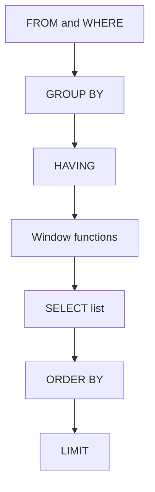

# Lecture 1 — Window Functions & the Ranking Family

> **Duration:** ~2 hours. **Outcome:** You can explain why a window function returns one value per row instead of one per group, write an `OVER (PARTITION BY … ORDER BY …)` clause from a plain-English request, and pick the correct member of the ranking family (`ROW_NUMBER`, `RANK`, `DENSE_RANK`, `NTILE`, `PERCENT_RANK`, `CUME_DIST`) based on how you want ties handled.

## 1. The problem `GROUP BY` cannot solve

You already know `GROUP BY`. It answers *"what is the total sales per category?"* by **collapsing** every row in a category down to a single output row:

```sql
SELECT category, SUM(amount) AS total
FROM sales
GROUP BY category;
```

Now change the question slightly: *"for each sale, show its amount **and** the total for its category, side by side."* Suddenly `GROUP BY` is the wrong shape — it threw away the individual rows. The classic workaround is a self-join or a correlated subquery:

```sql
SELECT s.id, s.category, s.amount,
       (SELECT SUM(amount) FROM sales s2 WHERE s2.category = s.category) AS category_total
FROM sales s;
```

That works, but it re-scans `sales` once per row, it's verbose, and it gets ugly fast when the question grows ("…and each sale's rank within its category, and the running total, and the difference from the previous sale"). **Window functions** are the purpose-built tool. They compute an aggregate (or a rank, or a neighbor's value) **over a set of rows related to the current row — without collapsing the output**:

```sql
SELECT id, category, amount,
       SUM(amount) OVER (PARTITION BY category) AS category_total
FROM sales;
```

Same number of output rows as input rows. Each row now carries its category's total. That is the entire idea: **look across rows, keep every row.**

## 2. Anatomy of the `OVER` clause

Any window function is `function(args) OVER (window_definition)`. The window definition has up to three parts, all optional:

```
OVER (
  PARTITION BY  <expr, …>     -- split rows into groups; the function restarts per group
  ORDER BY      <expr, …>     -- order rows *within* each partition
  <frame>                     -- which rows around the current row the function sees
)
```

| Part | What it does | If omitted |
|------|--------------|------------|
| `PARTITION BY` | Divides the result into independent groups; the window function is computed separately in each. | The whole result is one partition. |
| `ORDER BY` | Orders rows inside each partition. Required for ranking and offset functions; changes the *default frame* for aggregates. | No ordering; aggregate sees the entire partition. |
| frame (`ROWS`/`RANGE`/`GROUPS`) | Restricts the function to a sliding sub-range of the partition. | Default frame applies (see Lecture 2 — this default is a common bug source). |

An empty `OVER ()` is legal and means "the whole result set is one partition, unordered" — useful for a grand total on every row:

```sql
SELECT id, amount,
       SUM(amount) OVER () AS grand_total,
       amount * 100.0 / SUM(amount) OVER () AS pct_of_total
FROM sales;
```

### Where window functions run in the pipeline

This trips everyone up once. Window functions are evaluated **after** `WHERE`, `GROUP BY`, and `HAVING`, but **before** `ORDER BY` and `LIMIT`. Consequences:

- You **cannot** reference a window function in the same query's `WHERE` clause. `WHERE row_number() OVER (...) = 1` is a syntax error. Wrap the query in a CTE or subquery and filter in the outer query.
- If you `GROUP BY` first, the window function sees the *grouped* rows, not the original ones. Window functions and `GROUP BY` compose, but the window operates on the post-aggregation result.

```sql
-- WRONG: cannot filter on a window function directly
SELECT * FROM sales
WHERE row_number() OVER (PARTITION BY category ORDER BY amount DESC) <= 3;  -- ERROR

-- RIGHT: compute in a CTE, filter outside
WITH ranked AS (
  SELECT id, category, amount,
         row_number() OVER (PARTITION BY category ORDER BY amount DESC) AS rn
  FROM sales
)
SELECT * FROM ranked WHERE rn <= 3;
```

That top-N-per-group pattern is one of the most-used queries in all of analytics. Burn it in.


*Window functions run after GROUP BY and HAVING but before ORDER BY and LIMIT, which is why WHERE can never see one.*

## 3. `PARTITION BY` vs `GROUP BY`

They sound similar and are genuinely different:

| | `GROUP BY` | `PARTITION BY` |
|--|-----------|----------------|
| Output rows | One per group | One per input row (nothing collapses) |
| Can mix detail + aggregate? | No — non-grouped columns are illegal | Yes — that's the whole point |
| Where it lives | A clause of the whole query | Inside a single function's `OVER` |
| Multiple different groupings in one `SELECT`? | No | Yes — each window function can partition differently |

That last row is a superpower. In one `SELECT` you can have `SUM(amount) OVER (PARTITION BY category)` **and** `SUM(amount) OVER (PARTITION BY region)` **and** `SUM(amount) OVER ()` — three different aggregations, all on the original detail rows. Try doing that with `GROUP BY`.

## 4. The ranking family

Ranking functions assign a position to each row *within its partition*, ordered by the `ORDER BY`. They **require** an `ORDER BY` in the `OVER` clause (there is no "rank" without an order). Here is the whole family, and the only thing you must truly understand is **how each handles ties**.

Consider scores `100, 90, 90, 80` in one partition:

| Function | Meaning | Output for `100, 90, 90, 80` |
|----------|---------|------------------------------|
| `ROW_NUMBER()` | Sequential integer, **no ties** — arbitrary among equal rows | `1, 2, 3, 4` |
| `RANK()` | Ties share a rank; the next rank **skips** (gaps) | `1, 2, 2, 4` |
| `DENSE_RANK()` | Ties share a rank; the next rank **does not skip** | `1, 2, 2, 3` |
| `NTILE(n)` | Splits the partition into `n` roughly equal buckets, numbered `1..n` | `NTILE(2)` → `1, 1, 2, 2` |
| `PERCENT_RANK()` | `(rank - 1) / (rows - 1)`; relative standing, 0 to 1 | `0, 0.33, 0.33, 1` |
| `CUME_DIST()` | Cumulative distribution: fraction of rows ≤ current | `0.25, 0.75, 0.75, 1` |

```sql
SELECT
  name, category, score,
  ROW_NUMBER()  OVER w AS row_num,
  RANK()        OVER w AS rnk,
  DENSE_RANK()  OVER w AS dense_rnk,
  NTILE(4)      OVER w AS quartile,
  ROUND((PERCENT_RANK() OVER w)::numeric, 2) AS pct_rank,
  ROUND((CUME_DIST()    OVER w)::numeric, 2) AS cume_dist
FROM players
WINDOW w AS (PARTITION BY category ORDER BY score DESC);
```

Note the `WINDOW w AS (…)` clause: instead of repeating the identical `OVER (…)` six times, define it once and reference it by name. Both PostgreSQL 16 and SQLite support this. It keeps long analytic `SELECT`s readable and guarantees every function uses the *exact* same window.

### Picking the right one

- **"Give me exactly the top 3, no ties, no duplicates."** → `ROW_NUMBER()`. It breaks ties arbitrarily, so add a deterministic tiebreaker to `ORDER BY` (e.g. `ORDER BY amount DESC, id`) or you'll get non-reproducible results.
- **"Olympic standings — two silvers means no one gets bronze."** → `RANK()` (gaps after ties).
- **"Distinct tiers with no gaps — 1st tier, 2nd tier, 3rd tier."** → `DENSE_RANK()`.
- **"Split customers into quartiles / deciles by spend."** → `NTILE(4)` / `NTILE(10)`.
- **"What percentile is this row in?"** → `PERCENT_RANK()` or `CUME_DIST()`.

### `NTILE` fine print

`NTILE(n)` distributes rows as evenly as possible; when the row count isn't divisible by `n`, the **earlier** buckets get one extra row. Thirteen rows into `NTILE(4)` → buckets of size `4, 3, 3, 3`. Don't assume equal-sized buckets; assume *balanced* ones.

## 5. A worked example

Set up a tiny, reproducible table (works in both PostgreSQL and SQLite):

```sql
CREATE TABLE players (
  name     TEXT,
  category TEXT,
  score    INTEGER
);

INSERT INTO players (name, category, score) VALUES
  ('Ada',   'chess', 100),
  ('Bo',    'chess',  90),
  ('Cy',    'chess',  90),
  ('Deb',   'chess',  80),
  ('Eve',   'go',     70),
  ('Fin',   'go',     70),
  ('Gus',   'go',     55);
```

Now the ranking query (PostgreSQL — the `::numeric` casts keep `ROUND` happy; in SQLite drop them and just `ROUND(..., 2)`):

```sql
SELECT name, category, score,
       ROW_NUMBER() OVER w AS row_num,
       RANK()       OVER w AS rnk,
       DENSE_RANK() OVER w AS dense_rnk
FROM players
WINDOW w AS (PARTITION BY category ORDER BY score DESC);
```

Expected output:

```
 name | category | score | row_num | rnk | dense_rnk
------+----------+-------+---------+-----+----------
 Ada  | chess    |  100  |    1    |  1  |    1
 Bo   | chess    |   90  |    2    |  2  |    2
 Cy   | chess    |   90  |    3    |  2  |    2
 Deb  | chess    |   80  |    4    |  4  |    3
 Eve  | go       |   70  |    1    |  1  |    1
 Fin  | go       |   70  |    2    |  1  |    1
 Gus  | go       |   55  |    3    |  3  |    2
```

Read the `chess` partition slowly. `Bo` and `Cy` tie at 90. `ROW_NUMBER` still gives them distinct 2 and 3 (arbitrary which is which). `RANK` gives both 2, then jumps to 4 for `Deb` — the gap. `DENSE_RANK` gives both 2, then 3 — no gap. This single example is worth memorizing; it *is* the difference between the three functions.

## 6. Common mistakes

| Mistake | Symptom | Fix |
|---------|---------|-----|
| `ROW_NUMBER()` with no tiebreaker | Results change between runs | Add a unique column to `ORDER BY`, e.g. `ORDER BY amount DESC, id` |
| Filtering on a window function in `WHERE` | `column "rn" does not exist` / syntax error | Move the window function into a CTE/subquery, filter in the outer query |
| Expecting `RANK` where you wanted `DENSE_RANK` | Unexpected gaps in rank numbers | Choose based on the tie table above |
| Forgetting `ORDER BY` in a ranking `OVER` | Error, or all rows get rank 1 | Ranking always needs an order |
| Assuming `NTILE` makes equal buckets | Off-by-one bucket sizes | Earlier buckets get the extra rows |

## 7. Check yourself

- In one sentence, why does a window function return the same number of rows as its input while `GROUP BY` does not?
- Given `100, 100, 90`, what does `RANK()` output? What does `DENSE_RANK()`? What does `ROW_NUMBER()`?
- Why can't you put `row_number() OVER (...) = 1` in a `WHERE` clause, and what's the standard fix?
- You need "each customer's 3 most recent orders." Which ranking function, and what belongs in the `ORDER BY`?
- What does an empty `OVER ()` compute, and when is it useful?
- What does the `WINDOW` clause buy you?

If you can answer all six without scrolling up, move to Lecture 2 — where the *frame* turns ranking into running totals.

## Further reading

- **PostgreSQL 16 — Window Function Processing:** <https://www.postgresql.org/docs/16/tutorial-window.html>
- **PostgreSQL 16 — Window Function reference (`ROW_NUMBER`, `RANK`, …):** <https://www.postgresql.org/docs/16/functions-window.html>
- **SQLite — Window Functions:** <https://www.sqlite.org/windowfunctions.html>
