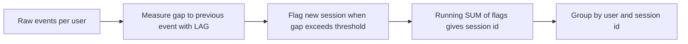

# Lecture 3 — Advanced Patterns: Gaps-and-Islands, Sessionization & Pivot

> **Duration:** ~2 hours. **Outcome:** You can collapse consecutive rows into runs and find the holes between them (gaps-and-islands), split an event stream into sessions by an inactivity gap, pivot rows into columns with conditional aggregation, and articulate the decision between a window function and a plain `GROUP BY`.

Lectures 1 and 2 gave you the primitives. This lecture is about the two or three *patterns* those primitives assemble into — the ones that show up in real analytics work again and again. Learn the pattern, not just the syntax.

## 1. Gaps-and-islands

**The problem shape:** you have a sequence (dates, integer IDs, login days) and you want to find the *runs of consecutive values* ("islands") or the *breaks between them* ("gaps"). Examples: consecutive login streaks, contiguous ranges of invoice numbers, uptime windows, "which days did we have no sales?"

### The row_number difference trick

The elegant solution rests on one observation: **for a run of consecutive values, `value − ROW_NUMBER()` is constant.** Watch. Say a user logged in on days 1, 2, 3, 6, 7, 10:

| login_day | row_number | day − row_number |
|----------:|-----------:|-----------------:|
| 1 | 1 | 0 |
| 2 | 2 | 0 |
| 3 | 3 | 0 |
| 6 | 4 | 2 |
| 7 | 5 | 2 |
| 10 | 6 | 4 |

The `day − row_number` column is **the same within each consecutive run** and changes whenever there's a gap. That constant is a natural group key for the island. Group by it and you have your runs:

```sql
WITH numbered AS (
  SELECT login_day,
         login_day - ROW_NUMBER() OVER (ORDER BY login_day) AS grp
  FROM logins
)
SELECT MIN(login_day) AS run_start,
       MAX(login_day) AS run_end,
       COUNT(*)       AS run_length
FROM numbered
GROUP BY grp
ORDER BY run_start;
```

Result: `(1–3, len 3)`, `(6–7, len 2)`, `(10–10, len 1)`. That's gaps-and-islands in eight lines.

### With dates instead of integers

Dates aren't integers, but the trick still works — subtract `ROW_NUMBER()` *days* from the date, and consecutive dates map to the same anchor date:

```sql
-- PostgreSQL: date arithmetic with an integer offset yields a date
WITH numbered AS (
  SELECT login_date,
         login_date - (ROW_NUMBER() OVER (ORDER BY login_date))::int AS grp
  FROM logins
)
SELECT MIN(login_date) AS streak_start,
       MAX(login_date) AS streak_end,
       COUNT(*)        AS streak_days
FROM numbered
GROUP BY grp
ORDER BY streak_start;
```

In SQLite, use `julianday(login_date) - ROW_NUMBER() OVER (ORDER BY login_date)` as the group key (both are numbers). If you have multiple users, add `PARTITION BY user_id` to the `ROW_NUMBER()` and `GROUP BY user_id, grp`.

### Finding the gaps directly with `LEAD`

Sometimes you want the *holes*, not the runs. `LEAD` finds them in one pass — compare each row to the next:

```sql
SELECT login_day + 1 AS gap_start,
       next_day  - 1 AS gap_end
FROM (
  SELECT login_day,
         LEAD(login_day) OVER (ORDER BY login_day) AS next_day
  FROM logins
) t
WHERE next_day - login_day > 1;   -- a jump of more than 1 means a gap between
```

For days `1,2,3,6,7,10` this yields gaps `4–5` and `8–9`. Both techniques — row_number-difference for islands, `LAG`/`LEAD` for gaps — belong in your toolkit.

## 2. Sessionization

**The problem shape:** a raw event stream (clicks, API calls, page views) with a user and a timestamp, and you want to group consecutive events into **sessions**, where a session ends after some period of inactivity (say 30 minutes). This is gaps-and-islands' close cousin, and it's the bread and butter of product analytics.

The recipe has three steps, each a window function you already know:

1. **Measure the gap** to the previous event per user with `LAG`.
2. **Flag session starts** — a new session begins on the first event *or* when the gap exceeds the threshold.
3. **Assign a session id** with a running `SUM` over those flags.


*Sessionization is three chained window-function steps: measure, flag, then number.*

```sql
WITH gaps AS (
  SELECT user_id, event_time,
         event_time - LAG(event_time) OVER (PARTITION BY user_id ORDER BY event_time)
           AS since_prev
  FROM events
),
flagged AS (
  SELECT user_id, event_time,
         CASE
           WHEN since_prev IS NULL                       THEN 1   -- first event for the user
           WHEN since_prev > INTERVAL '30 minutes'       THEN 1   -- inactivity gap → new session
           ELSE 0
         END AS is_new_session
  FROM gaps
)
SELECT user_id, event_time,
       SUM(is_new_session) OVER (PARTITION BY user_id ORDER BY event_time
                                 ROWS BETWEEN UNBOUNDED PRECEDING AND CURRENT ROW)
         AS session_no
FROM flagged
ORDER BY user_id, event_time;
```

The running `SUM` of the 0/1 flag is the trick: it stays constant across a session and ticks up by one at each new-session boundary, giving every event a `session_no` that is unique per user. From there you can `GROUP BY user_id, session_no` to get session start, end, duration, and event count. (SQLite: replace `INTERVAL '30 minutes'` with a comparison in seconds, e.g. store times as epoch integers and test `since_prev > 1800`.)

This exact pattern — `LAG` to measure, `CASE` to flag, running `SUM` to number — is one of the highest-leverage things in this whole course. Challenge 2 makes you build it end to end.

## 3. Pivot and unpivot with conditional aggregation

**Pivot** = rows into columns ("one row per user, one column per month"). SQL's portable way to pivot is **conditional aggregation**: an aggregate wrapped around a `CASE` (or, cleaner, an aggregate with a `FILTER` clause).

```sql
-- Sales per category, one column per quarter (CASE form — works everywhere)
SELECT category,
       SUM(CASE WHEN quarter = 'Q1' THEN amount ELSE 0 END) AS q1,
       SUM(CASE WHEN quarter = 'Q2' THEN amount ELSE 0 END) AS q2,
       SUM(CASE WHEN quarter = 'Q3' THEN amount ELSE 0 END) AS q3,
       SUM(CASE WHEN quarter = 'Q4' THEN amount ELSE 0 END) AS q4
FROM sales
GROUP BY category;
```

PostgreSQL (and SQLite 3.30+) offer the SQL-standard **`FILTER`** clause, which reads far better and lets `COUNT`/`AVG` skip non-matching rows *without* the `ELSE 0` distortion:

```sql
SELECT category,
       SUM(amount) FILTER (WHERE quarter = 'Q1') AS q1,
       SUM(amount) FILTER (WHERE quarter = 'Q2') AS q2,
       COUNT(*)    FILTER (WHERE amount > 1000)   AS big_orders
FROM sales
GROUP BY category;
```

`FILTER` also composes with window functions — `COUNT(*) FILTER (WHERE status = 'paid') OVER (PARTITION BY customer_id)` counts paid orders per customer while keeping every row. Prefer `FILTER` over `CASE` when your engine supports it; it's clearer and handles `AVG`/`COUNT` correctly (a filtered-out row is *absent*, not counted as zero).

> **Note:** PostgreSQL also ships a `crosstab` function in the `tablefunc` extension and `NULL`-aware pivots, but `FILTER`/`CASE` aggregation is portable, needs no extension, and is what you'll reach for 95% of the time.

**Unpivot** = columns into rows (the inverse). The portable trick is a `UNION ALL` per column, or in PostgreSQL a `LATERAL` join over a `VALUES` list:

```sql
-- Turn q1..q4 columns back into (category, quarter, amount) rows
SELECT category, v.quarter, v.amount
FROM quarterly_sales q
CROSS JOIN LATERAL (VALUES
  ('Q1', q.q1), ('Q2', q.q2), ('Q3', q.q3), ('Q4', q.q4)
) AS v(quarter, amount);
```

## 4. Window function vs `GROUP BY` — the decision

Both aggregate. When do you use which? One question decides it:

> **Do you need to keep the detail rows?**

- **You need one row per group** (a summary table, a report line per category) → `GROUP BY`.
- **You need the detail rows *plus* an aggregate/rank/neighbor on each** → window function.

More concretely:

| You want… | Use |
|-----------|-----|
| Total sales per category (one row each) | `GROUP BY` |
| Each sale next to its category total | window (`SUM() OVER (PARTITION BY …)`) |
| Top 3 products *per* category | window (`ROW_NUMBER`, filter in outer query) |
| Running total / moving average | window (frame) |
| Period-over-period growth | window (`LAG`) |
| A single number: "how many customers?" | `GROUP BY` / scalar aggregate |
| Percent of total on every row | window (`x / SUM(x) OVER ()`) |

They also **compose**: a `GROUP BY` query can have window functions in its `SELECT` (the window then runs over the grouped rows). A common report is "monthly revenue (`GROUP BY month`), with a running yearly total and month-over-month growth (windows over those grouped months)":

```sql
SELECT month,
       SUM(amount)                                    AS monthly,
       SUM(SUM(amount)) OVER (ORDER BY month)         AS running_yearly,   -- window over the GROUP BY result
       SUM(amount) - LAG(SUM(amount)) OVER (ORDER BY month) AS mom_delta
FROM sales
GROUP BY month
ORDER BY month;
```

Read `SUM(SUM(amount)) OVER (...)` carefully: the inner `SUM(amount)` is the group aggregate; the outer `SUM(...) OVER` is a window running over those per-month sums. Nesting an aggregate inside a window is legal and idiomatic once you've grouped.

### Performance note

Window functions are not free — the engine must sort each partition (unless an index already provides the order). But they are almost always **faster and clearer** than the correlated-subquery or self-join alternatives, which re-scan the table per row. Check with `EXPLAIN (ANALYZE, BUFFERS)` (Week 7) — you'll typically see one `WindowAgg` node over a single sort, versus a nested-loop that touches the table N times. When a window query is slow, the usual fix is an index whose column order matches `PARTITION BY … ORDER BY …` so the planner can skip the sort.

## 5. Putting it together — a retention preview

You'll build full cohort retention in Challenge 1, but here's the skeleton, which uses everything above: assign each user to a signup-month cohort, compute months-since-signup per activity, and pivot:

```sql
WITH cohort AS (         -- each user's signup month
  SELECT user_id, date_trunc('month', MIN(event_time)) AS cohort_month
  FROM events GROUP BY user_id
),
activity AS (            -- months-since-signup for each active month
  SELECT c.cohort_month,
         (date_part('year',  e.event_time) - date_part('year',  c.cohort_month)) * 12
         + (date_part('month', e.event_time) - date_part('month', c.cohort_month)) AS month_no,
         e.user_id
  FROM events e JOIN cohort c USING (user_id)
)
SELECT cohort_month,
       COUNT(DISTINCT user_id) FILTER (WHERE month_no = 0) AS m0,
       COUNT(DISTINCT user_id) FILTER (WHERE month_no = 1) AS m1,
       COUNT(DISTINCT user_id) FILTER (WHERE month_no = 2) AS m2
FROM activity
GROUP BY cohort_month
ORDER BY cohort_month;
```

CTEs (Week 3) + `FILTER` pivot (this lecture) + date math = the cohort triangle. Everything this week has been building to that.

## 6. Check yourself

- State the row_number-difference trick in one sentence. Why is `value − ROW_NUMBER()` constant across a consecutive run?
- What are the three window-function steps of sessionization, in order?
- Why does the running `SUM` of a 0/1 "new session" flag produce a valid session id?
- Write a `FILTER` clause that counts only `status = 'paid'` rows inside a `SUM`.
- Give one question best answered by `GROUP BY` and one best answered by a window function.
- What does `SUM(SUM(amount)) OVER (ORDER BY month)` compute after a `GROUP BY month`?

If all six land, you're ready for the exercises — start with `exercises/exercise-01-ranking-within-partitions.md`.

## Further reading

- **PostgreSQL 16 — `FILTER` on aggregates:** <https://www.postgresql.org/docs/16/sql-expressions.html#SYNTAX-AGGREGATES>
- **PostgreSQL 16 — `tablefunc` / `crosstab` (optional):** <https://www.postgresql.org/docs/16/tablefunc.html>
- **"Gaps and Islands" — the canonical explainer (Itzik Ben-Gan's method, engine-agnostic):** <https://www.red-gate.com/simple-talk/databases/sql-server/t-sql-programming-sql-server/the-sql-of-gaps-and-islands-in-sequences/>
