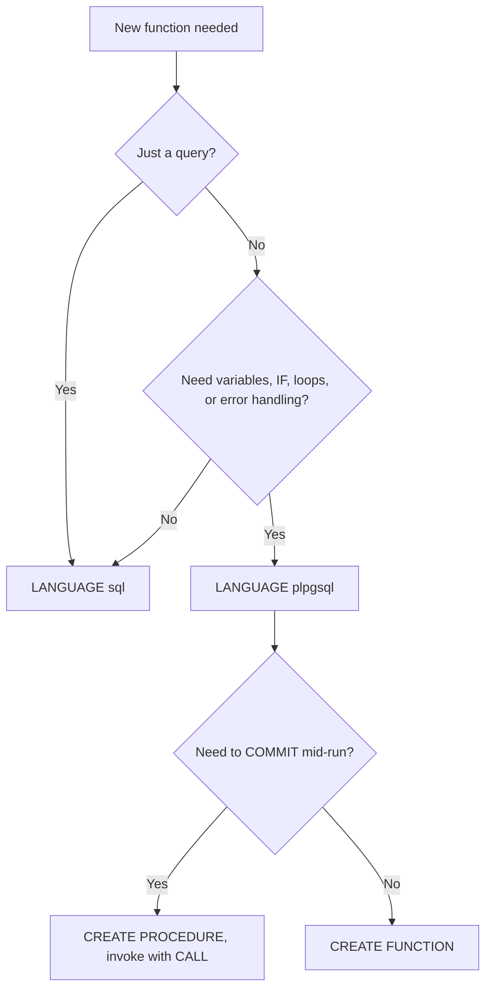

# Lecture 2 — Functions: SQL vs PL/pgSQL

> **Duration:** ~2 hours. **Outcome:** You can write both `LANGUAGE sql` and `LANGUAGE plpgsql` functions; use variables, `IF`/`CASE`/loops, `RETURNS TABLE`, and `RETURN QUERY`; handle errors with `EXCEPTION` blocks and `RAISE`; and choose the right language for the job.

A function is server-side logic with a name, typed arguments, and a typed return value. You call it inside SQL just like a built-in (`SELECT lower(x)` and `SELECT my_function(x)` look identical to the caller). Functions let you name a calculation, run multi-step logic close to the data (no round-trips), and enforce rules that must hold no matter which app connects. PostgreSQL ships two languages you will use constantly: plain **SQL** and procedural **PL/pgSQL**. This lecture teaches both and, crucially, when to pick which.

## 1. The simplest function: `LANGUAGE sql`

If your function is *just a query*, write it in SQL. It is faster (the planner can inline it) and simpler.

```sql
CREATE OR REPLACE FUNCTION order_total_cents(p_order_id bigint)
RETURNS bigint
LANGUAGE sql
STABLE
AS $$
    SELECT coalesce(sum(oi.quantity * oi.unit_price_cents), 0)
    FROM   order_items oi
    WHERE  oi.order_id = p_order_id;
$$;
```

Call it:

```sql
SELECT order_total_cents(1001);
SELECT o.order_id, order_total_cents(o.order_id) AS total
FROM   orders o
WHERE  o.placed_at >= date '2026-01-01';
```

Note the pieces you will repeat forever:

- `$$ ... $$` is **dollar-quoting** — a string literal that doesn't need you to escape inner quotes. Use it for every function body.
- `p_order_id` — the `p_` prefix is a convention to distinguish **p**arameters from column names, avoiding ambiguity inside the body.
- `STABLE` is a **volatility** marker (Section 6). Get it right; it affects correctness and performance.

## 2. Volatility categories — declare them honestly

Every function is `VOLATILE` (the default), `STABLE`, or `IMMUTABLE`. This tells the planner how aggressively it may cache or reorder calls.

| Category | Meaning | Example |
|----------|---------|---------|
| `IMMUTABLE` | Same inputs → same output, forever. No DB access. | `lower(text)`, arithmetic |
| `STABLE` | Same inputs → same output *within one statement*. May read the DB. | a function that looks up a row |
| `VOLATILE` | May return different results even in one statement; may have side effects. | `random()`, `now()`, anything that writes |

Declaring `IMMUTABLE` on something that reads a table is a **bug** — the planner may cache a stale value. When unsure, `STABLE` for read-only, `VOLATILE` for anything that writes. Only mark `IMMUTABLE` for pure computation, but do mark it — it lets the value be used in an index expression.

## 3. When SQL isn't enough: PL/pgSQL

SQL functions can only *be* a query (or a few). The moment you need a variable, a branch, a loop, or error handling, switch to **PL/pgSQL** — Postgres's procedural language.

```sql
CREATE OR REPLACE FUNCTION apply_late_fee(p_invoice_id bigint)
RETURNS numeric
LANGUAGE plpgsql
AS $$
DECLARE
    v_balance   numeric;
    v_due_date  date;
    v_fee       numeric := 0;
BEGIN
    SELECT balance, due_date
      INTO v_balance, v_due_date
      FROM invoices
     WHERE invoice_id = p_invoice_id;

    IF NOT FOUND THEN
        RAISE EXCEPTION 'Invoice % does not exist', p_invoice_id
            USING ERRCODE = 'no_data_found';
    END IF;

    IF v_due_date < current_date AND v_balance > 0 THEN
        v_fee := round(v_balance * 0.015, 2);   -- 1.5% late fee
        UPDATE invoices
           SET balance = balance + v_fee
         WHERE invoice_id = p_invoice_id;
    END IF;

    RETURN v_fee;
END;
$$;
```

The anatomy of every PL/pgSQL function:

- `DECLARE` — declare variables with types (and optional defaults).
- `BEGIN ... END` — the executable body.
- `SELECT ... INTO var` — run a query and store the result into a variable.
- `RAISE` — emit a message or throw an error.
- `RETURN` — hand back the result.

## 4. Control flow

### Conditionals

```sql
IF v_score >= 90 THEN
    v_grade := 'A';
ELSIF v_score >= 80 THEN
    v_grade := 'B';
ELSE
    v_grade := 'C';
END IF;
```

`CASE` works too, and reads well for value mapping:

```sql
v_tier := CASE
    WHEN v_spend >= 10000 THEN 'platinum'
    WHEN v_spend >= 1000  THEN 'gold'
    ELSE 'standard'
END;
```

### Loops

Three loop forms. Prefer the one that fits:

```sql
-- Count-controlled
FOR i IN 1..10 LOOP
    RAISE NOTICE 'iteration %', i;
END LOOP;

-- Condition-controlled
WHILE v_remaining > 0 LOOP
    v_remaining := v_remaining - 1;
END LOOP;

-- Row-by-row over a query result
FOR rec IN SELECT customer_id, email FROM customers WHERE status = 'active'
LOOP
    RAISE NOTICE 'customer % <%>', rec.customer_id, rec.email;
END LOOP;
```

A word of caution: a row-by-row loop that could be **one set-based `UPDATE`** is almost always the wrong choice — it is slower and harder to reason about. Reach for loops when the logic genuinely can't be expressed in a single statement, not by reflex.

## 5. Returning sets: `RETURNS TABLE` and `RETURN QUERY`

Functions can return a whole result set, not just a scalar. `RETURNS TABLE(...)` declares the output columns:

```sql
CREATE OR REPLACE FUNCTION top_customers(p_min_orders int)
RETURNS TABLE(customer_id bigint, full_name text, order_count bigint)
LANGUAGE plpgsql
STABLE
AS $$
BEGIN
    RETURN QUERY
        SELECT c.customer_id, c.full_name, count(o.order_id)
        FROM   customers c
        JOIN   orders o ON o.customer_id = c.customer_id
        GROUP  BY c.customer_id, c.full_name
        HAVING count(o.order_id) >= p_min_orders
        ORDER  BY count(o.order_id) DESC;
END;
$$;
```

Call it as if it were a table — this is the key move:

```sql
SELECT * FROM top_customers(5);
```

`RETURN QUERY` can appear multiple times to accumulate rows, and `RETURN NEXT` returns one row at a time inside a loop. The column names in `RETURNS TABLE(...)` become output columns — so avoid naming a `RETURNS TABLE` column the same as a base-table column you reference unqualified, or you'll get an ambiguity error. Qualify everything (`c.customer_id`) to stay safe.

## 6. Error handling: `EXCEPTION` blocks

Wrap risky logic in a sub-block with an `EXCEPTION` section. If an error is raised inside `BEGIN`, control jumps to the matching handler; the sub-block's changes are rolled back to a savepoint, but the function can recover.

```sql
CREATE OR REPLACE FUNCTION safe_transfer(
    p_from bigint, p_to bigint, p_cents bigint
) RETURNS text
LANGUAGE plpgsql
AS $$
BEGIN
    UPDATE accounts SET balance_cents = balance_cents - p_cents WHERE id = p_from;
    UPDATE accounts SET balance_cents = balance_cents + p_cents WHERE id = p_to;

    IF (SELECT balance_cents FROM accounts WHERE id = p_from) < 0 THEN
        RAISE EXCEPTION 'insufficient funds in account %', p_from
            USING ERRCODE = 'check_violation';
    END IF;

    RETURN 'ok';
EXCEPTION
    WHEN check_violation THEN
        RETURN 'declined: insufficient funds';
    WHEN others THEN
        RAISE WARNING 'transfer failed: %', SQLERRM;
        RETURN 'error';
END;
$$;
```

Key facts:

- `WHEN <condition>` matches by **error code name** (`unique_violation`, `foreign_key_violation`, `division_by_zero`, `no_data_found`, `others`).
- Inside a handler, `SQLERRM` is the message and `SQLSTATE` is the 5-char code.
- Entering an `EXCEPTION` block is not free — Postgres sets a savepoint. Don't wrap a hot loop body in one "just in case."
- `WHEN others` catches everything; use it sparingly and re-raise (`RAISE;`) if you can't truly handle the error.

### `RAISE` levels

| Level | Effect |
|-------|--------|
| `RAISE DEBUG/LOG/INFO/NOTICE/WARNING` | Emits a message; execution continues |
| `RAISE EXCEPTION` | Throws an error; aborts the statement (and the transaction, unless caught) |

## 7. Functions vs. procedures (`CALL`)

PostgreSQL 11+ also has **stored procedures** (`CREATE PROCEDURE`, invoked with `CALL`). The one thing a procedure can do that a function cannot: **`COMMIT`/`ROLLBACK` mid-body**. A function always runs inside the caller's single transaction. Use a procedure only when you genuinely need to commit in chunks (e.g., a batch job processing millions of rows in transactions of 10,000). For everything else this week, use a **function**.

```sql
CREATE PROCEDURE purge_old_logs(p_days int)
LANGUAGE plpgsql AS $$
BEGIN
    DELETE FROM audit_log WHERE changed_at < now() - make_interval(days => p_days);
    COMMIT;   -- legal in a procedure, illegal in a function
END; $$;

CALL purge_old_logs(90);
```

## 8. Choosing the language — the decision

| If you need… | Use |
|--------------|-----|
| Just a query, wrapped in a name | `LANGUAGE sql` (inlinable, fastest) |
| Variables, `IF`, loops, error handling | `LANGUAGE plpgsql` |
| To return a set from a single query | `LANGUAGE sql` with `RETURNS TABLE` (or plpgsql + `RETURN QUERY`) |
| To `COMMIT` mid-run | `CREATE PROCEDURE` + `CALL` |

The rule: **start in SQL, escalate to PL/pgSQL only when you hit something SQL can't express.** Every line of procedural code is a line the planner can't optimize.


*Deciding which language, and function vs procedure, fits the job.*

## 9. SQLite note

SQLite has **no user-defined SQL functions in pure SQL** — you register functions in the host language (Python's `create_function`, etc.), and it has no PL/pgSQL and no stored procedures. All the function work this week is PostgreSQL. Keep that boundary clear when you carry these skills to a SQLite project.

## 10. Check yourself

- When should a function be `LANGUAGE sql` instead of `plpgsql`?
- What do `IMMUTABLE`, `STABLE`, and `VOLATILE` promise the planner?
- Why is declaring a table-reading function `IMMUTABLE` a bug?
- How do you return multiple rows from a function, and how do you call such a function?
- What does `IF NOT FOUND THEN` test after a `SELECT ... INTO`?
- What is the one thing a procedure can do that a function cannot?

When all six are easy, do [Exercise 2](../exercises/exercise-02-plpgsql-function-control-flow.md).

## Further reading

- **PostgreSQL — PL/pgSQL:** <https://www.postgresql.org/docs/16/plpgsql.html>
- **PostgreSQL — `CREATE FUNCTION`:** <https://www.postgresql.org/docs/16/sql-createfunction.html>
- **PostgreSQL — Function volatility categories:** <https://www.postgresql.org/docs/16/xfunc-volatility.html>
- **PostgreSQL — trapping errors:** <https://www.postgresql.org/docs/16/plpgsql-control-structures.html#PLPGSQL-ERROR-TRAPPING>
