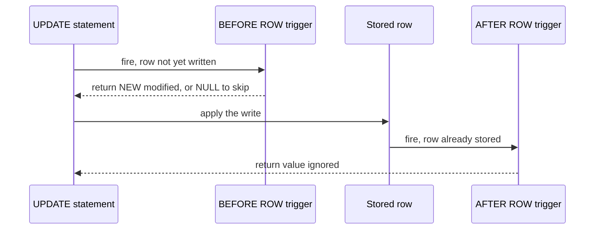

# Lecture 3 — Triggers

> **Duration:** ~2 hours. **Outcome:** You can write `BEFORE` and `AFTER` triggers at `ROW` and `STATEMENT` level, use `NEW`/`OLD`/`TG_OP`, implement audit-log and derived-column patterns, and — just as important — recognize when a trigger is the wrong tool.

A trigger is a function the database calls **automatically** whenever a table changes. You don't invoke it; the `INSERT`, `UPDATE`, or `DELETE` invokes it for you, inside the same transaction. That is the superpower and the curse. The superpower: a rule wired as a trigger *cannot be bypassed* — no app, no rogue `psql` session, no forgotten code path can write to the table without the trigger firing. The curse: that logic is invisible to anyone reading the application code, and a chain of triggers firing triggers is one of the hardest bugs to trace. This lecture teaches the mechanics, the two patterns worth ~90% of real trigger use, and a hard look at when to say no.

## 1. The two-part structure

A trigger in PostgreSQL is always **two objects**:

1. A **trigger function** — a normal function, `LANGUAGE plpgsql`, that `RETURNS trigger`. It receives special variables and returns a row (or `NULL`).
2. A **trigger** — the binding that says "call function F `BEFORE`/`AFTER` this event `ON` this table `FOR EACH` row/statement."

You write the function once and can bind it to several tables.

```sql
-- 1. the function
CREATE OR REPLACE FUNCTION set_updated_at()
RETURNS trigger
LANGUAGE plpgsql
AS $$
BEGIN
    NEW.updated_at := now();
    RETURN NEW;
END;
$$;

-- 2. the binding
CREATE TRIGGER trg_customers_updated_at
    BEFORE UPDATE ON customers
    FOR EACH ROW
    EXECUTE FUNCTION set_updated_at();
```

## 2. The special variables

Inside a trigger function you get context variables for free:

| Variable | Meaning |
|----------|---------|
| `NEW` | The new row (available in `INSERT` and `UPDATE`; `NULL` on `DELETE`) |
| `OLD` | The old row (available in `UPDATE` and `DELETE`; `NULL` on `INSERT`) |
| `TG_OP` | The operation as text: `'INSERT'`, `'UPDATE'`, or `'DELETE'` |
| `TG_TABLE_NAME` | The table the trigger fired on |
| `TG_WHEN` | `'BEFORE'` or `'AFTER'` |
| `TG_LEVEL` | `'ROW'` or `'STATEMENT'` |

## 3. `BEFORE` vs. `AFTER` — timing decides what you can do

This is the single most important distinction. The trigger fires either **before** the row is written or **after**.

| | `BEFORE` | `AFTER` |
|--|----------|---------|
| Fires | Before the change is applied | After the change is applied |
| Can modify `NEW`? | **Yes** — change `NEW` and the modified row is what gets written | No — the row is already stored; editing `NEW` does nothing |
| Can cancel the operation? | **Yes** — `RETURN NULL` skips the write | No |
| Sees the row's final stored state? | Not guaranteed (other `BEFORE` triggers may still run) | Yes |
| Best for | Validating/normalizing input, filling derived columns | Auditing, cascading to *other* tables, notifications |

The rule of thumb: **`BEFORE` to change the row that's being written; `AFTER` to react to a change that already happened.** Never try to modify `NEW` in an `AFTER` trigger — it's too late.


*Timing of BEFORE and AFTER row triggers around one write.*

### Return value contract

- **`BEFORE ROW`**: return `NEW` (optionally modified) to proceed, or `NULL` to silently skip this row.
- **`AFTER ROW`**: the return value is ignored — conventionally `RETURN NULL`.
- **On `DELETE`**: a `BEFORE` trigger returns `OLD` to proceed (or `NULL` to cancel the delete).

## 4. `ROW` vs. `STATEMENT` level

- **`FOR EACH ROW`** — the function fires once per affected row. One `UPDATE` touching 1,000 rows fires it 1,000 times. `NEW`/`OLD` are populated. This is what you want for auditing and derived columns.
- **`FOR EACH STATEMENT`** — the function fires **once per statement**, regardless of how many rows changed (even zero). `NEW`/`OLD` are *not* available. Use it for coarse actions: "log that *someone* ran a bulk update," or refresh a cache once after a batch.

```sql
CREATE TRIGGER trg_orders_bulk_note
    AFTER INSERT ON orders
    FOR EACH STATEMENT
    EXECUTE FUNCTION note_bulk_insert();
```

If you need per-row access to the changed data at statement level, PostgreSQL 10+ offers **transition tables** (`REFERENCING OLD TABLE AS ... NEW TABLE AS ...`) so a single statement-level trigger can see every changed row as a set — far more efficient than 10,000 row-level firings for bulk work.

## 5. Pattern A — the audit log (append-only history)

The most common trigger in the world: record *who changed what, when* into a separate history table. This is an `AFTER ROW` trigger because you want to record the change that actually happened.

```sql
CREATE TABLE audit_log (
    audit_id    bigint GENERATED ALWAYS AS IDENTITY PRIMARY KEY,
    table_name  text        NOT NULL,
    operation   text        NOT NULL,
    row_pk      text,
    old_row     jsonb,
    new_row     jsonb,
    changed_by  text        NOT NULL DEFAULT current_user,
    changed_at  timestamptz NOT NULL DEFAULT now()
);

CREATE OR REPLACE FUNCTION audit_row_change()
RETURNS trigger
LANGUAGE plpgsql
AS $$
BEGIN
    INSERT INTO audit_log(table_name, operation, row_pk, old_row, new_row)
    VALUES (
        TG_TABLE_NAME,
        TG_OP,
        coalesce(NEW.id::text, OLD.id::text),
        CASE WHEN TG_OP IN ('UPDATE','DELETE') THEN to_jsonb(OLD) END,
        CASE WHEN TG_OP IN ('INSERT','UPDATE') THEN to_jsonb(NEW) END
    );
    RETURN NULL;   -- AFTER trigger: return value ignored
END;
$$;

CREATE TRIGGER trg_accounts_audit
    AFTER INSERT OR UPDATE OR DELETE ON accounts
    FOR EACH ROW
    EXECUTE FUNCTION audit_row_change();
```

Why this is a good trigger: the audit table **cannot drift**. Every write to `accounts`, from any source, lands a row in `audit_log`. `to_jsonb(NEW)` captures the whole row generically, so the same function audits any table with an `id` column.

## 6. Pattern B — the maintained derived column

Keep a stored column correct without trusting every writer to update it. This is a **`BEFORE ROW`** trigger because you're modifying the row on its way in.

```sql
-- Keep order_items.line_total_cents = quantity * unit_price_cents, always.
CREATE OR REPLACE FUNCTION compute_line_total()
RETURNS trigger
LANGUAGE plpgsql
AS $$
BEGIN
    NEW.line_total_cents := NEW.quantity * NEW.unit_price_cents;
    RETURN NEW;
END;
$$;

CREATE TRIGGER trg_line_total
    BEFORE INSERT OR UPDATE ON order_items
    FOR EACH ROW
    EXECUTE FUNCTION compute_line_total();
```

**But pause.** For a derived value that depends only on columns *in the same row*, PostgreSQL 12+ gives you a **generated column** — no trigger needed, and it can't be wrong:

```sql
ALTER TABLE order_items
    ADD COLUMN line_total_cents bigint
    GENERATED ALWAYS AS (quantity * unit_price_cents) STORED;
```

Prefer the generated column. Use a `BEFORE` trigger for a derived value only when it depends on **other rows or tables** (e.g., maintaining an `orders.item_count` when `order_items` change) — that a generated column can't express.

## 7. `INSTEAD OF` triggers on views

You met updatable views in Lecture 1. For a complex (multi-table) view, an `INSTEAD OF` trigger defines what a write *means*:

```sql
CREATE TRIGGER trg_customer_view_insert
    INSTEAD OF INSERT ON customer_summary_view
    FOR EACH ROW
    EXECUTE FUNCTION insert_customer_and_profile();
```

The function decides which base tables to touch. This is the only way to make a join-backed view writable.

## 8. When NOT to use a trigger

This is the part people skip and regret. Triggers are the right tool less often than they feel like they are.

| Situation | Better tool |
|-----------|-------------|
| Enforce a single-row rule (`price >= 0`) | `CHECK` constraint |
| Enforce uniqueness or a foreign key | `UNIQUE` / `FOREIGN KEY` constraint |
| Derived value from same-row columns | `GENERATED ALWAYS AS ... STORED` column |
| A default value | `DEFAULT` clause |
| Core business logic the app team must see | Application code (explicit, testable, reviewable) |
| Cascading a change to many tables | Usually application code — triggers hide the blast radius |

The failure modes to fear:

1. **Invisibility.** Business logic in a trigger is logic no application developer sees while reading the app. Document every trigger loudly.
2. **Cascade chains.** Trigger on table A writes table B, whose trigger writes table C. One `UPDATE` sets off a chain reaction that's brutal to debug and can even loop.
3. **Performance.** A `FOR EACH ROW` trigger runs its function once per row. Bulk-loading a million rows means a million function calls. Prefer statement-level triggers with transition tables for bulk paths.
4. **Surprising transaction behavior.** A trigger that raises an exception aborts the *whole* statement (and, uncaught, the transaction). A trigger doing slow work extends every write's latency and lock-hold time.

The healthy default: **constraints and generated columns first; triggers only for cross-row/cross-table invariants and audit trails that truly must be un-bypassable.** Challenge 2 is exactly this judgement — a rule that no `CHECK` can express, so a trigger *is* the right answer.

## 9. Managing triggers

```sql
-- List triggers on a table
SELECT tgname, tgenabled FROM pg_trigger
WHERE tgrelid = 'accounts'::regclass AND NOT tgisinternal;

ALTER TABLE accounts DISABLE TRIGGER trg_accounts_audit;   -- temporarily off
ALTER TABLE accounts ENABLE  TRIGGER trg_accounts_audit;
DROP TRIGGER IF EXISTS trg_accounts_audit ON accounts;
```

Disabling a trigger for a bulk load can be a legitimate performance move — but you own re-enabling it and backfilling anything the audit missed.

## 10. SQLite note

SQLite **has** row-level `BEFORE`/`AFTER`/`INSTEAD OF` triggers and `NEW`/`OLD`, but **no statement-level triggers**, no `TG_OP`-style variables (you bind one trigger per operation), and the trigger body is plain SQL — no PL/pgSQL. The audit-log pattern translates; the derived-column and complex-branching patterns are clumsier. All examples here are PostgreSQL.

## 11. Check yourself

- What two database objects make up a trigger?
- In which trigger can you modify `NEW` and have it stick — `BEFORE` or `AFTER`? Why?
- What's in `OLD` during an `INSERT`? What's in `NEW` during a `DELETE`?
- When does a `FOR EACH STATEMENT` trigger fire, and what *isn't* available to it?
- Give the correct return value for a `BEFORE ROW INSERT` trigger that wants the write to proceed.
- Name three things that should be a constraint or generated column instead of a trigger.

When all six are easy, do [Exercise 3](../exercises/exercise-03-audit-trigger.md).

## Further reading

- **PostgreSQL — Trigger behavior overview:** <https://www.postgresql.org/docs/16/trigger-definition.html>
- **PostgreSQL — `CREATE TRIGGER`:** <https://www.postgresql.org/docs/16/sql-createtrigger.html>
- **PostgreSQL — Triggers in PL/pgSQL (`NEW`/`OLD`/`TG_*`):** <https://www.postgresql.org/docs/16/plpgsql-trigger.html>
- **PostgreSQL — Generated columns:** <https://www.postgresql.org/docs/16/ddl-generated-columns.html>
