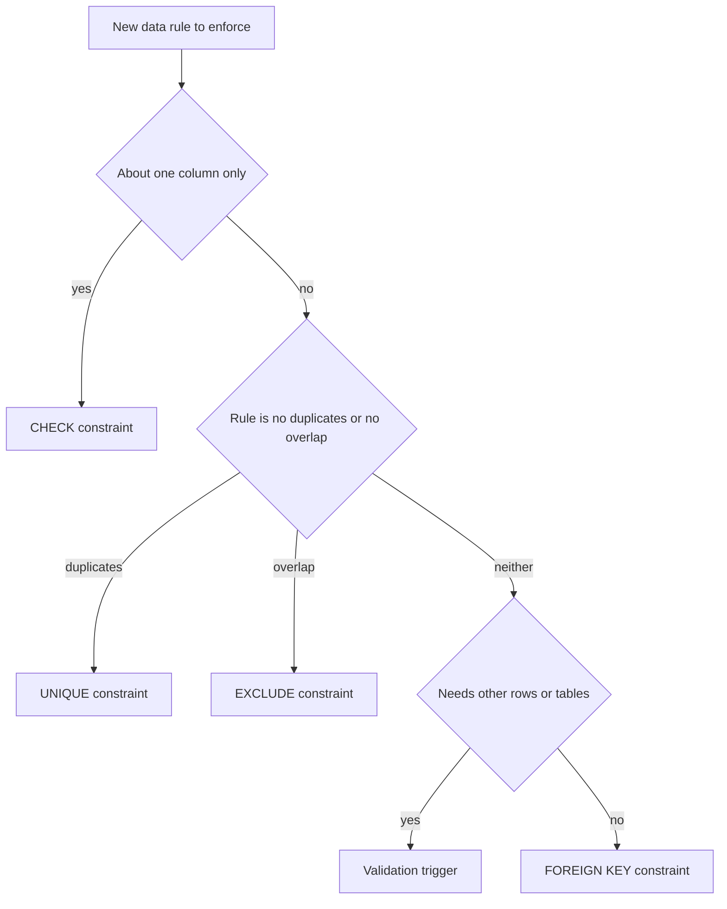
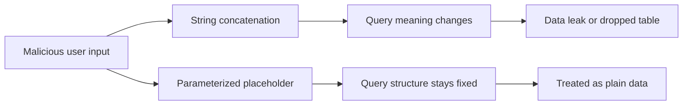

# Lecture 3 — Integrity at Scale & SQL-Injection Defense

> **Duration:** ~2 hours. **Outcome:** You can choose the right integrity mechanism — `CHECK`, `FOREIGN KEY`, `UNIQUE`, `EXCLUDE`, or a validation trigger — for a given rule, add an `EXCLUDE` constraint for "no overlap" problems, and rewrite any string-concatenated SQL as a parameterized query, explaining why parameterization (not escaping) is the actual fix.

Access control (Lectures 1–2) decides *who* may touch data. This lecture protects *the data itself*: rules that keep the contents valid no matter which role writes them, and the discipline that keeps an attacker's input from ever being executed as SQL. Both share one philosophy — **push the rule into the engine, where it's enforced universally, instead of trusting every caller to remember it.** A constraint the database enforces holds against every application, every migration, and every hand-edited `UPDATE`.

## 1. Why constraints beat application validation

Your application validates input — good. But the same three failure modes from Lecture 2 apply: a second service writes directly, a migration bypasses the app, a bug slips a bad value through. Application validation is a *convenience* for users (fast feedback); **database constraints are the guarantee.** If the column says `CHECK (price >= 0)`, then no code path anywhere can persist a negative price. The invariant is true of the data, not merely of one write path.

Constraints also protect *future* correctness. Every query you write can assume the invariants hold — you never defensively code around "what if `quantity` is negative," because the engine already made it impossible. That is integrity *at scale*: the guarantees compound across the whole codebase.

## 2. The constraint toolbox

| Constraint | Guarantees | Example rule |
|-----------|------------|--------------|
| `NOT NULL` | Value must be present | Every order has a `customer_id` |
| `UNIQUE` | No duplicate value(s) | One account per email |
| `PRIMARY KEY` | `UNIQUE` + `NOT NULL`, the row's identity | `id` |
| `FOREIGN KEY` | Value references a real row elsewhere | `order.customer_id` exists in `customers` |
| `CHECK` | A boolean expression holds per row | `price >= 0`, `end_date > start_date` |
| `EXCLUDE` | No two rows conflict under an operator | No two bookings overlap for one room |

The first five you met in Week 4. This lecture goes deeper on `CHECK`, on foreign-key *actions*, and introduces `EXCLUDE` — the constraint most engineers have never used and reach for far too rarely.

### `CHECK` — arbitrary per-row rules

A `CHECK` is any boolean expression over the row's own columns:

```sql
CREATE TABLE line_item (
  id        bigint GENERATED ALWAYS AS IDENTITY PRIMARY KEY,
  qty       int   NOT NULL CHECK (qty > 0),
  unit_price numeric(10,2) NOT NULL CHECK (unit_price >= 0),
  discount  numeric(4,3) NOT NULL DEFAULT 0
              CHECK (discount >= 0 AND discount <= 1)
);

-- Multi-column CHECK: a table-level constraint referencing two columns
ALTER TABLE reservation
  ADD CONSTRAINT valid_range CHECK (checkout > checkin);
```

`CHECK` cannot reference *other rows* or *other tables* (it's per-row and must be immutable). "Total must equal the sum of line items" is **not** a `CHECK` — that needs a trigger (§4) or a generated design. Know the boundary.

### Foreign-key referential actions

A foreign key isn't just "the value must exist" — it also dictates what happens when the *referenced* row changes:

```sql
CREATE TABLE order_item (
  order_id  bigint NOT NULL REFERENCES orders(id)
              ON DELETE CASCADE,       -- delete the order → its items vanish too
  product_id bigint NOT NULL REFERENCES products(id)
              ON DELETE RESTRICT       -- can't delete a product still on an order
);
```

| Action | On delete/update of the parent… |
|--------|--------------------------------|
| `RESTRICT` / `NO ACTION` | Reject if children exist (default) |
| `CASCADE` | Delete/update the children too |
| `SET NULL` | Null out the child's FK column |
| `SET DEFAULT` | Reset the child's FK to its default |

Choosing the action *is* a data-integrity decision: `CASCADE` for owned children (order items belong to the order), `RESTRICT` for shared references (don't delete a product that history points at).

## 3. `EXCLUDE` — the "no overlap" constraint

Some rules can't be expressed as `UNIQUE` because the conflict isn't *equality* — it's *overlap*. Classic case: a room may not be double-booked; two reservations conflict if their time ranges intersect **and** they're the same room. `UNIQUE (room_id, during)` won't catch overlaps that aren't identical.

`EXCLUDE` generalizes `UNIQUE` to any operator. With the `btree_gist` extension and a range type:

```sql
CREATE EXTENSION IF NOT EXISTS btree_gist;   -- lets = and && mix in one index

CREATE TABLE reservation (
  id      bigint GENERATED ALWAYS AS IDENTITY PRIMARY KEY,
  room_id int    NOT NULL,
  during  tstzrange NOT NULL,
  EXCLUDE USING gist (
    room_id WITH =,        -- same room
    during  WITH &&        -- AND overlapping time ranges  → rejected
  )
);
```

Now the database itself refuses to insert a second reservation whose `during` overlaps an existing one for the same room:

```sql
INSERT INTO reservation (room_id, during)
  VALUES (7, '[2026-08-01 09:00, 2026-08-01 11:00)');   -- ok

INSERT INTO reservation (room_id, during)
  VALUES (7, '[2026-08-01 10:00, 2026-08-01 12:00)');   -- ERROR: conflicting key value
```

`UNIQUE` is the special case of `EXCLUDE` where every column uses `WITH =`. Whenever you catch yourself planning to enforce "no two rows may overlap / conflict" in application code with a `SELECT ... FOR UPDATE` then a check, stop — an `EXCLUDE` constraint does it correctly and race-free, because the engine enforces it atomically under concurrency.

## 4. Validation triggers — when a constraint can't reach

Some invariants span rows or tables and so exceed what a `CHECK`/`EXCLUDE` can express. That's the job of a validation trigger (you built the machinery in Week 9). The rule of thumb:

> **Prefer a constraint. Use a trigger only when the rule needs data a constraint can't see** — other rows, other tables, or a running aggregate.

```sql
CREATE FUNCTION enforce_credit_limit() RETURNS trigger AS $$
BEGIN
  IF (SELECT coalesce(sum(amount), 0) FROM invoice
      WHERE customer_id = NEW.customer_id) + NEW.amount
     > (SELECT credit_limit FROM customers WHERE id = NEW.customer_id)
  THEN
    RAISE EXCEPTION 'invoice would exceed customer % credit limit', NEW.customer_id;
  END IF;
  RETURN NEW;
END;
$$ LANGUAGE plpgsql;

CREATE TRIGGER check_credit
  BEFORE INSERT OR UPDATE ON invoice
  FOR EACH ROW EXECUTE FUNCTION enforce_credit_limit();
```

Triggers are more powerful but more expensive and easier to get wrong under concurrency (two simultaneous inserts can each pass the check, then jointly bust the limit — a `SELECT ... FOR UPDATE` on the customer row or `SERIALIZABLE` isolation from Week 5 closes that gap). When a plain constraint can express the rule, it is faster, declarative, and race-proof — always prefer it.


*Pick the cheapest tool that can express the rule, and reach for a trigger only when nothing else can see enough.*

## 5. SQL injection — how a string becomes an exploit

Now the other half of protecting data: making sure attacker input can never *become* SQL. Injection happens whenever untrusted input is **concatenated into a query string**. The canonical example:

```python
# NEVER do this — user_input goes straight into the SQL text
name = request.args["name"]
cur.execute("SELECT * FROM users WHERE name = '" + name + "'")
```

If `name` is `' OR '1'='1`, the query the database receives is:

```sql
SELECT * FROM users WHERE name = '' OR '1'='1'   -- returns every row
```

Worse, `'; DROP TABLE users; --` can terminate the statement and run a second one. The database has no way to tell "data the developer meant" from "SQL the attacker injected" — because by the time the engine sees it, it's all one string. Injection remains at the top of the OWASP risk lists decades after it was understood, purely because string-building queries is so easy to reach for.

**Escaping is not the fix.** Manually doubling quotes (`'' `) misses edge cases — different encodings, numeric contexts with no quotes, `LIKE` metacharacters, second-order injection where stored data is later concatenated. Every "I'll just sanitize it" scheme has a bypass. The only robust defense is to **never mix data into the query text at all.**

## 6. Parameterized queries — the actual fix

A **parameterized (prepared) query** sends the SQL *structure* and the *data* to the engine as **separate things**. The `?` / `$1` placeholders are bound to values *after* the statement is parsed, so user input can never change the query's meaning — it's data, by construction, not code.

```python
# Python (psycopg 3) — parameters passed separately, never concatenated
cur.execute("SELECT * FROM users WHERE name = %s", [name])

# Python sqlite3 — same idea, ? placeholders
cur.execute("SELECT * FROM users WHERE name = ?", (name,))
```

```javascript
// Node (pg) — $1, $2 placeholders + a values array
await client.query('SELECT * FROM users WHERE name = $1', [name]);
```

```sql
-- Even in psql / PL/pgSQL, don't build strings. Prepared statement:
PREPARE find_user (text) AS SELECT * FROM users WHERE name = $1;
EXECUTE find_user('any '' weird -- input');   -- treated as pure data
```

Now `' OR '1'='1` is looked up as a literal name — the database searches for a user *named* `' OR '1'='1`, finds none, done. The apostrophes never terminate a string because there is no surrounding string to terminate. This is not merely safer; it's also usually **faster** (the plan can be cached and reused) and cleaner to read.


*Concatenation lets input rewrite the query; parameterization keeps input as data no matter what it contains.*

### The one place placeholders don't reach: identifiers

Placeholders bind *values*, not *identifiers* (table/column names) or SQL keywords. You cannot write `ORDER BY $1` to parameterize a column name. When a column or sort direction genuinely must come from user input, **never concatenate it** — validate it against an allow-list of known-good identifiers:

```python
SORT_COLUMNS = {"name", "created_at", "email"}       # allow-list
col = request.args.get("sort", "name")
if col not in SORT_COLUMNS:
    raise BadRequest("invalid sort column")
query = f"SELECT * FROM users ORDER BY {col}"         # col is now provably safe
```

In PL/pgSQL, the equivalent tools are `format()` with `%I` (quotes an identifier) and `%L` (quotes a literal), used only after you've constrained the input:

```sql
EXECUTE format('SELECT * FROM %I ORDER BY %I', 'users', safe_col);
```

## 7. Defense in depth ties the week together

Notice how the layers back each other up. Even if an injection bug *does* slip through:

- **Least privilege (Lecture 1)** means the app's role can't `DROP TABLE` or read `salaries` — the injected SQL is refused.
- **RLS (Lecture 2)** means an injected `SELECT * FROM documents` still returns only the current tenant's rows — `WHERE '1'='1'` can't defeat a policy the engine appends *after* the query.
- **Constraints (this lecture)** mean injected garbage that tries to write invalid data is rejected at the storage layer.

No single layer is trusted to be perfect. That is the whole point of the week: overlapping guarantees so one mistake is caught by the next.

## 8. Check yourself

- Give one rule expressible as a `CHECK` and one that requires a trigger. What's the dividing line?
- Why can't `UNIQUE` prevent double-booking a room, and what constraint can?
- What does `ON DELETE CASCADE` vs `ON DELETE RESTRICT` decide, and when do you want each?
- Why is manually escaping quotes an unreliable defense against injection?
- How does a parameterized query make `' OR '1'='1` harmless — what is sent to the engine separately?
- You must let users choose the sort column. Placeholders can't bind an identifier. What do you do instead?

That completes the conceptual core. The exercises turn each of these into muscle memory; the challenges and mini-project make you defend a real multi-tenant schema.

## Further reading

- **PostgreSQL — Constraints (`CHECK`, FK, `EXCLUDE`):** <https://www.postgresql.org/docs/current/ddl-constraints.html>
- **PostgreSQL — `CREATE TABLE ... EXCLUDE` + range types:** <https://www.postgresql.org/docs/current/rangetypes.html#RANGETYPES-CONSTRAINT>
- **OWASP — SQL Injection Prevention Cheat Sheet:** <https://cheatsheetseries.owasp.org/cheatsheets/SQL_Injection_Prevention_Cheat_Sheet.html>
- **Bobby Tables — parameterized queries by language:** <https://bobby-tables.com/>
