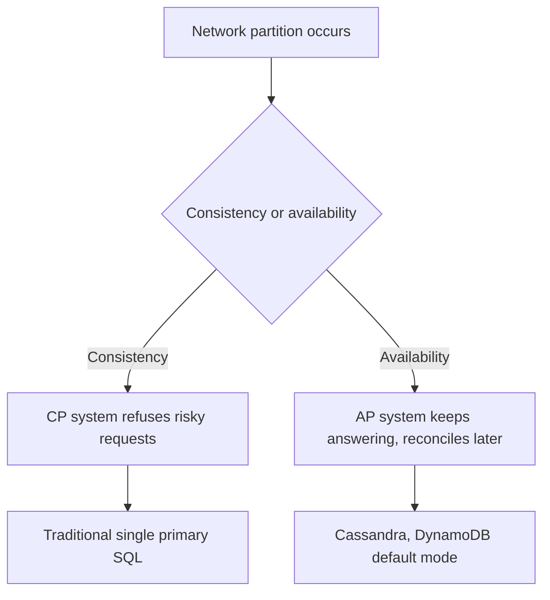

# Lecture 3 — Sharding, horizontal scaling & an honest SQL-vs-NoSQL decision

> **Duration:** ~2 hours. **Outcome:** You can explain sharding and choose a shard key with its hot-spots and cross-shard costs in mind, distinguish vertical from horizontal scaling, and make a defensible SQL-vs-NoSQL decision grounded in CAP/PACELC and concrete consistency requirements — not vibes.

## 1. Where we are in the scaling ladder

Three lectures, three moves, in the order you should reach for them:

1. **Partitioning** (Lecture 1) — split a table *within one server*. Cheap, low-risk.
2. **Replication** (Lecture 2) — copy the database to *more servers* for read scaling and HA. Writes still go to one primary.
3. **Sharding** (this lecture) — split the *data itself* across multiple servers, so **writes** scale horizontally too.

Notice the gap replication leaves: every write still funnels to a single primary. When one machine can't hold all the data, or can't absorb the write rate no matter how big you make it, you've hit the wall replication can't climb. Sharding is the answer — and it's the most expensive, most irreversible move in the whole course. Reach for it last.


*The scaling ladder, cheapest and lowest-risk move first.*

## 2. Vertical vs. horizontal scaling

| | **Vertical (scale up)** | **Horizontal (scale out)** |
|--|-------------------------|----------------------------|
| Move | Bigger machine — more CPU, RAM, faster disk | More machines sharing the load |
| Ceiling | The biggest box money can buy | Effectively unbounded |
| Complexity | Near zero — same architecture | High — distributed data, coordination |
| Failure impact | One machine = one failure domain | Many machines = many partial failures |
| Cost curve | Superlinear at the top (huge boxes cost a premium) | Roughly linear (commodity boxes) |

**Always exhaust vertical scaling and replication first.** Modern single machines are enormous — 128 cores, terabytes of RAM, NVMe disks. A tuned Postgres on a big box plus read replicas serves workloads most engineers overestimate. Sharding is what you do when *one machine physically cannot* hold the data or take the write rate.

## 3. What sharding actually is

**Sharding** = horizontal partitioning across *separate database servers*. Each server (a **shard**) holds a disjoint subset of the rows and is a full, independent database. A row's home shard is decided by a **shard key** run through a routing function.

```
                       ┌─────────────┐
     write user 1042 ──► router: hash(1042) % 4 = 2
                       └──────┬──────┘
             ┌──────────┬─────┴─────┬──────────┐
             ▼          ▼           ▼          ▼
         ┌───────┐  ┌───────┐  ┌───────┐  ┌───────┐
         │Shard 0│  │Shard 1│  │Shard 2│  │Shard 3│
         └───────┘  └───────┘  └───────┘  └───────┘
          users      users     users←1042  users
          0,4,8..    1,5,9..    2,6,10..   3,7,11..
```

Partitioning (Lecture 1) and sharding are the same *idea* — split rows by a key — at two different scales. Partitioning splits within a server (the engine routes for you, transparently). Sharding splits across servers (something — your app, a proxy, or an extension like Citus — must route, and cross-server operations are now hard).

## 4. Choosing a shard key — the decision that defines the system

The shard key is the most consequential choice in a sharded system. Get it wrong and you either can't scale or you rewrite everything. Judge a candidate key on four axes:

1. **Even distribution.** Rows and load should spread evenly. A key with a few dominant values creates a **hot shard** that's overloaded while others idle.
2. **Query alignment.** Most queries should be answerable from a *single shard*. If your common query needs data from all shards (a **scatter-gather**), you've lost most of sharding's benefit.
3. **Low cross-shard fan-out.** Data that's accessed together should live together. Related rows on the same shard = single-shard reads and local transactions.
4. **Rebalanceable.** When you add shards, moving data should be tractable.

### Hash vs. range shard keys

| | **Hash sharding** | **Range sharding** |
|--|-------------------|--------------------|
| Route by | `hash(key) % N` (or consistent hashing) | key falls in a range, e.g. `A–M`, `N–Z` |
| Distribution | Very even | Can be skewed (some ranges hotter) |
| Range queries | Bad — a range scatters across all shards | Good — a range hits one/few shards |
| Hot spots | Rare (hash spreads them) | Common (e.g. newest time range = all writes) |
| Adding shards | Naive `% N` remaps almost everything → use **consistent hashing** | Split a hot range |

**Consistent hashing** deserves a mention: with plain `hash(key) % N`, changing `N` (adding a shard) reshuffles nearly every key. Consistent hashing places shards and keys on a ring so adding a shard only moves a *fraction* of keys — this is why DynamoDB, Cassandra, and friends use it.

### A worked example

Sharding a multi-tenant SaaS. Candidate keys:

- **`user_id` (hash):** even distribution, and most queries are "this user's stuff" → single-shard. Good. But a query like "all users in org X" scatters. If your product is user-centric, this wins.
- **`org_id` (hash):** keeps a whole organization's data together — org-wide queries stay single-shard, and an org-scoped transaction is local. But a huge customer becomes a **hot shard** (the "celebrity/whale" problem). Great for B2B *if* tenants are similar-sized; dangerous if one tenant is 100× the others.
- **`created_at` (range):** terrible shard key — **all new writes hit the newest shard**, so writes don't scale at all. (It's a fine *partition* key within a shard, though — don't confuse the two.)

The right answer depends entirely on the access pattern. That's the point: **there is no universally correct shard key; there's only the key that matches how this workload reads and writes.**

## 5. What sharding costs you

Be clear-eyed. Splitting data across servers breaks things that were free on one box:

- **Cross-shard joins and transactions.** A join across shards means gathering from every shard and combining in the middle — slow and complex. A transaction spanning shards needs distributed commit (two-phase commit), which is slow and fragile. You design *hard* to avoid both.
- **Global constraints vanish.** A unique index or foreign key across all shards isn't enforceable cheaply — each shard only knows its own rows. Global uniqueness (e.g. unique email) needs a separate lookup service or a UUID scheme.
- **Rebalancing is a project.** Adding shards means moving live data without downtime. This is genuinely hard operational work.
- **Every query needs a shard key.** Queries without the shard key become scatter-gather across all shards. Analytics ("count all users") fan out to everything.
- **Operational multiplication.** Backups, monitoring, failover, upgrades — now times N shards.

**This is why sharding is last.** Real teams have run single Postgres primaries into the tens of terabytes with partitioning and replicas before sharding. Shard when you must, not when it sounds impressive.

## 6. Sharding in the PostgreSQL world

You don't have to build routing by hand:

- **Citus** (an extension, now open-source under Microsoft) turns PostgreSQL into a distributed database: you pick a *distribution column* (the shard key), and Citus transparently spreads a "distributed table" across worker nodes and routes/plans queries — including some cross-shard aggregates — for you.
- **Application-level sharding** — your app owns the routing logic. Maximum control, maximum code and operational burden.
- **Foreign data wrappers (`postgres_fdw`)** can stitch remote tables together, a lower-level building block.

The takeaway: sharding on Postgres is a real, supported path (Citus), not a fantasy — but it's still the heaviest tool in the box.

## 7. When the relational model itself is the wrong fit — SQL vs NoSQL

Sometimes the honest answer isn't "shard Postgres," it's "this workload doesn't want a relational database." To decide well, you need CAP and consistency models — not marketing.

### CAP, precisely

The **CAP theorem**: when a network **partition** (P) happens — nodes can't talk to each other — a distributed system must choose between **Consistency** (C: every read sees the latest write) and **Availability** (A: every request gets a non-error response). You cannot have both *during a partition*.

The common misreading is "pick 2 of 3." Sharper: **partitions are a fact of distributed life, so the real choice is C vs. A when one occurs.**

- **CP systems** (choose consistency): during a partition, refuse requests that can't be made consistent. Example: a system that rejects writes rather than risk divergence. Traditional single-primary SQL leans CP.
- **AP systems** (choose availability): during a partition, keep answering, accept that different nodes may temporarily disagree, and reconcile later. Example: Cassandra, DynamoDB in their default modes.


*CAP is the choice a distributed system makes only when a partition actually happens.*

### PACELC — the part CAP leaves out

CAP only talks about behavior *during* a partition. **PACELC** extends it: **if Partition, then A vs C; Else (normal operation), Latency vs Consistency.** Even with a healthy network, strong consistency costs latency (coordination round-trips). Many NoSQL systems are "AP / EL" — available under partition, and low-latency (eventually consistent) even when healthy. This is usually the *real* reason teams pick them, more than partition tolerance.

### Consistency models

| Model | Guarantee | Typical home |
|-------|-----------|--------------|
| **Strong / linearizable** | Every read sees the most recent committed write | Single-primary SQL, Spanner, etcd |
| **Read-your-writes** | You always see your own writes (others may lag) | Session-consistent stores, careful replica routing |
| **Eventual** | Given no new writes, replicas converge *eventually* | Cassandra, DynamoDB (default), DNS |
| **Causal** | Causally related writes are seen in order | Some distributed stores, collaborative apps |

"NoSQL" is not one thing — it's a family, chosen for different reasons:

| Type | Examples | Shines at |
|------|----------|-----------|
| **Key-value** | Redis, DynamoDB | Blazing-fast lookups by key; caching; sessions |
| **Document** | MongoDB, Couchbase | Flexible/nested schema, per-document access |
| **Wide-column** | Cassandra, ScyllaDB, HBase | Massive write throughput, time-series, multi-region AP |
| **Graph** | Neo4j | Deep relationship traversal (social graphs, fraud rings) |

### A decision framework you can defend

Prefer **relational (SQL)** when:

- Your data is relational — entities with relationships you query across (joins).
- You need **transactions and strong consistency** — money, inventory, bookings, anything where a wrong answer is a real incident.
- The schema is stable enough to model, and integrity constraints matter.
- Your scale fits one big primary + replicas (which is *most* applications).
- You value query flexibility — ad-hoc questions you didn't design for, which SQL answers and rigid NoSQL access patterns don't.

Prefer **NoSQL** when:

- The access pattern is **simple and known** — mostly get/put by a key, few or no cross-entity joins.
- You need **write throughput or scale beyond one primary**, and can accept eventual consistency for it (e.g. a global feed, IoT/event ingestion, telemetry).
- The data is **schemaless or wildly variable** per record.
- You need **multi-region availability** with writes accepted everywhere and reconciled later (AP).
- A specialized shape fits: a graph problem → a graph DB; a pure cache → Redis.

The mature answer is rarely "all-in on one." **Polyglot persistence** is normal: Postgres as the source of truth for orders and users, Redis for the session cache, Elasticsearch for search, a wide-column store for the firehose of events. Use each where it's strong.

### The trap to avoid

"We'll use MongoDB so we don't need migrations / so it scales" is the classic mistake. NoSQL doesn't remove schema — it moves schema management into your application code (now *every* reader must handle every historical shape). And most apps never reach the scale that justifies giving up joins and transactions. **The default should be a relational database; deviating from it is a decision you should be able to defend with a specific access pattern and consistency requirement — which is exactly what Challenge 2 asks you to do.**

## 8. Check yourself

- What does sharding scale that read replicas cannot?
- Name the four properties of a good shard key.
- Why is `created_at` a bad shard key but a fine partition key?
- Explain hash vs. range sharding and give one query pattern that favors each.
- State CAP correctly (the choice is between what, and when?), then say what PACELC adds.
- Give a concrete workload where you'd choose NoSQL and defend it in one sentence; do the same for SQL.
- What does "polyglot persistence" mean, and why is it usually saner than picking one database for everything?

If all seven are solid, you've finished the lectures — head to the exercises.

## Further reading

- **Citus (distributed PostgreSQL):** <https://www.citusdata.com/> and <https://github.com/citusdata/citus>
- **Martin Kleppmann, *Designing Data-Intensive Applications*** — the definitive treatment of replication, partitioning, and consistency. The one book to buy for this whole topic.
- **Jepsen** — rigorous consistency testing of real databases; sobering and clarifying: <https://jepsen.io/analyses>
- **"A Critique of the CAP Theorem" (Kleppmann):** <https://arxiv.org/abs/1509.05393>
