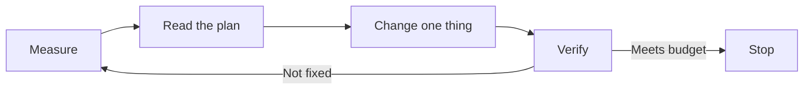
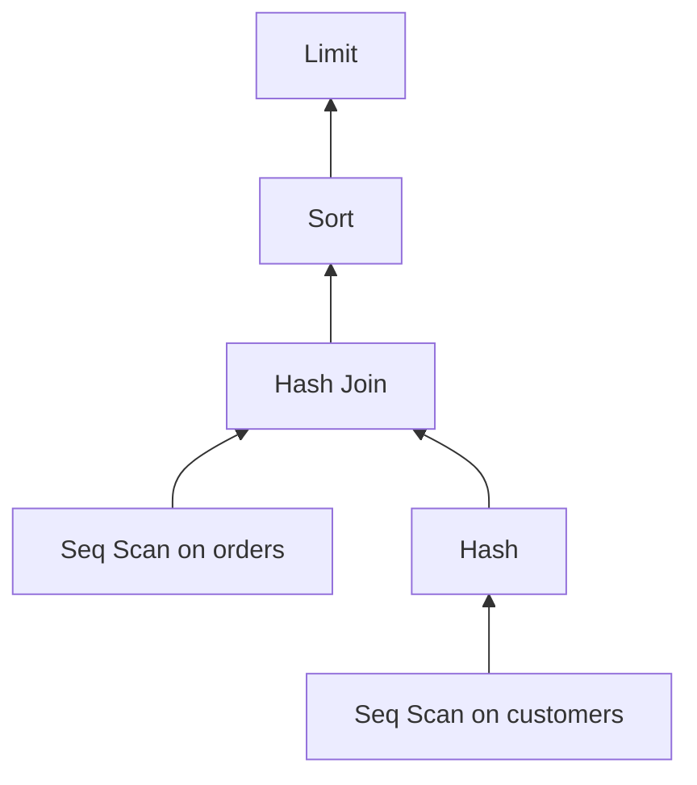

# Lecture 1 — A performance-tuning methodology

> **Duration:** ~2 hours. **Outcome:** You can state the five-step tuning loop from memory, run each step against a real Postgres database, and explain why "add an index and hope" is the mark of a junior engineer.

## 1. The one rule: measure before you touch

Most bad database tuning comes from a single mistake — changing something before measuring it. Someone reports "the app is slow," an engineer adds an index on the column they *think* is the problem, latency does not move, and now the table carries a useless index that slows down every write forever.

The senior move is boring and reliable. It is a loop:

```
measure  →  read the plan  →  change ONE thing  →  verify  →  repeat
```

Every step matters, and skipping the first one is the classic failure. You do not get to have an opinion about what is slow until you have a number. This lecture walks the loop end to end; the exercises and the capstone make you run it for real.


*The five-step tuning loop — each pass changes exactly one thing and verifies before repeating.*

| Step | Question it answers | Primary tool |
|------|--------------------|--------------|
| **Measure** | Which query is actually costing the most? | `pg_stat_statements` |
| **Read the plan** | *Why* is that query slow? | `EXPLAIN (ANALYZE, BUFFERS)` |
| **Change one thing** | What single lever fixes the cause? | index / rewrite / type / stats |
| **Verify** | Did it actually help, at p95? | re-run the plan + timing |
| **Repeat** | What is the next-worst query now? | back to Measure |

## 2. Step 1 — Measure: find the worst query

You cannot tune what you cannot see. The best per-query telemetry Postgres offers is the `pg_stat_statements` extension. It normalizes every executed statement (replacing literals with `$1`, `$2`…) and accumulates timing across all executions.

Enable it once. In `postgresql.conf`:

```conf
shared_preload_libraries = 'pg_stat_statements'
pg_stat_statements.track = all
```

Restart Postgres, then in the target database:

```sql
CREATE EXTENSION IF NOT EXISTS pg_stat_statements;
```

Now let the workload run for a while, and ask the killer question — **where is total time going?**

```sql
SELECT
    substr(query, 1, 60)                        AS query,
    calls,
    round(total_exec_time::numeric, 1)          AS total_ms,
    round(mean_exec_time::numeric, 2)           AS mean_ms,
    round((100 * total_exec_time /
        sum(total_exec_time) OVER ())::numeric, 1) AS pct
FROM pg_stat_statements
ORDER BY total_exec_time DESC
LIMIT 10;
```

Read this table carefully, because it teaches the most important lesson in tuning:

| Signal | What it means | What to do |
|--------|--------------|-----------|
| High `total_ms`, high `calls`, low `mean_ms` | A *fast* query run millions of times | Fix by calling it less (caching, batching), or shave the mean |
| High `total_ms`, low `calls`, high `mean_ms` | A genuinely slow query | Read its plan — this is the classic tuning target |
| High `mean_ms`, one call | A report or migration | Usually fine; ignore unless it blocks users |

The number that matters is **`total_exec_time` (its share of the whole)**, not the single slowest query. A 5-second report run twice a day matters far less than a 40 ms query run 3 million times a day (which burns 33 hours of CPU daily). Optimize where the *time actually lives*.

To reset the counters and measure a clean window:

```sql
SELECT pg_stat_statements_reset();
```

> **SQLite note.** SQLite has no `pg_stat_statements`. For the zero-setup track, measure at the driver/app layer — wrap queries in timing, or use `.timer on` in the `sqlite3` shell and run the query in a loop. The *method* is identical; only the instrument changes.

## 3. Step 2 — Read the plan: find out *why*

Once you have the guilty query, ask the planner what it is doing. `EXPLAIN` shows the *estimated* plan; `EXPLAIN ANALYZE` actually runs it and shows *real* timings and row counts. Always add `BUFFERS` — I/O is usually the real story.

```sql
EXPLAIN (ANALYZE, BUFFERS, FORMAT TEXT)
SELECT o.id, o.total, c.email
FROM orders o
JOIN customers c ON c.id = o.customer_id
WHERE o.created_at >= now() - interval '7 days'
ORDER BY o.total DESC
LIMIT 20;
```

A sample plan you must be able to read:

```
Limit  (cost=48210.11..48210.16 rows=20 width=48) (actual time=812.4..812.4 rows=20 loops=1)
  Buffers: shared hit=1204 read=38891
  ->  Sort  (cost=48210.11..48934.55 rows=289776 width=48) (actual time=812.4..812.4 rows=20 loops=1)
        Sort Key: o.total DESC
        Sort Method: top-N heapsort  Memory: 27kB
        ->  Hash Join  (cost=... rows=289776 ...) (actual time=... rows=291001 loops=1)
              ->  Seq Scan on orders o  (cost=... rows=289776 ...) (actual time=... rows=291001 ...)
                    Filter: (created_at >= (now() - '7 days'::interval))
                    Rows Removed by Filter: 4708999
              ->  Hash  (...)
                    ->  Seq Scan on customers c  (...)
Planning Time: 0.31 ms
Execution Time: 812.9 ms
```

Read it bottom-up (leaves first, root last). The checklist you run on every plan:


*Execution runs bottom-up — leaves scan first, the Limit at the root returns last.*

1. **Where is the time?** Look at `actual time` on each node. The `Seq Scan on orders` reading 5 million rows and throwing 4.7M away (`Rows Removed by Filter`) is the smell.
2. **Estimate vs. reality.** Compare `rows=` (estimate) to `actual … rows=`. If they diverge by 10× or more, the planner has stale or missing statistics and is choosing a bad plan for a *good* reason — fix the stats, not the query.
3. **Buffers.** `read=38891` means ~304 MB pulled from disk (38891 × 8 KB). High `read` vs. `hit` = the working set does not fit in cache, or you are scanning too much.
4. **Sort method.** `top-N heapsort` in memory is fine. `external merge Disk: … kB` means the sort spilled to disk — raise `work_mem` or avoid sorting so many rows.
5. **Join algorithm.** Nested loop is great for few rows, catastrophic for many. Hash join is good for big unsorted sets. Merge join wants sorted inputs. A nested loop over a million rows is a red flag.

The table you will consult constantly:

| Plan node | Good when | Bad sign |
|-----------|-----------|----------|
| `Seq Scan` | Small table, or you truly need most rows | Big table + selective `WHERE` (wants an index) |
| `Index Scan` | Selective predicate, few rows out | — |
| `Index Only Scan` | All needed columns are in the index (covering) | — |
| `Bitmap Heap Scan` | Medium selectivity, many scattered rows | — |
| `Nested Loop` | Inner side tiny or indexed | Millions of loops (`loops=` is huge) |
| `Hash Join` | Large unsorted join | Hash spills to disk (low `work_mem`) |
| `Sort` | Small result to order | `external merge Disk:` = spill |

## 4. Step 3 — Change ONE thing

The discipline: change exactly one thing per iteration, so that when latency moves you *know what moved it*. Change three things at once and you have learned nothing — you cannot tell which helped, which hurt, and which was noise.

The levers, roughly in the order you should reach for them:

**a. Refresh statistics.** The cheapest fix. If estimates are wildly wrong, the planner is flying blind.

```sql
ANALYZE orders;                       -- refresh stats
ALTER TABLE orders ALTER COLUMN created_at SET STATISTICS 1000;  -- more detail on a hot column
```

**b. Add the right index.** Match the index to the predicate. For the query above — filtering on `created_at`, ordering by `total` — a composite index lets Postgres both filter and pre-sort:

```sql
CREATE INDEX CONCURRENTLY idx_orders_created_total
    ON orders (created_at, total DESC);
```

A **partial** index if you only ever query recent rows; a **covering** index (`INCLUDE`) if you want an index-only scan:

```sql
CREATE INDEX idx_orders_recent ON orders (total DESC)
    WHERE created_at >= '2026-01-01';
CREATE INDEX idx_orders_cust ON orders (customer_id) INCLUDE (total, created_at);
```

Always build production indexes with `CONCURRENTLY` so you do not lock writes on a live table. (Week 6 covers index types in depth — here you *apply* that knowledge.)

**c. Rewrite the query.** Sometimes no index helps because the query asks for too much. Push filters down, drop `SELECT *`, replace a correlated subquery with a join or a window function, add a `LIMIT`, or fix an implicit type cast that defeats an index (`WHERE id = '42'` on an integer column can prevent index use).

**d. Tune a knob (last resort).** `work_mem`, `effective_cache_size`, `random_page_cost` change how the planner costs plans. These are session- or system-wide and blunt — reach for them only after the query itself is as good as it gets.

## 5. Step 4 — Verify (and quote p95, not one run)

A single run lies. The first execution reads from disk (cold cache); the second reads from RAM (warm). Caching, autovacuum, and background load all add variance. So verify like a scientist:

```sql
-- run several times; discard the first (cold) run
EXPLAIN (ANALYZE, BUFFERS) SELECT ...;   -- run #1 (cold, ignore)
EXPLAIN (ANALYZE, BUFFERS) SELECT ...;   -- run #2
EXPLAIN (ANALYZE, BUFFERS) SELECT ...;   -- run #3
```

For a real latency number, benchmark with `pgbench` running the query many times and report the **p95** (95th percentile) — the latency 95% of users beat. Users feel the tail, not the average.

```bash
pgbench -n -f query.sql -T 30 -c 4 mydb   # 30s, 4 clients, custom script
```

Record the before/after side by side. This is the core of the capstone report:

| Metric | Before | After |
|--------|-------:|------:|
| Plan node | `Seq Scan`, 5M rows | `Index Scan`, 291k rows |
| Buffers read | 38891 | 402 |
| Execution time (warm) | 812 ms | 6.1 ms |
| p95 (pgbench) | 840 ms | 9 ms |

If the number did not move, **revert the change** and form a new hypothesis. A "fix" that does not measurably help is not a fix — it is future maintenance cost.

## 6. Step 5 — Repeat, then stop

After a fix, the *shape* of the problem changes. Re-run `pg_stat_statements` (reset it first). The query that was #1 may now be #7; a different query is now the bottleneck. Iterate.

And crucially — **know when to stop.** Tuning has diminishing returns and real costs (every index slows writes and eats disk). You stop when:

- The query meets its **latency budget** (e.g. "checkout p95 under 100 ms"). A budget is a target, not "as fast as possible."
- The remaining offenders are cheap in aggregate — small share of `total_exec_time`.
- The next fix would cost more than it saves (an index on a write-heavy table you rarely read).

Lecture 3 returns to "when to stop" in detail. For now, hold the idea: **tuning ends at the budget, not at perfection.**

## 7. A worked micro-example

Slow query reported: a dashboard count.

```sql
SELECT count(*) FROM events WHERE user_id = 42 AND type = 'click';
```

**Measure:** `pg_stat_statements` shows it at 18% of total time, mean 240 ms, 900k calls/day.
**Read:** `EXPLAIN ANALYZE` shows `Seq Scan on events`, 20M rows scanned, `Rows Removed by Filter: 19,998,700`.
**Change one thing:** the predicate is `(user_id, type)`, so:

```sql
CREATE INDEX CONCURRENTLY idx_events_user_type ON events (user_id, type);
```

**Verify:** plan flips to `Index Only Scan`, buffers `read` drops from 122k to 4, warm time 240 ms → 0.3 ms, p95 260 ms → 1 ms.
**Repeat:** reset stats, the next offender surfaces. Stop when the dashboard hits its 50 ms budget.

Five steps, one lever, a number to prove it. That is the whole job.

## 8. Check yourself

- What are the five steps of the tuning loop, in order?
- Why is `total_exec_time` a better sort key than `mean_exec_time` when hunting bottlenecks?
- In an `EXPLAIN ANALYZE` plan, what does a large `Rows Removed by Filter` tell you?
- The estimate says `rows=50` but `actual rows=50000`. What is the likely cause, and what do you do *first*?
- Why must you change only one thing per iteration?
- Why report p95 instead of the single fastest run?
- Name two costs of adding an index that make "just add indexes everywhere" a bad strategy.

If you can answer all seven, you have the methodology. The rest of the week is repetition until it is reflex.

## Further reading

- **PostgreSQL — Using EXPLAIN:** <https://www.postgresql.org/docs/16/using-explain.html>
- **PostgreSQL — pg_stat_statements:** <https://www.postgresql.org/docs/16/pgstatstatements.html>
- **Use The Index, Luke! (Markus Winand):** <https://use-the-index-luke.com/>
