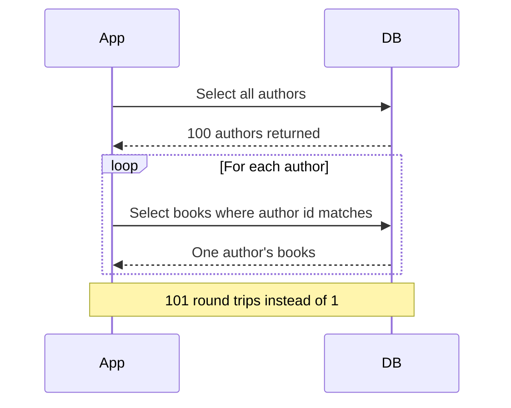

# Lecture 2 — Schema-design review: anti-patterns & trade-offs

> **Duration:** ~2 hours. **Outcome:** You can review a schema and name its anti-patterns — EAV, over-indexing, wrong types, N+1 — explain the trade-off each one makes, and recommend the fix without running a single query.

## 1. Why a schema review beats a query fix

Lecture 1 tuned *queries*. But the fastest query is the one you never had to write, and the deepest performance problems live in the **schema**, not the SQL. A badly shaped table forces every query against it to be slow, and no index rescues a fundamentally wrong design. Senior engineers review the schema first, because a design flaw caught on a whiteboard costs an hour; the same flaw caught in production costs a migration, a maintenance window, and a postmortem.

A schema review is not about taste. Each anti-pattern below is a **deliberate trade** — it buys something (usually flexibility or developer speed) and pays for it (usually query performance or data integrity). Your job in a review is to name the trade and decide whether the team can afford it *here*.

## 2. Anti-pattern: EAV (Entity–Attribute–Value)

EAV stores attributes as rows instead of columns, so you can add "fields" without changing the schema:

```sql
-- The EAV table (the anti-pattern)
CREATE TABLE product_attributes (
    product_id  bigint,
    attr_name   text,     -- 'color', 'weight', 'voltage', ...
    attr_value  text      -- everything is text
);
```

It looks flexible. It is a trap. To fetch one product with five attributes you either self-join the table five times or pivot it, every value is stringly-typed so the database cannot enforce that `weight` is a number, and you cannot put a meaningful constraint or a useful index on `attr_value`.

```sql
-- Getting one product's fields out of EAV: a join per attribute
SELECT p.id,
       c.attr_value  AS color,
       w.attr_value  AS weight
FROM products p
LEFT JOIN product_attributes c ON c.product_id = p.id AND c.attr_name = 'color'
LEFT JOIN product_attributes w ON w.product_id = p.id AND w.attr_name = 'weight';
```

**The trade:** EAV buys schema-less flexibility and pays with query complexity, lost type safety, lost constraints, and terrible plans.

**The fix, in order of preference:**

1. **Real columns.** If the attributes are known and finite, they are columns. This is almost always the right answer.
2. **A `jsonb` column** for genuinely sparse / unpredictable attributes — Postgres can index it with GIN and type-check with a `CHECK`:

   ```sql
   ALTER TABLE products ADD COLUMN attrs jsonb NOT NULL DEFAULT '{}';
   CREATE INDEX idx_products_attrs ON products USING gin (attrs);
   SELECT * FROM products WHERE attrs @> '{"color":"red"}';
   ```
3. EAV only when you are literally building a form-builder where users define fields at runtime — and even then, isolate it.

## 3. Anti-pattern: over-indexing

Indexes make reads fast. Beginners learn this and then index everything — a fresh index on every column "just in case." This is a real and common performance bug, because every index has a cost you do not see until write time:

- Every `INSERT`/`UPDATE`/`DELETE` must update **every** index on the table. Ten indexes = ten B-trees to maintain per write.
- Indexes consume disk and RAM (they compete with data for cache).
- The planner spends more time considering more indexes.
- Redundant indexes are pure waste — an index on `(a)` is already covered by an index on `(a, b)` for queries that filter on `a` alone.

Find the dead weight. Postgres tracks index usage:

```sql
-- Indexes that are never scanned (candidates for removal)
SELECT schemaname, relname AS table, indexrelname AS index,
       idx_scan AS scans, pg_size_pretty(pg_relation_size(indexrelid)) AS size
FROM pg_stat_user_indexes
WHERE idx_scan = 0
ORDER BY pg_relation_size(indexrelid) DESC;
```

```sql
-- Redundant indexes: (a) is a prefix of (a, b)
-- Drop idx on (a) if idx on (a, b) exists and (a)-alone lookups are rare.
```

**The trade:** each index buys faster reads *for the queries that use it* and pays a tax on every write plus disk. On a write-heavy table (an events log, a queue), an unused index is all cost and no benefit.

**The fix:** index for the queries you actually run (check `pg_stat_statements`), drop indexes with `idx_scan = 0`, and prefer one composite index over three single-column ones when the queries share a prefix.

## 4. Anti-pattern: wrong types

Choosing the wrong column type is quietly expensive. It wastes storage (which wastes cache, which causes disk reads), defeats indexes, and lets bad data in.

| Wrong | Right | Why it matters |
|-------|-------|----------------|
| `text` / `varchar` for a fixed set | `enum` or a lookup table + FK | `text` allows typos ('activ', 'ACTIVE'); enum is 4 bytes and validated |
| `varchar(255)` reflexively | size to the real domain, or just `text` | The 255 is a MySQL cargo-cult; in Postgres unbounded `text` is fine and `varchar(n)` only adds a check |
| `float`/`real` for money | `numeric(12,2)` | Floats cannot represent 0.10 exactly — accounting bugs |
| `text` for timestamps | `timestamptz` | Sorting/filtering on a date string is wrong across formats and time zones |
| `text` for UUIDs | `uuid` | 16 bytes vs. 36, and validated |
| `int` for a growing id | `bigint` | `int` overflows at ~2.1 billion — a real production outage |
| storing `'123'` then `WHERE id = 123` | match the literal to the column | implicit casts can prevent index use |

The classic performance sting: an implicit cast that defeats an index.

```sql
-- Column phone is text. This forces a cast on every row → no index use:
SELECT * FROM users WHERE phone = 5551234;      -- int literal vs text column
-- Correct: match the type
SELECT * FROM users WHERE phone = '5551234';
```

**The trade:** loose types buy "we'll figure it out later" and pay with storage bloat, lost validation, and index-defeating casts. **The fix:** pick the narrowest correct type up front; types are the cheapest constraint you have.

## 5. Anti-pattern: N+1 (the query that hides in the app)

The N+1 is the most common performance bug in any application with an ORM, and the database review is where you catch it. The app fetches a list (1 query), then loops and fetches each item's detail (N queries):

```
SELECT * FROM authors;                    -- 1 query, returns 100 authors
-- then, in application code, for each author:
SELECT * FROM books WHERE author_id = ?;  -- 100 more queries
```

101 round-trips where 1 would do. Each is individually fast, so `pg_stat_statements` shows a *fast mean* with a *huge call count* — exactly the "high total, high calls, low mean" row from Lecture 1. That is the fingerprint of an N+1.


*The N+1 pattern — one list query followed by a round trip per row.*

**The fix** is a single set-based query — a join, or `IN (...)`, or an ORM "eager load"/`JOIN FETCH`:

```sql
SELECT a.id, a.name, b.title
FROM authors a
LEFT JOIN books b ON b.author_id = a.id;   -- one round-trip
```

**The trade:** the N+1 is not a schema flaw so much as a usage flaw, but the review surfaces it — because a well-designed schema with the right foreign keys makes the single-query rewrite trivial. If joining is awkward, the schema is telling you something.

## 6. Two more you will see constantly

**Unbounded `SELECT *` and missing `LIMIT`.** Fetching every column and every row "because the UI might need it" pulls data the query does not use (defeating index-only scans), balloons network transfer, and turns a paginated list into a full-table read. Select the columns you need; paginate with keyset pagination (`WHERE id > $last ORDER BY id LIMIT 50`) rather than large `OFFSET`s, which scan and discard.

**Missing foreign keys / no constraints.** A schema with no FKs, no `NOT NULL`, no `CHECK` "for flexibility" pushes integrity into application code, where it is enforced inconsistently and rots. Orphan rows accumulate, and the planner loses information it could use. Constraints are documentation the database *enforces* — and they are nearly free.

## 7. Denormalization is not an anti-pattern (when it is deliberate)

The counterpoint: sometimes the *correct* senior decision is to break normal form on purpose. A pre-computed `order_total`, a cached `comment_count`, a materialized view for a dashboard — these duplicate data to avoid an expensive join or aggregate on every read.

The line between "smart denormalization" and "data-integrity bug" is **intent and control**:

| Deliberate denormalization | Accidental duplication |
|----------------------------|------------------------|
| Documented, with a reason (measured latency win) | Copy-paste column, no reason |
| Kept in sync by a trigger, job, or materialized view | Hope and manual updates |
| You can rebuild it from the source of truth | The copies have already drifted |

Denormalize when you have *measured* that the normalized form misses the latency budget — never speculatively. This is the through-line of the whole week: measure, then decide.

## 8. The review checklist

Run this against any schema handed to you:

- [ ] Any EAV / "attributes" tables? Could they be columns or `jsonb`?
- [ ] Any table with more than ~5 indexes? Are they all scanned (`idx_scan > 0`)?
- [ ] Redundant indexes (a single-column index that is a prefix of a composite)?
- [ ] `text` where a type (`enum`, `timestamptz`, `numeric`, `uuid`, `bigint`) belongs?
- [ ] Money in `float`? (Always a bug.)
- [ ] `int` primary keys on tables that will exceed 2 billion rows?
- [ ] Foreign keys present and indexed? (FK columns are not auto-indexed in Postgres.)
- [ ] `NOT NULL` / `CHECK` constraints where the domain allows?
- [ ] Any query pattern that smells like N+1 (high calls, low mean in `pg_stat_statements`)?
- [ ] Any denormalization — is it deliberate and kept in sync, or drifting?

## 9. Check yourself

- What does EAV buy, and what are the three things it costs?
- Why is an unused index worse than no index on a write-heavy table?
- Give two reasons `float` is the wrong type for a money column.
- How does an N+1 show up in `pg_stat_statements` — what does its row look like?
- Why can `WHERE phone = 5551234` be slow when `phone` is `text`?
- When is denormalization the *right* call, and what must accompany it?
- A table has indexes on `(user_id)` and `(user_id, created_at)`. Which is likely redundant, and for which queries?

## Further reading

- **PostgreSQL — Data Types:** <https://www.postgresql.org/docs/16/datatype.html>
- **PostgreSQL — JSON Types & indexing:** <https://www.postgresql.org/docs/16/datatype-json.html>
- **SQL Antipatterns, Bill Karwin (book overview / talks):** <https://pragprog.com/titles/bksqla/sql-antipatterns/>
