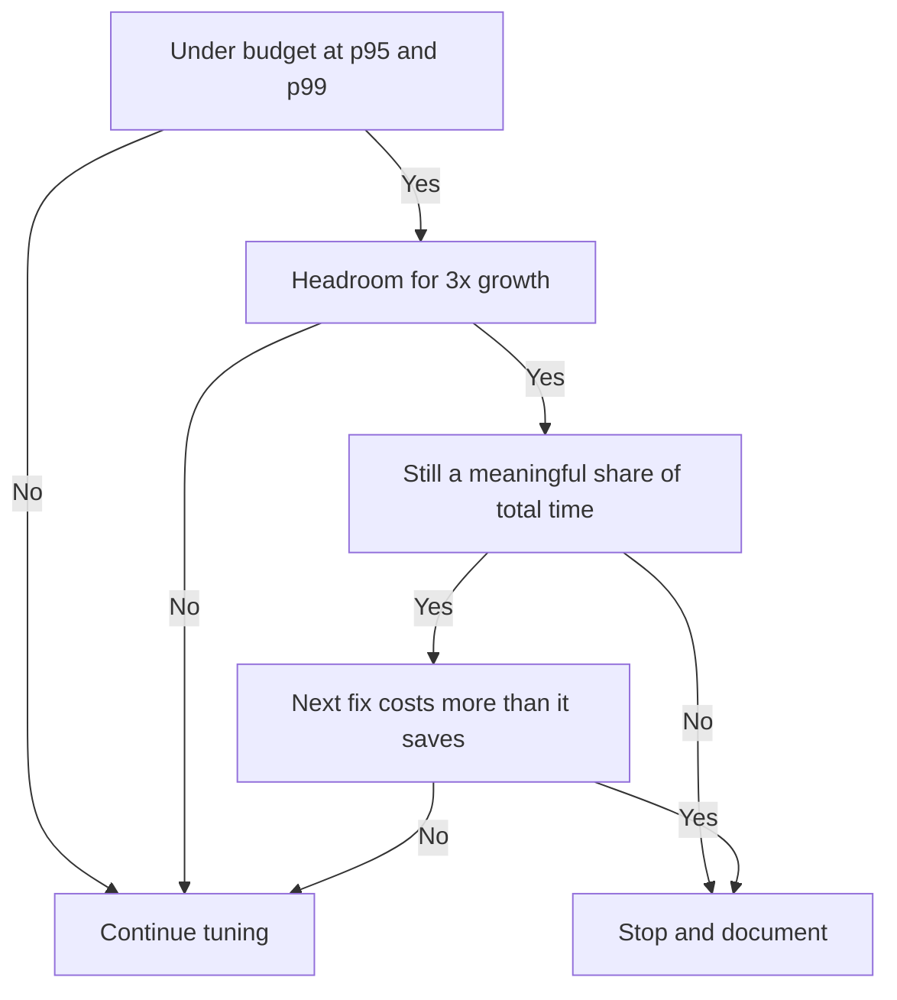

# Lecture 3 — Putting it together: capacity, monitoring & when to stop

> **Duration:** ~2 hours. **Outcome:** You can project a table's growth on the back of an envelope, stand up the monitoring that tells you a database is drifting before users complain, and defend a decision to *stop* tuning against someone who wants "faster."

## 1. From "make it fast" to "keep it fast"

Lectures 1 and 2 fixed problems that already exist. This lecture is about the two things that turn a one-time tuning win into a durable one: **capacity planning** (will this design survive 10× the data?) and **monitoring** (will I know before the users do?). It closes on the hardest discipline of all — knowing when the query is fast *enough* and walking away.

## 2. Capacity planning: the back-of-envelope

You do not need a spreadsheet to know whether a table is going to be a problem. You need row width, row count, and a growth rate.

**Estimate row width.** Sum the column sizes plus per-row overhead (Postgres adds ~23 bytes of tuple header, rounded up for alignment):

| Type | Bytes |
|------|------:|
| `bigint`, `timestamptz`, `float8` | 8 |
| `int`, `real`, `date` | 4 |
| `smallint` | 2 |
| `bool` | 1 |
| `uuid` | 16 |
| `numeric` | ~variable, ~8–16 typical |
| `text` | length + 1–4 (or TOASTed if large) |
| tuple header overhead | ~23–28 |

Postgres gives you the real numbers directly, which is better than guessing once data exists:

```sql
SELECT
    pg_size_pretty(pg_total_relation_size('orders'))  AS total,   -- table + indexes + TOAST
    pg_size_pretty(pg_relation_size('orders'))        AS heap,    -- just the table
    pg_size_pretty(pg_indexes_size('orders'))         AS indexes,
    (SELECT count(*) FROM orders)                     AS rows;
```

**Project forward.** If `orders` is 291 MB at 5M rows, that is ~61 bytes/row. Growing at 200k rows/day:

```
+200k rows/day × 61 bytes ≈ 12 MB/day ≈ 4.3 GB/year (heap)
```

Now add indexes (often 30–100% of heap size on top) and TOAST for large text. The question a review answers: at projected growth, does the **working set** (the hot rows + their indexes) still fit in RAM in 12 months? When it stops fitting, `Buffers: read` climbs, and latency degrades gradually — the slow-boiling-frog outage. That is your cue to consider partitioning (Week 11), archiving cold data, or a bigger box.

**A worked estimate.** A `page_views` table: `bigint id`, `bigint user_id`, `int page_id`, `timestamptz at`, plus ~28 overhead ≈ 56 bytes/row. At 50M views/month → 2.8 GB/month heap, ~5–6 GB/month with indexes. Within a year you are at ~70 GB and any full scan is doomed. You would design this partitioned by month from day one — the capacity math *drives the schema decision*.

## 3. Index and table bloat

Postgres uses MVCC (Week 5): updates and deletes leave dead tuples that `autovacuum` later reclaims. If autovacuum falls behind on a hot table, dead rows accumulate — the table and its indexes physically grow even though the live row count is flat. Bloat wastes cache and slows scans.

Check it, and watch that autovacuum is keeping up:

```sql
SELECT relname,
       n_live_tup, n_dead_tup,
       round(100 * n_dead_tup / nullif(n_live_tup + n_dead_tup, 0), 1) AS dead_pct,
       last_autovacuum
FROM pg_stat_user_tables
ORDER BY n_dead_tup DESC
LIMIT 10;
```

A high `dead_pct` (say >20%) on a busy table means autovacuum is losing the race. Levers: tune `autovacuum_vacuum_scale_factor` down on that table so it vacuums more often, or for a one-time reclaim, `VACUUM (ANALYZE)` manually. `REINDEX CONCURRENTLY` rebuilds a bloated index without locking. Bloat is the reason "the same query got slower over three months with no code change."

## 4. Monitoring: the four signals

You cannot watch a database by staring at it. Instrument these four, alert on trends, and you will see problems forming:

| Signal | Source | What a bad trend means |
|--------|--------|------------------------|
| **Query latency (p95/p99)** | `pg_stat_statements`, app metrics | Something regressed — new query, data growth, bad plan |
| **Cache hit ratio** | `pg_stat_database` | Falling ratio = working set outgrowing RAM |
| **Dead tuples / bloat** | `pg_stat_user_tables` | Autovacuum falling behind |
| **Connections / locks** | `pg_stat_activity` | Contention, connection-pool exhaustion, long transactions |

`pg_stat_statements` is the backbone. Snapshot it on a schedule (reset, wait, capture) so you can see *which* query regressed, not just that "the database is slow."

```sql
-- Cache hit ratio for the whole database (want > ~0.99 for OLTP)
SELECT datname,
       round(100 * blks_hit / nullif(blks_hit + blks_read, 0), 2) AS cache_hit_pct
FROM pg_stat_database
WHERE datname = current_database();
```

```sql
-- Long-running / blocked queries right now
SELECT pid, state, wait_event_type, wait_event,
       now() - query_start AS runtime, substr(query, 1, 60) AS query
FROM pg_stat_activity
WHERE state <> 'idle'
ORDER BY runtime DESC;
```

For continuous history, wire these into Prometheus + Grafana via `postgres_exporter`, or use your cloud provider's built-in dashboards. The tool matters less than the habit: **trends over time**, with alerts, so you learn about a regression from a graph, not a user.

> **`auto_explain` for the queries you missed.** `pg_stat_statements` tells you *which* query is slow; `auto_explain` logs the *plan* of any query exceeding a threshold, automatically, in production. Set `auto_explain.log_min_duration = '250ms'` and every slow query logs its plan for you to read later — no need to reproduce it by hand.

## 5. Knowing when to stop

This is the section juniors skip and seniors live by. Tuning is not "make it as fast as possible." It is "make it meet the budget, then stop." Three reasons stopping is a skill:

**1. Diminishing returns.** Going from 800 ms to 8 ms is a 100× win an afternoon buys you. Going from 8 ms to 6 ms might take a week and a fragile query rewrite. The second win is real and almost never worth it.

**2. Every optimization has a cost.** An index taxes writes and disk. A denormalization adds a sync burden and a drift risk. A hand-tuned query is harder to read and maintain. Caching adds an invalidation problem. You are always *trading*, and past the budget the trade goes negative.

**3. The budget is the finish line.** A latency budget ("checkout p95 < 100 ms", "search p99 < 300 ms") is set by product needs, not vanity. Once a query is under budget with headroom for growth, it is done — move your effort to the next thing that is over budget, or to something that is not the database at all.

The checklist for *stop or continue*:


*Four questions decide whether to keep tuning or stop and document.*

- [ ] Is the query under its stated latency budget at p95 **and** p99?
- [ ] Is there headroom for projected data growth (will it still pass at 3× rows)?
- [ ] Is this query still a meaningful share of `total_exec_time`, or is it now noise?
- [ ] Would the next fix cost more (in writes / maintenance / complexity) than it saves?

If it is under budget, has headroom, is no longer a top offender, and the next fix costs more than it saves — **stop and document it.** Write down the budget it meets and the plan it uses, so the next person (or future you) does not re-tune a query that is already fine.

## 6. Bringing the week together

The whole week is one loop at three zoom levels:

- **Query level** (Lecture 1): measure → read the plan → change one thing → verify → repeat, to a budget.
- **Schema level** (Lecture 2): review for anti-patterns, fix the shape so queries *can* be fast.
- **System level** (this lecture): project growth, monitor the trends, and know when fast enough is enough.

The capstone asks you to run all three: profile a slow seeded database, fix its worst queries and its worst schema decisions, verify with before/after plans, and stop when it meets the target — then write it up so someone else could trust your work.

## 7. Check yourself

- Given a 200 MB table at 4M rows growing 100k rows/day, roughly how much heap does it add per year?
- What does a falling cache-hit ratio tell you, and what causes it?
- What is bloat, what causes it under MVCC, and how do you detect it?
- Name the four monitoring signals and one Postgres source for each.
- What does `auto_explain` give you that `pg_stat_statements` does not?
- Give three reasons a senior engineer stops tuning a query that could still be made faster.
- Your query hits its p95 budget but fails p99 badly. Are you done? Why or why not?

## Further reading

- **PostgreSQL — Monitoring Statistics (`pg_stat_*`):** <https://www.postgresql.org/docs/16/monitoring-stats.html>
- **PostgreSQL — Routine Vacuuming & autovacuum:** <https://www.postgresql.org/docs/16/routine-vacuuming.html>
- **PostgreSQL — auto_explain:** <https://www.postgresql.org/docs/16/auto-explain.html>
- **postgres_exporter (Prometheus):** <https://github.com/prometheus-community/postgres_exporter>
